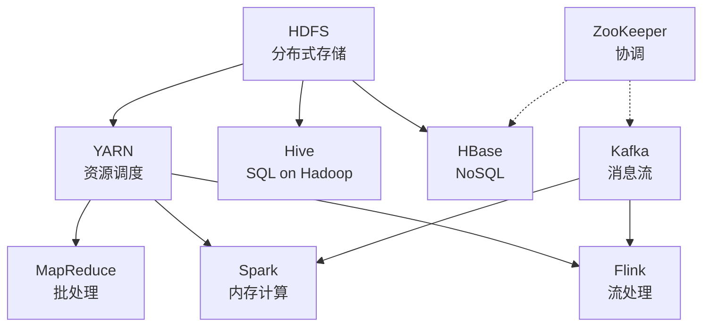

# 大数据架构速查表

## 大数据特征 5V

| V | 含义 |
|---|---|
| **Volume** | 体量大（TB → PB → EB） |
| **Velocity** | 速度快（数据产生 + 处理） |
| **Variety** | 多样（结构化 / 半结构化 / 非结构化） |
| **Veracity** | 真实性（质量、可信度） |
| **Value** | 价值密度低，需挖掘 |

## OLTP vs OLAP（必背）

| 维度 | OLTP（联机事务处理） | OLAP（联机分析处理） |
|---|---|---|
| 用户 | 业务操作员、最终用户 | 决策者、分析师 |
| 功能 | 日常事务（增删改） | 决策支持（多维分析） |
| 数据量 | GB 级 | TB-PB 级 |
| 操作 | 频繁短事务 | 复杂长查询 |
| 设计 | 规范化（3NF） | 反规范化（星型/雪花） |
| 响应 | 毫秒 | 秒-分钟 |
| 代表 | MySQL / Oracle | Hive / ClickHouse / Doris |

## Lambda 架构

```
                      ┌── Batch Layer ──────► Master Dataset → 批视图（准确）
   Data Stream ──┬─►  
                      └── Speed Layer ──────► 实时视图（近似）

                                              ↓
                          Serving Layer（查询时合并两个视图）
```

**优点**：批层兜底保证准确、速度层补充实时性
**缺点**：双链路、代码重复维护、复杂

## Kappa 架构

```
   Data Stream ──► Kafka ──► Stream Processing（Flink）──► Serving Layer
                                                            ↑
                                                      （重放历史数据回溯）
```

**优点**：单一流处理引擎、统一编程模型、运维简单
**缺点**：依赖流处理引擎的稳定性和回放能力

## Lambda vs Kappa 选型

| 维度 | Lambda | Kappa |
|---|---|---|
| 复杂度 | 高 | 低 |
| 准确性 | 高（批层兜底） | 依赖流引擎 |
| 运维 | 双链路 | 单链路 |
| 历史回溯 | 自然支持 | 依赖 Kafka 重放 |
| 选型建议 | 已有批处理积累 / 强一致 | 新建项目 / 实时优先 |

## 湖仓一体（Lakehouse）

```
传统数据仓库（结构化、贵）  ─┐
                             ├──► 湖仓一体 = 数据湖存储 + 数仓事务 + 数仓性能
传统数据湖（廉价、半结构化）─┘
```

**关键能力**：ACID 事务、时间旅行、Schema 演化、统一批流
**典型实现**：Apache Iceberg、Apache Hudi、Delta Lake

## 数仓分层（必背）

```
ADS  应用层 ──── 报表 / BI / 接口直接消费
DWS  汇总层 ──── 按主题、按维度聚合
DWD  明细层 ──── 清洗 + 维度退化 + 事实表
ODS  贴源层 ──── 原始数据，仅做格式转换
DIM  维度表 ──── 维表（用户/商品/时间...），横切支撑

数据流：业务库 → ODS → DWD → DWS → ADS → BI / API
```

## 维度建模

| 模型 | 结构 | 特点 |
|---|---|---|
| **星型（Star）** | 中央事实表 + 多个去规范化维度表 | 简单、查询快、空间冗余 |
| **雪花（Snowflake）** | 维度表进一步规范化 | 节省空间、查询复杂 |
| **星座（Galaxy）** | 多个事实表共享维度表 | 数仓多主题 |

## 存储选型

| 类型 | 代表 | 典型场景 |
|---|---|---|
| **分布式文件** | HDFS | 海量批数据离线 |
| **对象存储** | S3 / OSS / Ceph | 云上数据湖底座 |
| **列存数据库** | HBase / Cassandra | 海量随机读写 |
| **OLAP 数据库** | ClickHouse / Doris / StarRocks | 实时多维分析 |
| **Cube 引擎** | Kylin / Druid | 预聚合、固定维度 |
| **MPP 数据库** | Greenplum / Vertica | 传统大数据仓库 |
| **湖仓** | Iceberg / Hudi / Delta | ACID + 大数据规模 |

## NoSQL 四大类

| 类型 | 数据模型 | 代表 | 典型场景 |
|---|---|---|---|
| **Key-Value** | key → value | Redis / Memcached / DynamoDB | 缓存、会话、计数 |
| **Document** | JSON / BSON 文档 | MongoDB / CouchDB | 半结构化、内容管理 |
| **Column** | 列族 + 稀疏行 | HBase / Cassandra | 海量稀疏数据 |
| **Graph** | 节点 + 边 | Neo4j / JanusGraph | 关系网络、推荐 |

加上 **Time-Series**（InfluxDB / TDengine / Prometheus）和 **Search**（Elasticsearch / Solr），共 6 大类。

## Hadoop 生态核心组件



## HDFS 核心机制

| 组件 | 职责 |
|---|---|
| **NameNode** | 管理元数据（文件→块的映射、目录树） |
| **DataNode** | 存储实际数据块（默认 128MB） |
| **SecondaryNameNode** | 合并 fsimage + editlog（非热备） |
| **副本数** | 默认 3（第 1 副本同机架，第 2/3 副本异机架） |

**HDFS 不适合**：①低延迟（毫秒级）；②大量小文件（元数据膨胀）；③多用户写入 / 任意修改

## MapReduce 范式

```
Input → Split → Map → Shuffle → Sort → Reduce → Output
                ↑                            ↑
              并行处理                    汇总聚合
```

## Spark 核心抽象

| 抽象 | 含义 |
|---|---|
| **RDD** | 弹性分布式数据集（不可变、可分区、可重算） |
| **DataFrame** | 带 Schema 的分布式表 |
| **Dataset** | DataFrame + 强类型 |
| **DAG** | 有向无环图（操作依赖） |
| **Stage** | 由 shuffle 切分的执行阶段 |
| **Task** | 一个 Partition 上的执行单元 |

Spark 比 MR 快的根因：**内存计算 + DAG 优化 + 减少磁盘 I/O**

## Flink 核心概念

| 概念 | 含义 |
|---|---|
| **DataStream** | 无界流数据抽象 |
| **Window** | 时间窗口（滚动 / 滑动 / 会话） |
| **Watermark** | 水位线，处理乱序事件 |
| **State** | 状态管理（Keyed / Operator） |
| **Checkpoint** | 容错快照（exactly-once 基础） |
| **Event Time** | 事件实际发生时间（非到达时间） |

## 速记口诀

- **5V**：体 速 多 真 价
- **Lambda 双层、Kappa 单流、Lakehouse 合一**
- **数仓四层**：ODS → DWD → DWS → ADS
- **维度建模**：星型简单、雪花省空间
- **NoSQL 四类**：KV / Doc / Col / Graph
- **HDFS 三件套**：NameNode / DataNode / 副本 3
- **Spark 比 MR 快**：内存 + DAG + 少 I/O
- **Flink 流处理之王**：Watermark + Checkpoint + Event Time
