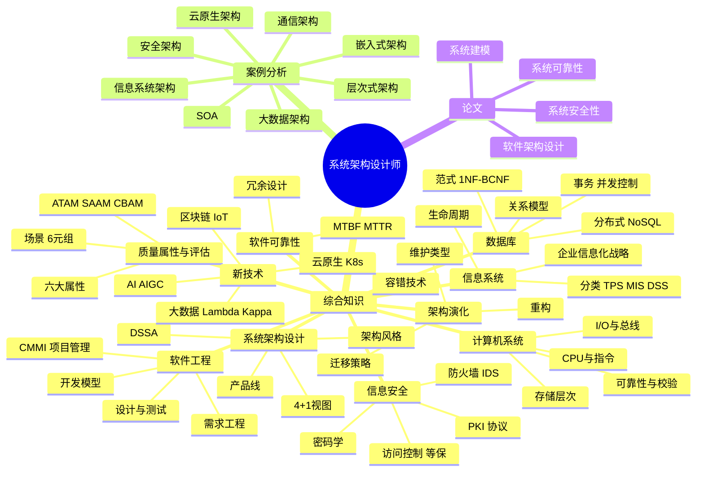
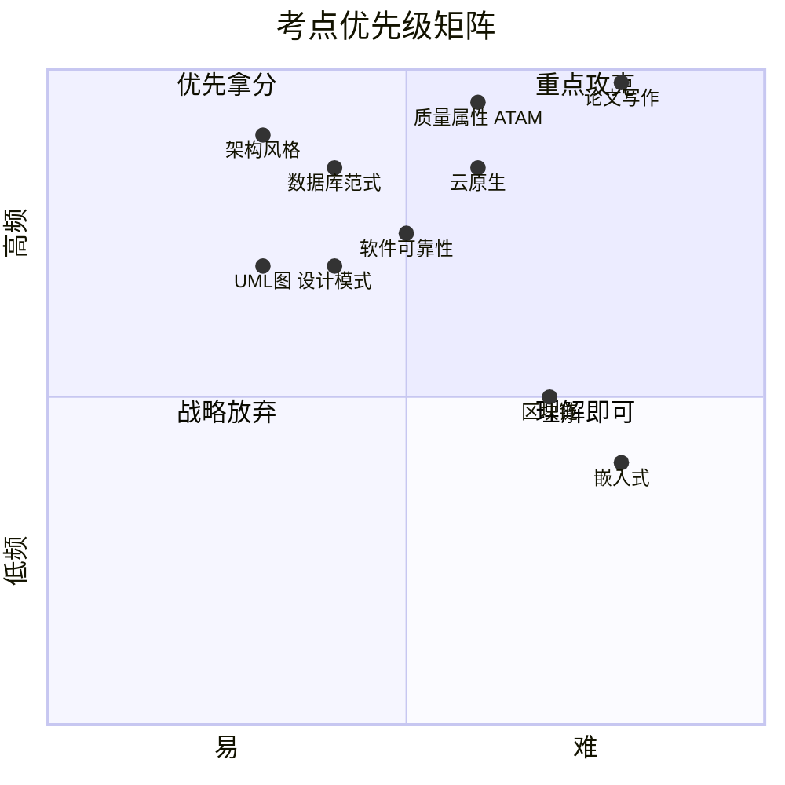

# 系统架构设计师 · 整体知识地图

## 备考优先级矩阵

<!--
  维护提示：quadrantChart 的坐标严格保持在 (0, 1) 开区间。
  GitHub 当前的 Mermaid 渲染器在遇到边界值 1.0 时会抛
  `Lexical error ... Unrecognized text`（见 issue #7 截图），
  修改数据点时请勿把任一分量写成 0 或 1，最靠边取 0.02 / 0.98。
-->

