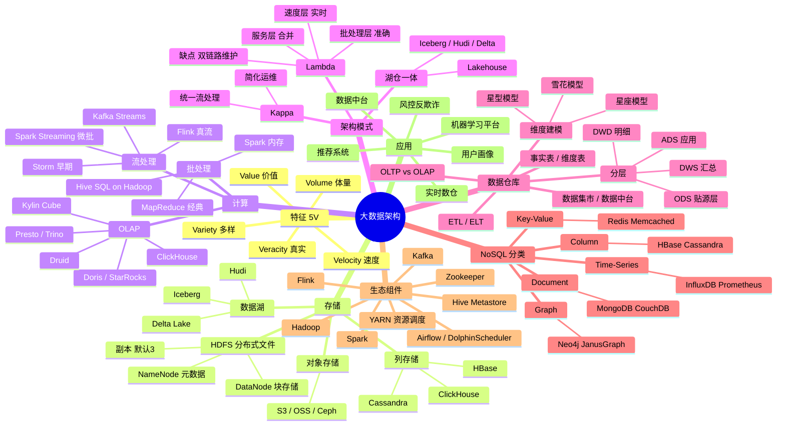
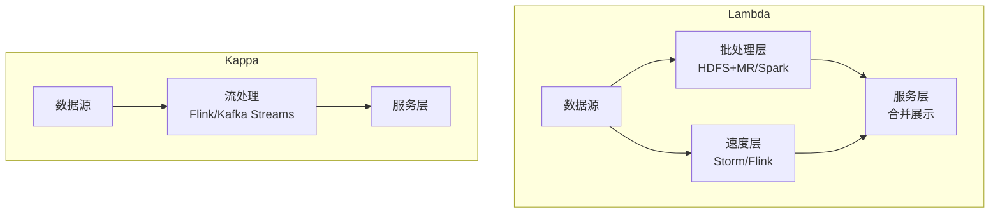
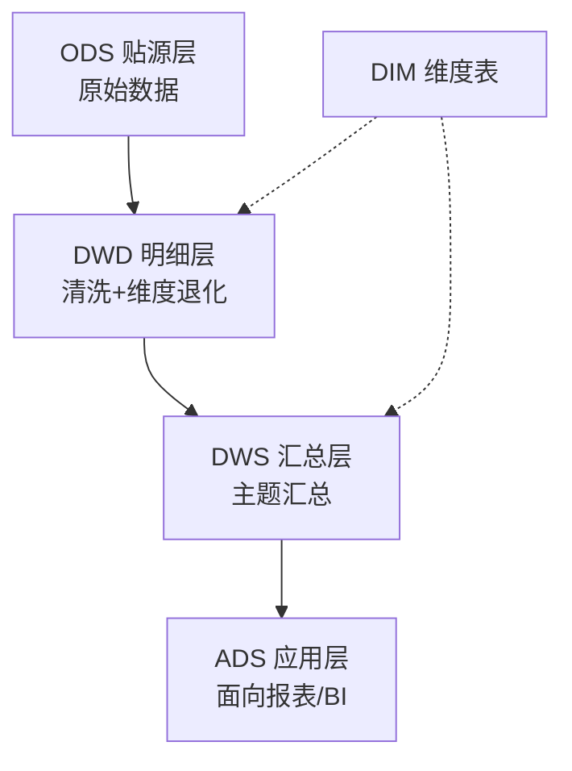
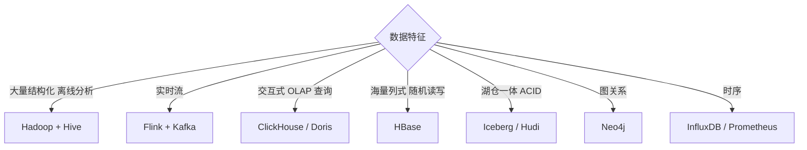

# 大数据架构脑图

## Lambda vs Kappa 对比

| 维度 | Lambda | Kappa |
|---|---|---|
| 复杂度 | 高（双链路） | 低（单链路） |
| 准确性 | 高（批层兜底） | 依赖流处理稳定性 |
| 运维成本 | 高 | 低 |
| 历史回溯 | 自然支持 | 通过重放 Kafka 实现 |
| 适用 | 已有批处理积累 | 新建系统 / 实时要求高 |

## 数仓分层

## 选型决策

## 速记口诀

- **5V**：体量 / 速度 / 多样 / 真实 / 价值
- **HDFS 三件套**：NameNode（元数据）/ DataNode（块）/ 副本数 3
- **Lambda 双链路、Kappa 单流**
- **数仓四层**：ODS → DWD → DWS → ADS
- **NoSQL 4 类**：KV / Doc / Col / Graph
