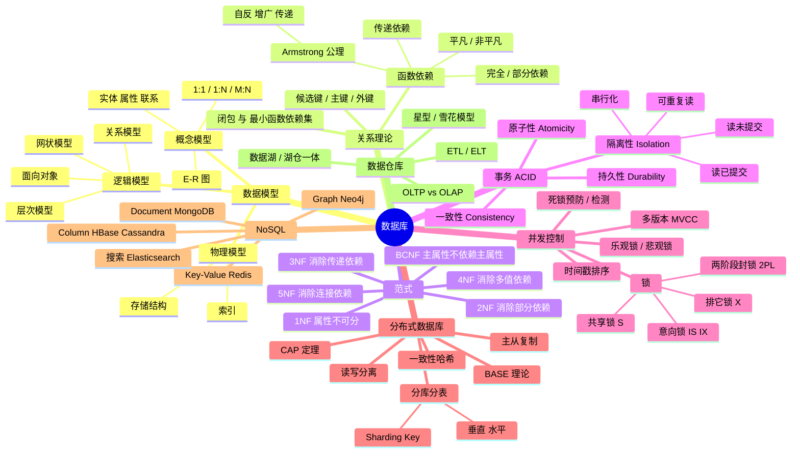
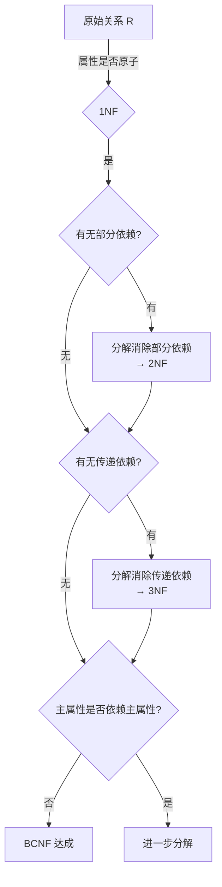
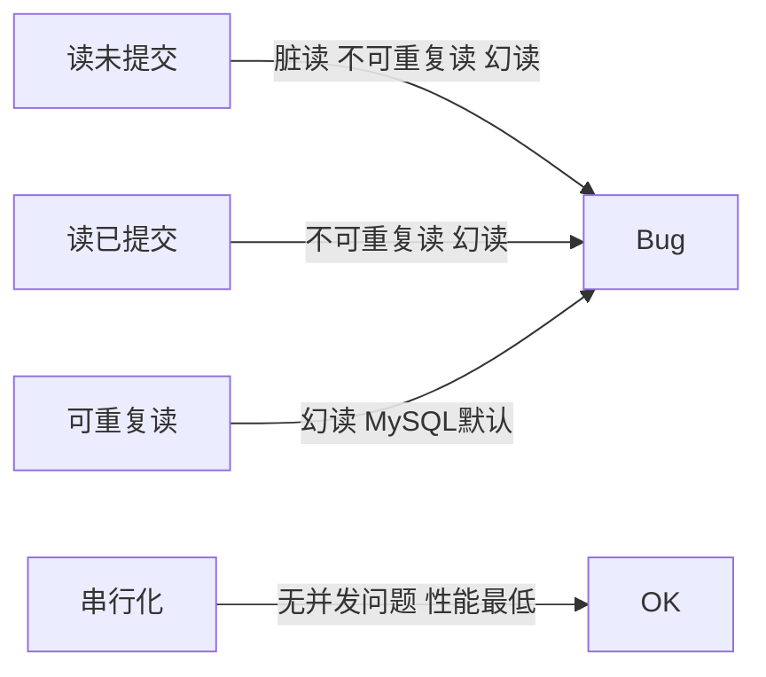
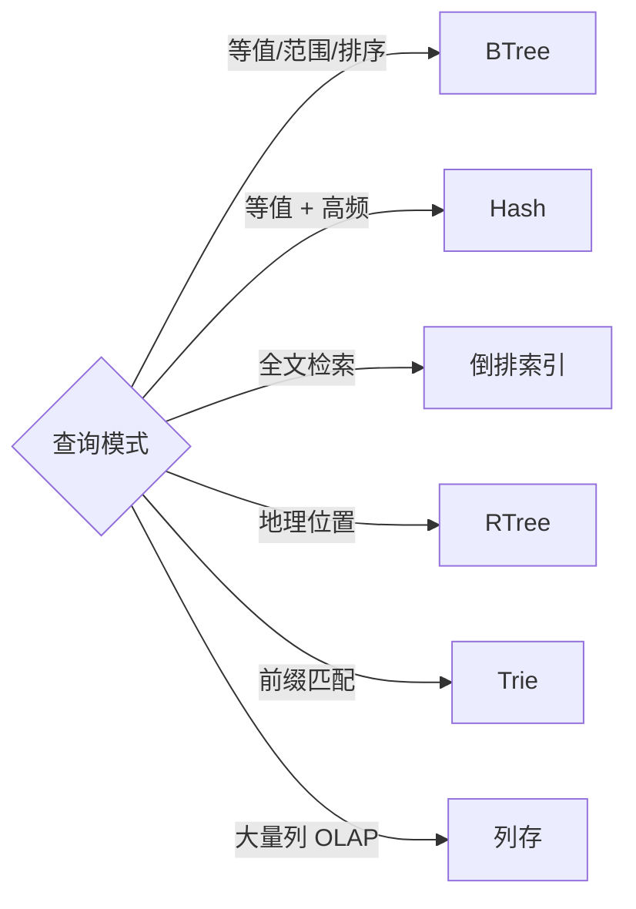

# 数据库脑图

## 范式分解决策树

## 隔离级别 vs 并发问题

## 索引选型

## 速记口诀

- 范式：**1NF 原子 · 2NF 全依赖 · 3NF 非传递 · BCNF 主属性纯洁**
- 锁兼容：**S-S 兼容、S-X / X-X 互斥**
- 隔离 4 级：**读未 → 读已 → 可重复 → 串行**（MySQL InnoDB 默认可重复读）
- ACID 与 BASE：强一致 → 最终一致
