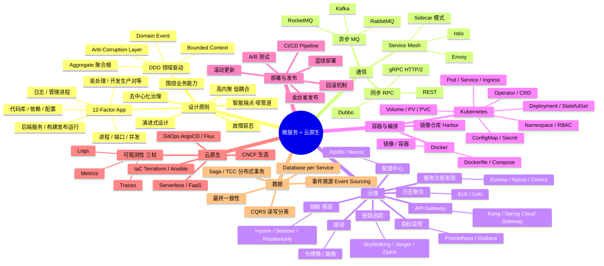
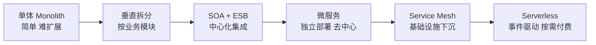
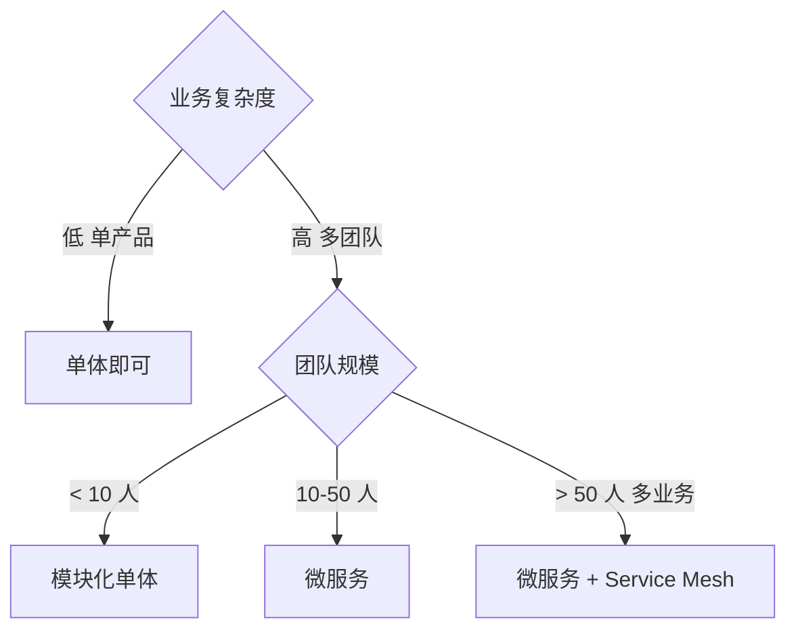
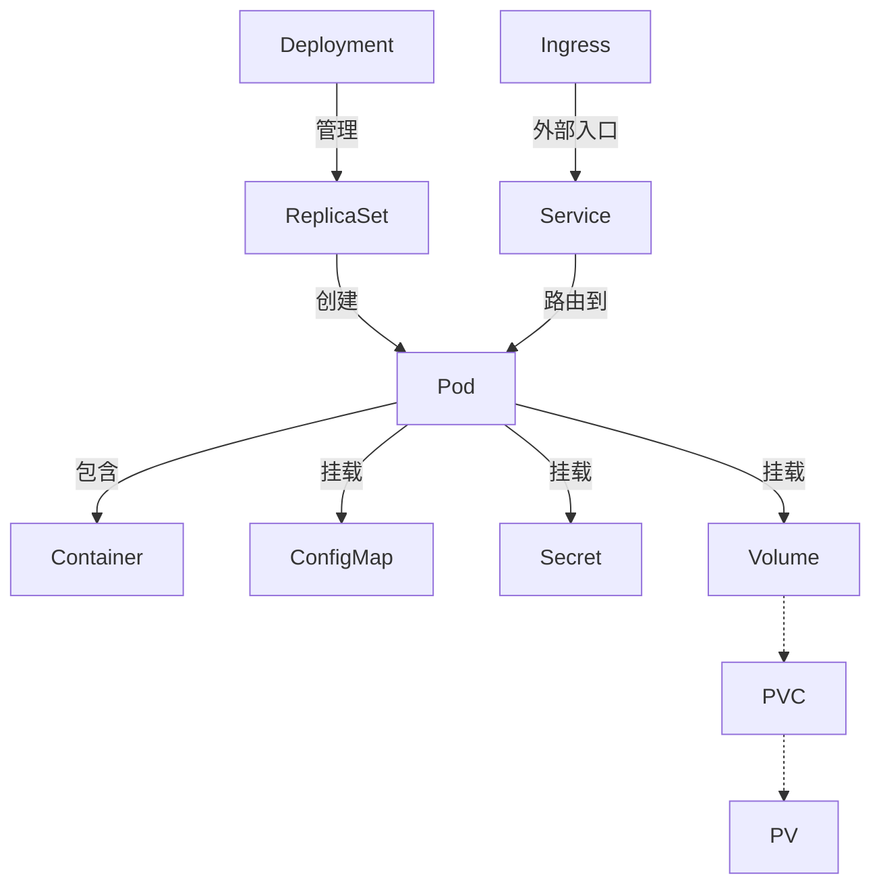

# 微服务与云原生脑图

## 单体 → SOA → 微服务演进

## 何时选微服务

## K8s 核心对象关系

## 速记口诀

- **DDD 四要素**：限界上下文 / 聚合根 / 领域事件 / 防腐层
- **12-Factor**：12 条戒律记不全没事，**配置外化 / 无状态 / 日志即流**这三条最关键
- **微服务通信**：同步用 gRPC，异步用 Kafka，治理用 Service Mesh
- **可观测三柱**：Metrics（聚合指标）/ Logs（事件流水）/ Traces（请求链路）
