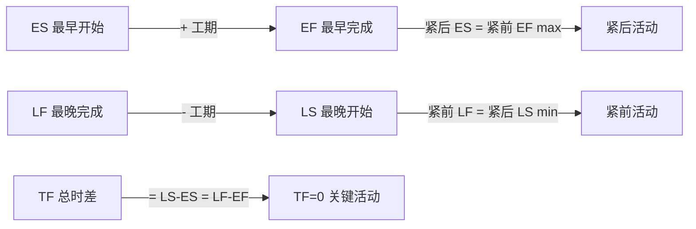
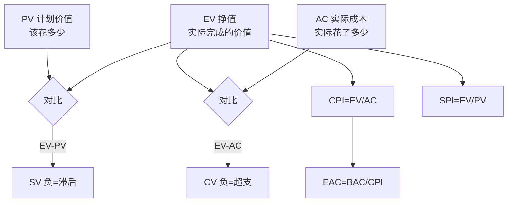
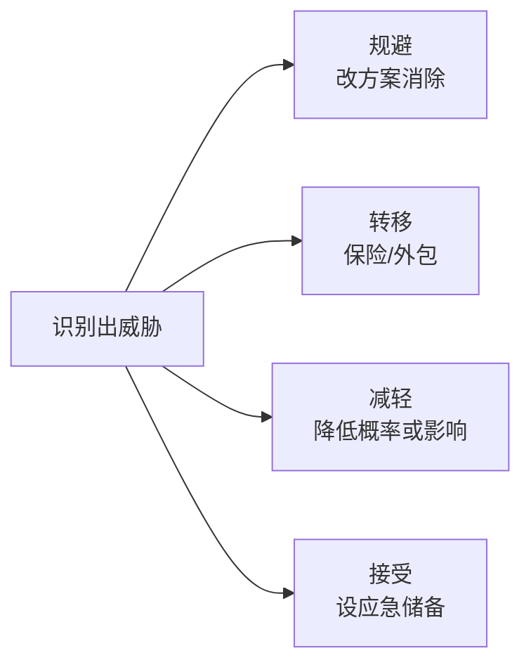

# 项目管理脑图（PMBOK）

```mermaid
mindmap
  root((项目管理))
    5 大过程组
      启动 Initiating
        立项 章程
      规划 Planning
        WBS / 计划制定
      执行 Executing
        团队建设
        采购
      监控 Monitoring
        EVM 挣值
        变更控制
      收尾 Closing
        经验教训
    10 大知识域
      整合管理
        项目章程
        变更控制
      范围管理
        WBS / 范围蔓延控制
      进度管理
        CPM / PERT
        关键路径
      成本管理
        EVM / 预算
      质量管理
        QA 过程 / QC 产品
      资源管理
        团队建设
        Tuckman 5 阶段
      沟通管理
        交互式 / 推 / 拉
        渠道数 n(n-1)/2
      风险管理
        识别 / 定性 / 定量
        应对 4 策略
      采购管理
        合同类型
      相关方管理
        Power-Interest 矩阵
    进度计算
      CPM 关键路径
        ES EF LS LF
        TF=LS-ES
        FF<=TF
        TF=0 关键活动
      PERT 三点估算
        te=(O+4M+P)/6
        sigma=(P-O)/6
        正态分布 68 95 99.7
      工期压缩
        赶工 Crashing 加成本
        快速跟进 Fast Tracking 加风险
    成本管理 EVM
      三基础值
        PV 计划价值
        EV 挣值
        AC 实际成本
      偏差
        CV=EV-AC 负超支
        SV=EV-PV 负滞后
      指数
        CPI=EV/AC
        SPI=EV/PV
      预测
        EAC=BAC/CPI
        ETC=EAC-AC
        VAC=BAC-EAC
    风险管理
      过程
        识别 -> 定性 -> 定量 -> 应对 -> 监控
      消极风险
        规避 Avoid
        转移 Transfer
        减轻 Mitigate
        接受 Accept
      积极风险
        开拓 / 分享 / 提高 / 接受
    人力资源
      Tuckman 5 阶段
        形成 Forming
        震荡 Storming
        规范 Norming
        执行 Performing
        解散 Adjourning
      激励理论
        马斯洛 5 层
        赫兹伯格 双因素
        X-Y 理论
        期望理论
      冲突管理 5 法
        撤退 / 缓解 / 妥协
        强迫 / 解决问题 推荐
    配置管理
      基线 Baseline
      变更控制 CCB
      配置审计
      版本管理
    采购合同
      固定总价 FFP
        风险在卖方
      成本补偿 CPFF
        风险在买方
      工料合同 T&M
        中间形态
```

## CPM 节点参数计算



## EVM 速记图



## 风险应对四策略



## 速记口诀

- **5 过程组**：启 → 规 → 执 → 监 → 收
- **10 知识域**：整范进成质资沟风采相（口诀"整饭进城，制资沟风采想"）
- **EVM 三基础**：PV/EV/AC ——计划/挣得/花费
- **PERT te=(O+4M+P)/6, σ=(P-O)/6**
- **TF=0 必关键，多条关键路径常见**
- **威胁四策略**：避 / 转 / 减 / 接
