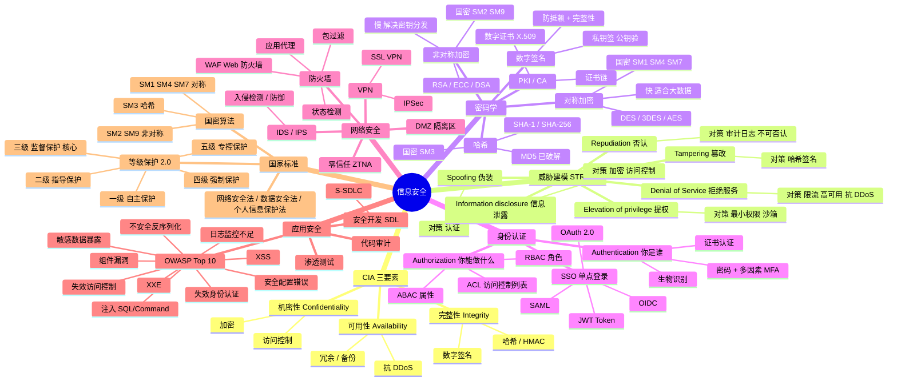
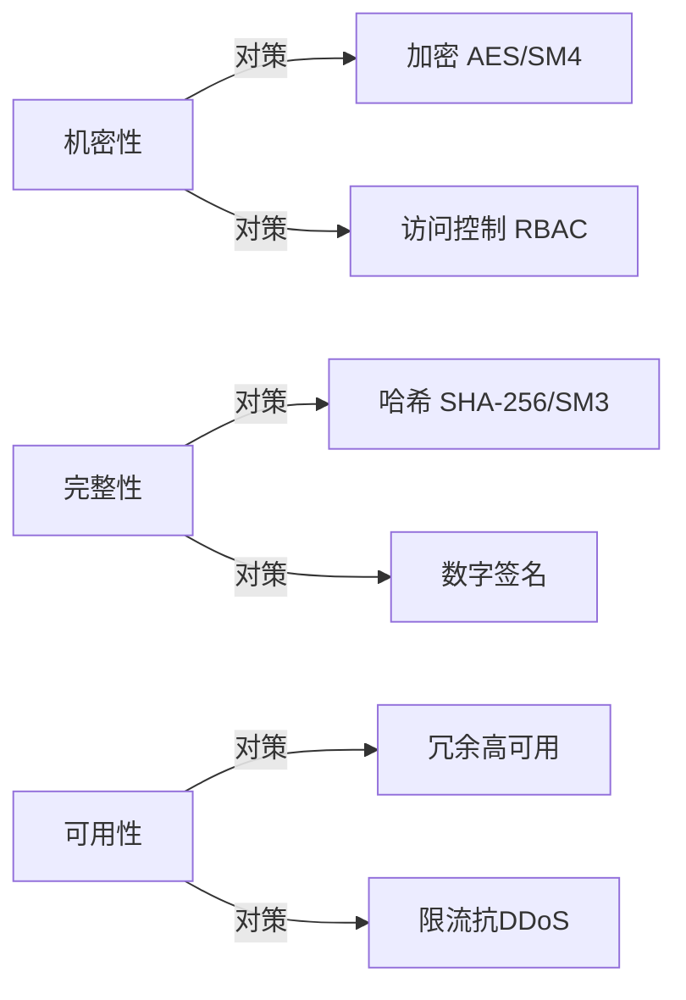
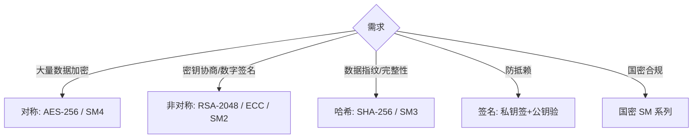

# 信息安全脑图



## CIA 与对策矩阵



## STRIDE 速查

| 威胁 | 含义 | 对策 |
|---|---|---|
| **S**poofing | 伪装身份 | 强认证 + MFA |
| **T**ampering | 数据篡改 | 哈希 + 签名 |
| **R**epudiation | 否认操作 | 审计日志 + 不可否认签名 |
| **I**nfo disclosure | 信息泄露 | 加密 + 访问控制 |
| **D**oS | 拒绝服务 | 限流 + 高可用 + WAF |
| **E**lev of privilege | 提权 | 最小权限 + 沙箱 |

## 加密算法选型



## 等保 2.0 五级

```
一级 自主 → 二级 指导 → 三级 监督（互联网企业核心系统主流） → 四级 强制 → 五级 专控
```

## 速记口诀

- **CIA**：机密 / 完整 / 可用——一切安全设计的初心
- **STRIDE**：伪 / 篡 / 抵 / 泄 / 拒 / 提——威胁建模的标准锤
- **国密**：**SM2 非对称 / SM3 哈希 / SM4 对称**——这三个最常考
- **AuthN ≠ AuthZ**：认证（你是谁）≠ 授权（你能做什么）
