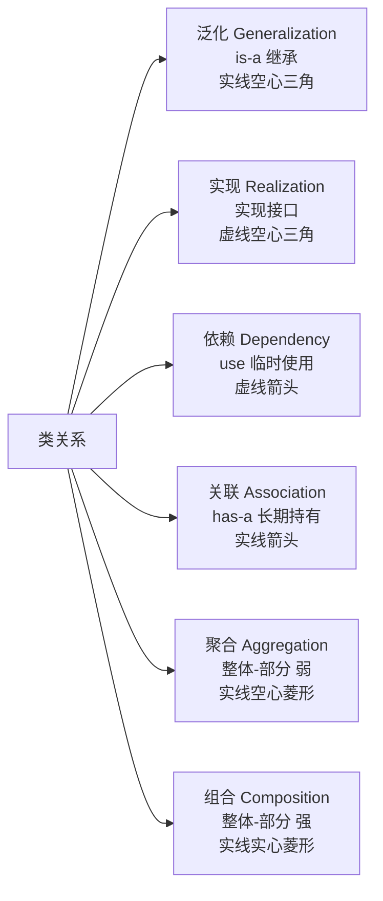
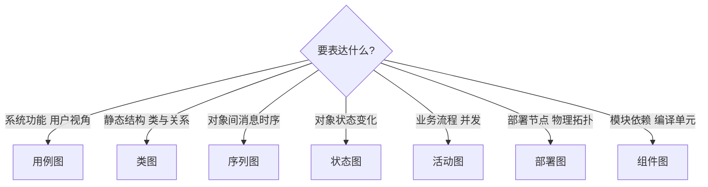
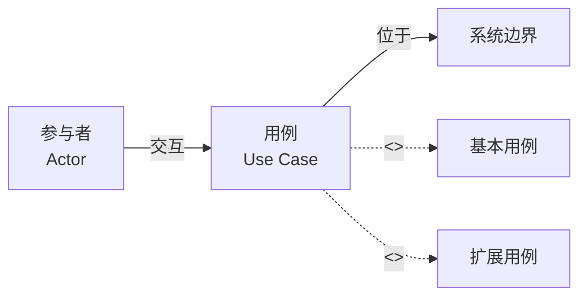

# UML 脑图（14 种图 + 关系）

```mermaid
mindmap
  root((UML 2.x))
    结构图 7
      类图 Class
        类 属性 操作
        关系 6种
      对象图 Object
      包图 Package
      组件图 Component
      部署图 Deployment
      组合结构图 Composite
      制品图 Artifact
    行为图 7
      用例图 Use Case
        参与者 用例 系统边界
      活动图 Activity
        泳道 决策 并发
      状态图 State
        状态 转换 触发
      序列图 Sequence
        生命线 消息 激活
      通信图 Communication
        Collaboration
      时序图 Timing
      交互概览图
    交互图 4子类
      序列 通信 时序 交互概览
```



## 类关系六种（必记）



## 类关系强弱排序

```
依赖 < 关联 < 聚合 < 组合 < 泛化 / 实现
（耦合从弱到强）
```

## 何时选哪种图



## 用例图三要素



## 序列图 vs 活动图选择

| 想表达 | 选 |
|---|---|
| **对象间消息时序**（谁调用谁、什么顺序） | 序列图 |
| **流程/工作流**（决策、并发、分支） | 活动图 |
| **单个对象的生命周期** | 状态图 |
| **同一时刻多对象交互结构** | 通信图 |

## 速记口诀

- **结构 7 类**：类 / 对象 / 包 / 组件 / 部署 / 组合 / 制品
- **行为 7 图**：用例 / 活动 / 状态 / 序列 / 通信 / 时序 / 交互概览
- **6 种关系**：依赖 / 关联 / 聚合 / 组合 / 泛化 / 实现
- 聚合 vs 组合：**聚合可分离（部门-员工）、组合同生死（人-心脏）**
