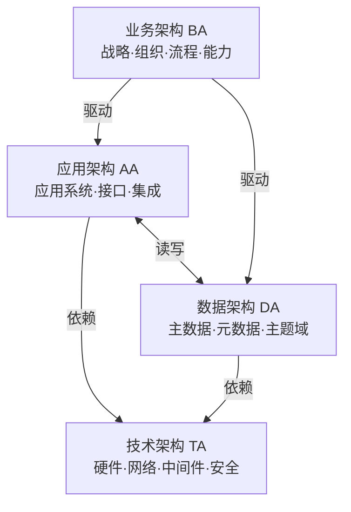
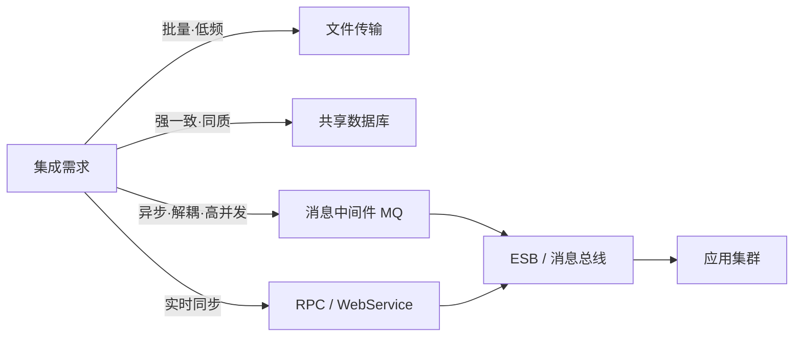
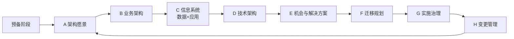

# 11 · 案例：信息系统架构（教材第 12 章）

> 案例分析高频考点之一。本章笔记覆盖：场景识别 → 核心知识点 → 典型架构图 → 高频考点速查 → 关联题索引 → 易错点。
> 教材参考：《系统架构设计师教程（第 2 版）》第 12 章「信息系统架构设计理论与实践」。

## 1. 场景识别（怎么从题干判断这是本章题）

### 关键词信号

- **业务关键词**：企业信息化、ERP / CRM / SCM / OA / MES、集团多组织、流程再造（BPR）、主数据治理（MDM）、企业架构（EA）、数字化转型。
- **技术关键词**：四视图、TOGAF / ADM、Zachman、FEA、EAI、SOA、ESB、共享数据库、文件传输、消息中间件、RPC / Web Service、数据中台。
- **数据特征**：跨多系统、跨多部门数据共享；异构数据源（Oracle + MySQL + 文件）需要整合；要求"统一身份 / 统一门户 / 统一数据"。

### 典型业务背景

1. 集团企业整合下属 N 家子公司的财务、HR、供应链系统，建设"一体化"平台。
2. 政府委办局打通"数据孤岛"，建设政务数据共享交换平台。
3. 制造企业落地 ERP + MES + WMS + PLM 集成，要求订单到生产到出库可追溯。
4. 银行核心系统改造，前置 / 渠道 / 总线 / 核心 / 后台分层重构。
5. 医院 HIS / LIS / PACS / EMR 异构集成，统一患者主索引（EMPI）。

## 2. 核心知识点

### 2.1 概念定义

**信息系统（IS）** 是由计算机硬件、软件、网络、数据、人员和过程组成的、面向组织业务目标的人机系统。**企业架构（EA）** 是从战略到执行、从业务到技术的端到端蓝图，用于指导信息系统建设。

### 2.2 主要分类 / 分层（四视图）

| 视图 | 关注点 | 核心制品 |
|---|---|---|
| 业务架构 BA | 业务战略、组织、流程、能力 | 业务能力图、价值链、流程图 |
| 应用架构 AA | 应用系统划分、应用间关系 | 应用全景图、应用集成图 |
| 数据架构 DA | 主数据、元数据、数据流 | 主题域模型、ER 图、数据流图 |
| 技术架构 TA | 软硬件平台、网络、中间件 | 部署图、网络拓扑、技术栈 |

主流方法论：**TOGAF**（含 ADM 8 阶段：架构愿景→业务→信息系统（数据+应用）→技术→机会与解决方案→迁移规划→实施治理→变更管理）；**Zachman**（6×6 矩阵）；**FEA**（联邦企业架构，5 参考模型）；**DoDAF**（国防部架构框架）。

### 2.3 关键技术特征（EAI 集成模式）

| 集成方式 | 耦合度 | 适用场景 | 典型问题 |
|---|---|---|---|
| 文件传输 | 低 | 批量、低频、异构平台 | 时效差、并发难、缺乏事务 |
| 共享数据库 | 高 | 同质系统、强一致性 | 强耦合、难演进、表结构入侵 |
| 远程过程调用（RPC / Web Service） | 中 | 实时调用、同步交互 | 紧耦合、可用性级联 |
| 消息传递（MQ） | 低 | 异步、高吞吐、解耦 | 顺序保证、幂等、重试 |

集成层次：**数据级集成 → 应用级集成（API）→ 业务流程集成（BPM）→ 门户级集成（统一界面）**。

### 2.4 与相关概念的边界

- **EA vs 系统架构**：EA 是组织级蓝图（多系统）；系统架构是单系统设计。
- **EAI vs SOA**：EAI 是集成方法论（含点对点、Hub-Spoke、ESB）；SOA 是面向服务的体系结构思想，是 EAI 的演进。
- **数据中台 vs 数据仓库**：中台强调能力共享和敏捷复用；数仓强调主题集成和历史分析。

## 3. 典型架构图 / 流程图

### 3.1 企业架构四视图关系图

### 3.2 EAI 集成模式选型决策图

### 3.3 TOGAF ADM 循环

## 4. 高频考点速查表

| 考点 | 典型问法 | 关键答案要点 |
|---|---|---|
| 四视图区分 | "请画出业务/应用/数据/技术架构图" | 业务=流程价值链，应用=系统盒子+接口，数据=主题域+ER，技术=部署+中间件 |
| TOGAF ADM | "采用何种方法论指导架构设计" | 8 阶段循环，从愿景到治理，强调可裁剪 |
| EAI 选型 | "为什么选 MQ 不选共享数据库" | 解耦、异步、削峰、容灾，避免数据库耦合演进 |
| 共享数据库陷阱 | "评价共享数据库集成方式" | 短期快、长期债，破坏封装、阻碍演进 |
| 文件传输适用 | "夜间批量对账用何方式" | 文件传输+CDC，离线处理时效要求低 |
| ESB 职责 | "ESB 在 SOA 中作用" | 路由、协议转换、消息变换、编排、监控 |
| 主数据 MDM | "如何避免一物多码" | MDM 平台统一编码、清洗、分发、治理 |
| 集成层次 | "门户/流程/应用/数据级集成区别" | 由表及里：UI 集成→流程编排→API→数据交换 |
| 同步异步选择 | "用户下单触发库存扣减" | 强一致用同步 RPC + TCC；最终一致用消息 |
| 数据一致性 | "跨系统如何保证一致" | 分布式事务（TCC/Saga/2PC）或最终一致+对账 |
| BFF / 网关 | "前后端分离下如何聚合多服务" | BFF 聚合 + API Gateway 统一入口 |
| 治理体系 | "建设后如何持续运营" | 标准、组织、流程、平台、度量五位一体 |

## 5. 关联题（双向索引）

- **案例题**：→ `past-papers/case-types/02-database-design.md`（含数据架构落地）；`past-papers/case-types/03-style-comparison.md`（架构风格对比）。
- **论文题**：→ `past-papers/paper-topics/01-architecture-design.md`；`past-papers/paper-topics/11-enterprise-integration.md`（企业集成专题）。
- **选择题**：→ `exam-bank/10-architecture-styles.md`（架构风格）；`exam-bank/06-ip-and-standards.md`（标准与法规）。
- **范文参考**：→ `past-papers/paper-samples/01-architecture-design.md`。

## 6. 易错点 + 反套路

### 6.1 概念混淆

- ❌ 把 EA 等同于 IT 架构 → ✅ EA 包含业务架构，IT 只是其中一部分。
- ❌ 把 SOA 当成 ESB 的代名词 → ✅ ESB 是 SOA 的实现技术之一，不是必选。
- ❌ 把数据集成等同于数据库共享 → ✅ 数据集成包括 ETL、CDC、消息、API、文件等多种手段。
- ❌ 认为 TOGAF 必须严格 8 阶段全做 → ✅ ADM 强调可裁剪，按企业成熟度选择阶段。
- ❌ 把"中台"理解为大数据平台 → ✅ 中台 = 业务+数据+技术能力的共享层，不只是数据。

### 6.2 答题陷阱

- ❌ 题干说"实时大屏"还选文件传输 → ✅ 实时性高场景必须 MQ / 流式 / 推送。
- ❌ 一律用 ESB 解决所有集成 → ✅ 互联网风格更倾向去中心化（API 网关 + 服务注册）。
- ❌ 写应用架构图时画了部署图 → ✅ 应用架构画应用盒子+接口，部署属于技术架构。
- ❌ 共享数据库当"集成银弹" → ✅ 必须指出耦合、演进、安全三大代价。

### 6.3 高分句模板

- "在【跨子公司、异构系统、强一致性要求高】的场景下，应优先考虑【ESB + 消息中间件】组合，因为【ESB 提供协议转换与编排，MQ 提供异步解耦与削峰】，可将系统耦合度从 O(N²) 降低到 O(N)。"
- "采用 TOGAF ADM 方法论指导，从【架构愿景】出发，依次输出【业务、数据、应用、技术】四视图，并通过【机会分析→迁移规划→实施治理】保证落地闭环。"
- "对于【夜间批量对账】采用文件传输；对于【实时下单扣库存】采用 TCC 同步；对于【订单状态广播】采用消息异步——按时效性和一致性匹配模式。"

### 6.4 速记口诀

> "**业应数技**四视图，**TOGAF** 八阶段循环；**文件、共库、调用、消息**四集成，**门户、流程、应用、数据**四层次；**EAI** 解决孤岛，**MDM** 解决一物多码，**ESB** 解决 N² 耦合。"

## 7. 答题模板（补充资料）

### 7.1 业务架构图绘制清单

绘制业务架构图必须覆盖：

1. **价值链**：从原材料到客户的端到端业务环节。
2. **业务能力地图**：核心能力 / 共享能力 / 支撑能力分层。
3. **业务流程**：跨部门关键流程（订单到现金 OTC、采购到付款 PTP、招到退 HTR）。
4. **组织映射**：业务能力对应到部门 / 角色，揭示责任主体。

### 7.2 应用架构图绘制清单

应用架构图核心要素：

1. **应用清单**：列出全部应用系统及版本，标注自研 / 商采 / 外包。
2. **应用关系**：调用、订阅、复制、读写关系标注协议（HTTP / SOAP / 文件 / DB）。
3. **应用域划分**：核心域 / 通用域 / 支撑域，体现领域驱动设计。
4. **复用与冗余**：揭示一物多码、功能重叠，作为优化抓手。

### 7.3 数据架构图绘制清单

数据架构图核心要素：

1. **主题域模型**：客户、产品、订单、账务等主题域划分。
2. **主数据**：识别主数据域（客户主数据、产品主数据、组织主数据），制定 MDM 策略。
3. **数据流图**：从源系统到分析平台的数据流转，含 ETL 关键节点。
4. **数据标准**：编码规则、命名规范、字典值。

### 7.4 技术架构图绘制清单

技术架构图核心要素：

1. **部署拓扑**：DMZ / 应用区 / 数据区分区，含负载均衡、防火墙位置。
2. **中间件**：应用服务器、消息中间件、缓存、API 网关。
3. **基础设施**：服务器 / 虚拟化 / 容器 / 云资源池。
4. **网络与安全**：VLAN / 专线 / VPN / 等保边界。

### 7.5 EAI 集成成熟度模型

| 阶段 | 特征 | 痛点 |
|---|---|---|
| 1. 点对点 | 系统两两接口，无中介 | N² 复杂度，维护爆炸 |
| 2. 中心化 Hub | 引入消息总线 / EAI Hub | 单点风险 |
| 3. ESB | 含路由/变换/编排能力 | 集中治理但仍重 |
| 4. 微服务+API | 去中心化、自治服务 | 治理分散需要工具支撑 |
| 5. 中台+API 经济 | 能力共享、对外开放 | 组织变革、数据治理压力大 |

### 7.6 中台战略要点

数据中台 + 业务中台 + 技术中台三层：

- **业务中台**：抽取通用业务能力（用户、商品、订单、支付）作为共享服务。
- **数据中台**：OneID / OneModel / OneService 三横，构建可复用数据资产。
- **技术中台**：统一基础设施（容器云、DevOps、监控、安全），降低边际成本。

