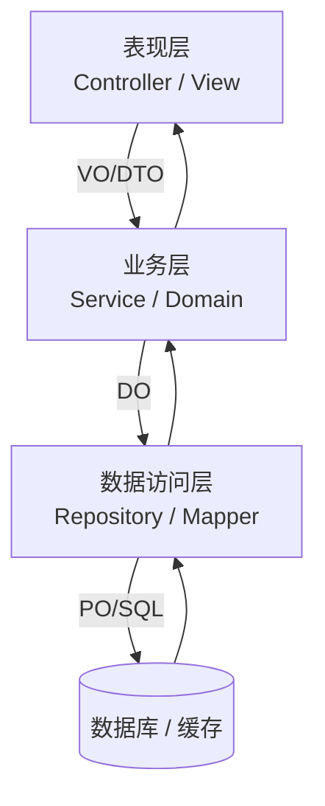
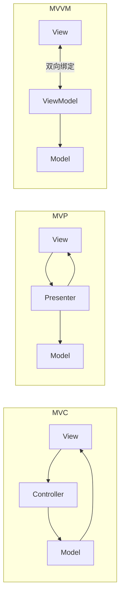
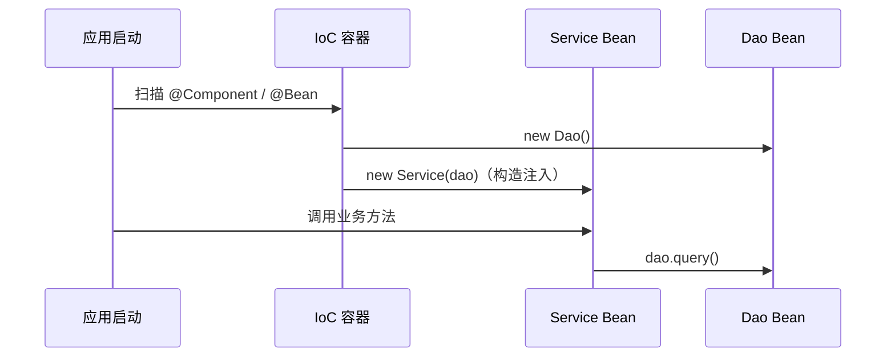
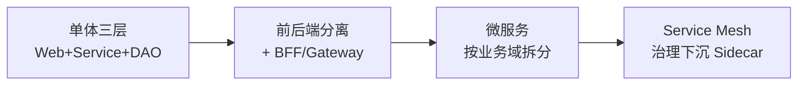

# 12 · 案例：层次式架构（教材第 13 章）

> 案例分析高频考点之一。本章笔记覆盖：场景识别 → 核心知识点 → 典型架构图 → 高频考点速查 → 关联题索引 → 易错点。
> 教材参考：《系统架构设计师教程（第 2 版）》第 13 章「层次式架构设计理论与实践」。

## 1. 场景识别（怎么从题干判断这是本章题）

### 关键词信号

- **业务关键词**：传统 Web 应用、企业级管理系统、Web 门户、内容管理（CMS）、OA、Intranet、Web 后台。
- **技术关键词**：表现层 / 业务层 / 数据层、MVC / MVP / MVVM、N 层架构、SSH / SSM / Spring Boot、JSP / Thymeleaf、BFF、关注点分离（SoC）、依赖倒置（DIP）、控制反转（IoC / DI）、面向接口编程。
- **数据特征**：数据从前端表单提交，经业务校验，落到关系型数据库；典型 CRUD 应用。

### 典型业务背景

1. 政府门户网站后台管理系统：Spring + Thymeleaf + MyBatis + MySQL。
2. 银行内部柜面系统：Java EE + Struts + EJB + Oracle，要求 N 层清晰隔离。
3. 移动 App 后端 BFF：聚合多个微服务，按设备类型定制响应。
4. 桌面 GUI 应用：WPF MVVM、Android MVVM（DataBinding+LiveData+ViewModel）。
5. CMS 内容平台：前端展现层、内容服务层、媒资数据层多级缓存。

## 2. 核心知识点

### 2.1 概念定义

**层次式架构（Layered Architecture）** 是按"职责相同的代码归一层、上层只调下层"的原则把系统纵向切片的架构风格。本质是 **关注点分离 + 单向依赖**——上层依赖下层接口，下层不感知上层。

### 2.2 主要分类 / 分层

**经典 N 层划分**：

| 层 | 职责 | 典型组件 |
|---|---|---|
| 表现层 Presentation | UI 渲染、用户交互、参数校验 | View、Controller、Filter |
| 业务逻辑层 Business / Service | 业务规则、流程编排、事务边界 | Service、DomainObject、Workflow |
| 数据访问层 DAO / Repository | 持久化、SQL、ORM 映射 | Mapper、Repository、JPA |
| 数据层 Data | 数据库、缓存、搜索引擎 | MySQL、Redis、ES |

**UI 模式三兄弟（MVC / MVP / MVVM）对比**：

| 模式 | 中介者 | View 与 Model 关系 | 测试性 | 典型场景 |
|---|---|---|---|---|
| MVC | Controller | View 直接读 Model | 中 | Web 后台（Spring MVC） |
| MVP | Presenter | View 不接触 Model | 高（View 接口可 mock） | Android 早期、桌面应用 |
| MVVM | ViewModel | 双向数据绑定 | 高 | WPF / Vue / Angular / Android Jetpack |

### 2.3 关键技术特征

- **关注点分离 SoC**：UI、业务、数据三类变化隔离，降低改动半径。
- **依赖倒置 DIP**：高层模块不应依赖低层模块，二者都应依赖抽象（接口）。
- **控制反转 IoC**：对象创建权交给容器（Spring IoC / Guice / Dagger），通过依赖注入 DI 解耦。
- **严格分层 vs 松散分层**：严格分层禁止跨层调用（必须 N→N-1）；松散分层允许 N→任意下层（如表现层直接读缓存）。
- **开闭原则 OCP**：层间通过接口契约扩展，避免修改既有层。

### 2.4 与相关概念的边界

- **N 层架构 vs 微服务**：N 层是纵向切片（同一进程内）；微服务是横向切片（按业务域拆进程）。
- **MVC vs 三层架构**：MVC 是表现层内部模式（C 是 Controller）；三层架构是整体分层。两者正交。
- **BFF vs API 网关**：BFF 按"前端体验"聚合裁剪服务；API 网关做协议、限流、鉴权统一入口。
- **DTO / VO / DO / PO**：分别是数据传输对象 / 视图对象 / 领域对象 / 持久化对象，跨层时做转换以避免污染。

## 3. 典型架构图 / 流程图

### 3.1 经典三层 + 视图边界（含 DTO 转换）

### 3.2 MVC vs MVP vs MVVM

### 3.3 IoC / DI 控制反转流程

## 4. 高频考点速查表

| 考点 | 典型问法 | 关键答案要点 |
|---|---|---|
| 分层目的 | "为什么要分层" | 关注点分离、可测试、可替换、可演进、并行开发 |
| MVC vs MVVM | "差异及选择理由" | MVC 单向、MVVM 双向绑定；MVVM 适合富客户端 |
| 严格分层 vs 松散 | "表现层能否直接读缓存" | 严格不行；松散允许但需评估侵入 |
| DIP 应用 | "为什么 Service 依赖接口而非实现" | 解耦实现、易 mock、易切换数据源 |
| 跨层对象转换 | "DTO/VO/DO/PO 区别" | 防止持久化对象污染上层；序列化字段可控 |
| 引入缓存的影响 | "Redis 加在哪一层" | 数据访问层包装；通过模板模式或 AOP 切入 |
| 引入 MQ 的影响 | "异步消息属于哪层" | 业务层发送，基础设施层实现；解耦上下游 |
| BFF 模式 | "前后端分离后表现层职责" | BFF 聚合多服务、按端定制；后端只暴露能力 |
| 性能开销 | "分层带来的代价" | 多次内存拷贝、跨层栈调用；可用零拷贝/合并优化 |
| 事务边界 | "事务放哪一层" | 业务层 Service（@Transactional），不放 DAO |
| 异常处理 | "异常如何穿层" | 下层抛业务异常，表现层统一翻译为响应码 |
| AOP 横切 | "日志、安全、事务怎么实现" | AOP 切面织入，避免污染各层 |

## 5. 关联题（双向索引）

- **案例题**：→ `past-papers/case-types/03-style-comparison.md`（架构风格对比含分层）；`past-papers/case-types/05-microservice-refactor.md`（单体三层→微服务演进）。
- **论文题**：→ `past-papers/paper-topics/01-architecture-design.md`；`past-papers/paper-topics/10-design-patterns.md`（含 MVC 类设计模式）。
- **选择题**：→ `exam-bank/10-architecture-styles.md`；`exam-bank/13-design-patterns.md`。
- **范文参考**：→ `past-papers/paper-samples/01-architecture-design.md`。

## 6. 易错点 + 反套路

### 6.1 概念混淆

- ❌ 把"三层架构"等同于"MVC" → ✅ 三层是整体结构，MVC 是表现层内部模式。
- ❌ 把 MVP 和 MVVM 混用 → ✅ MVP 靠 Presenter 调用 View 接口，MVVM 靠数据绑定。
- ❌ 把 IoC 和 DI 当同一概念 → ✅ IoC 是思想（控制反转），DI 是实现手段之一。
- ❌ 认为分层越多越好 → ✅ 每加一层增加调用与维护成本，按需分层。
- ❌ 跨层调用就是错的 → ✅ 松散分层允许，但要评估架构纪律和回归风险。

### 6.2 答题陷阱

- ❌ 画分层图把数据库放到业务层 → ✅ 数据库属于数据层，业务层只有逻辑。
- ❌ 把"前端"当作"表现层" → ✅ 前端是物理层（浏览器/App），表现层是逻辑分层。
- ❌ 认为 Spring 注解 = 控制反转 → ✅ 注解只是元数据，IoC 是容器接管对象生命周期。
- ❌ 在 DAO 层处理业务规则 → ✅ DAO 只做持久化，业务规则归 Service。

### 6.3 高分句模板

- "在【企业管理系统】下，应优先采用【经典三层 + Spring IoC】，因为【职责清晰、易并行开发、便于单元测试】，并用 DTO 防止持久化对象（PO）污染表现层。"
- "采用【MVVM + 双向绑定】可将视图状态变更与数据模型自动同步，相较 MVC 减少手写 Controller 代码 30% 以上，适合【富客户端 / 移动 App】场景。"
- "为应对【未来可能从 MyBatis 切换到 JPA】的演进风险，业务层依赖 Repository **接口**而非实现，遵循依赖倒置原则（DIP）。"

### 6.4 速记口诀

> "**表业数**三层切，**MVC** 控制流、**MVP** 接口隔、**MVVM** 双向贴；**关注点分离** 是魂，**依赖倒置** 是骨，**控制反转** 是肉；**DTO/VO/DO/PO** 跨层转换防污染。"

## 7. 答题模板（补充资料）

### 7.1 引入新组件后的分层调整（高频改造题）

| 引入组件 | 影响层 | 设计要点 |
|---|---|---|
| Redis 缓存 | 数据访问层 | Cache-Aside / Read-Through / Write-Through 三模式选择，需考虑缓存穿透/击穿/雪崩 |
| MQ 消息队列 | 业务层（生产者）+ 新增消费者层 | 业务层只发消息，消费者独立部署，注意幂等 |
| ES 全文搜索 | 数据访问层（双写或 CDC） | 关注一致性策略（同步双写 / Canal 异步同步） |
| 配置中心 | 横切（基础设施层） | 配置外置，支持动态刷新 |
| 网关 / BFF | 表现层之上新增聚合层 | 协议适配 + 字段裁剪 + 安全 + 限流 |

### 7.2 各模式适用场景对照

| 模式 | 最佳场景 | 不适合场景 |
|---|---|---|
| MVC | Web 后台、Controller 路由清晰场景 | 富交互、状态复杂的桌面 / 移动端 |
| MVP | 需要单测 View 行为的传统桌面 / Android | 简单 CRUD（过度设计） |
| MVVM | 数据驱动 UI、双向绑定（Vue / Angular / WPF / Jetpack Compose） | 性能敏感的高频更新场景（绑定开销） |
| 三层架构 | 企业级 CRUD 系统、信息化项目 | 高并发互联网产品（建议演进微服务） |
| BFF | 多端定制（Web / iOS / Android / 小程序） | 单一前端（不必要） |

### 7.3 高分点睛（评估视角）

回答"为什么分层"时，应从以下维度立体作答：

1. **可维护性**：变更局限在层内，降低改动半径。
2. **可测试性**：层间用接口契约，便于 mock 单测。
3. **可替换性**：底层数据库 / ORM 切换不波及业务层。
4. **可演进性**：从单体三层逐步抽出微服务，分层是基础。
5. **并行开发**：前后端、业务与持久化可并行。
6. **代价权衡**：跨层调用的内存拷贝与栈深度增加，需评估关键路径性能。

### 7.4 N 层架构演进路线

### 7.5 横切关注点（AOP）落地清单

下列横切关注点不应污染业务层，统一通过 AOP / 拦截器 / 中间件实现：

1. **日志**：请求 / 响应 / 异常日志，结合链路追踪 ID。
2. **事务**：@Transactional 切面，注意传播行为与隔离级别。
3. **安全**：鉴权（JWT / Session）、授权（RBAC / ABAC）。
4. **限流熔断**：Sentinel / Resilience4j 注解。
5. **缓存**：@Cacheable 等声明式缓存。
6. **审计**：操作日志、合规留痕。
7. **国际化**：i18n 资源装载。

> 这些能力本质都是**横切**——分布在多个层多个类中重复出现。AOP 用统一切面解决，避免散落到业务代码。

