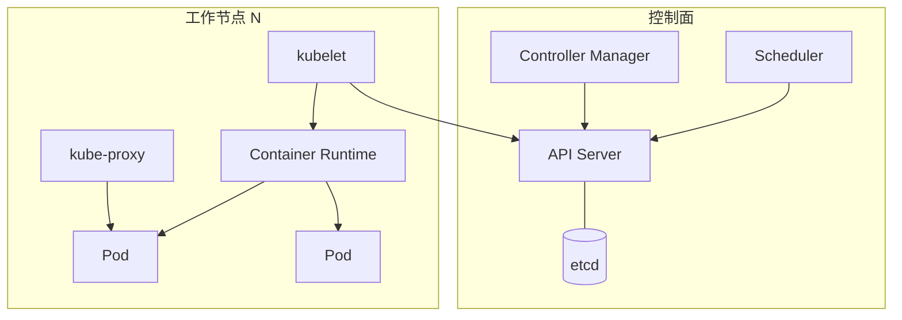
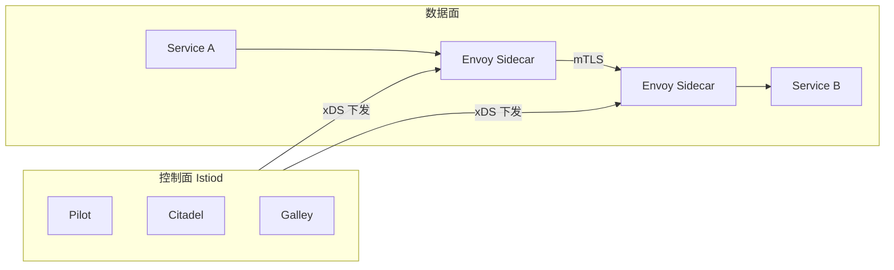
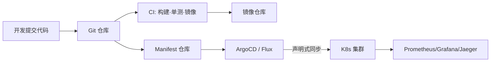

# 13 · 案例：云原生架构（教材第 14 章）— 🔥 近年高频

> 案例分析高频考点之一。本章笔记覆盖：场景识别 → 核心知识点 → 典型架构图 → 高频考点速查 → 关联题索引 → 易错点。
> 教材参考：《系统架构设计师教程（第 2 版）》第 14 章「云原生架构设计理论与实践」。

## 1. 场景识别（怎么从题干判断这是本章题）

### 关键词信号

- **业务关键词**：互联网高并发、双十一、秒杀、灰度发布、弹性扩缩容、降本增效、SaaS 多租户、Serverless / FaaS、AI 推理服务化。
- **技术关键词**：12-Factor、容器、Docker、Kubernetes / K8s、Pod、Deployment、Service、Ingress、Operator、CRD、Service Mesh、Istio、Envoy、Sidecar、Knative、CNCF、DevOps、CI/CD、GitOps（ArgoCD / Flux）、可观测性（Metrics + Logs + Traces）。
- **数据特征**：每秒万级 QPS、突发流量、按使用量付费、无状态优先、配置外置、不可变镜像。

### 典型业务背景

1. 电商平台从单体改造为微服务并上 K8s，支撑双十一弹性扩容 10 倍。
2. SaaS 公司多租户隔离 + 灰度发布 + 多区域部署。
3. 政务云：基于云原生改造存量信创系统，跨 IaaS 平台漂移。
4. 物联网：边缘 K3s + 中心 K8s 协同，函数计算处理设备消息。
5. AI 公司：模型推理用 Knative 按请求量自动从 0 弹起。

## 2. 核心知识点

### 2.1 概念定义

**云原生（Cloud Native）** 是面向云环境构建和运行可弹性扩展应用的方法论。CNCF 定义四要素：**容器化、微服务、动态编排、声明式 API**。强调"为云而生 / 用云的能力"，而非"把单体搬到云上"（Lift-and-Shift）。

### 2.2 主要分类 / 分层

**云原生四要素 + 4 大支柱（教材常考）**：

| 支柱 | 内容 | 代表技术 |
|---|---|---|
| 微服务 | 按业务域拆分独立部署单元 | Spring Cloud / Dubbo / gRPC |
| 容器 | 标准化打包和运行时 | Docker、containerd、CRI-O |
| DevOps | 持续集成 + 持续交付 + 自动化 | Jenkins / GitLab CI / ArgoCD |
| 持续交付 | 频繁、低风险、快速回滚 | 蓝绿、金丝雀、滚动 |

**12-Factor 应用十二要素（必背）**：

1. 基准代码（一份代码多份部署）2. 依赖（显式声明）3. 配置（存储于环境）4. 后端服务（视为附加资源）5. 构建/发布/运行（严格分离）6. 进程（无状态）7. 端口绑定（自包含）8. 并发（进程模型扩展）9. 易处理（快速启动优雅停止）10. 开发与生产等价 11. 日志（事件流）12. 管理进程（一次性任务）。

**K8s 核心对象**：

| 类别 | 对象 | 作用 |
|---|---|---|
| 工作负载 | Pod / Deployment / StatefulSet / DaemonSet / Job / CronJob | 调度的基本单位与控制器 |
| 服务发现 | Service（ClusterIP/NodePort/LoadBalancer）/ Ingress | 内外部流量入口 |
| 配置 | ConfigMap / Secret | 配置与敏感信息 |
| 存储 | PV / PVC / StorageClass | 持久卷管理 |
| 扩展 | CRD / Operator / HPA / VPA / Cluster Autoscaler | 自定义资源与伸缩 |

### 2.3 关键技术特征

- **不可变基础设施**：镜像构建一次到处运行，禁止登录改配置。
- **声明式 API**：用户描述"期望状态"，控制器持续 reconcile 到目标状态。
- **Service Mesh**：Sidecar 代理（Envoy）接管服务间通信，提供熔断、重试、mTLS、流量镜像、灰度。控制面（Istiod / Linkerd）下发配置。
- **Serverless / FaaS**：用户只交付函数代码，平台负责弹性、计费、运维（AWS Lambda、阿里 FC、Knative）。配套 BaaS（数据库、消息、对象存储等）。
- **可观测性三支柱**：Metrics（Prometheus）+ Logs（ELK / Loki）+ Traces（Jaeger / SkyWalking）。

### 2.4 与相关概念的边界

- **微服务 vs 云原生**：微服务是架构风格；云原生是工程方法论，微服务是其内核之一。
- **K8s 编排 vs Service Mesh**：K8s 解决"调度与生命周期"，Mesh 解决"服务间通信治理"，互补不互斥。
- **Serverless vs 容器**：Serverless 屏蔽实例概念，按调用计费；容器仍是实例视角。
- **DevOps vs SRE**：DevOps 强调流程文化；SRE 强调用工程方法保障可靠性，含 SLI/SLO/SLA、错误预算。

## 3. 典型架构图 / 流程图

### 3.1 K8s 集群核心组件

### 3.2 Service Mesh 数据面 / 控制面

### 3.3 CI/CD + GitOps 流水线

## 4. 高频考点速查表

| 考点 | 典型问法 | 关键答案要点 |
|---|---|---|
| 云原生四要素 | "云原生包含哪些内容" | 容器+微服务+DevOps+持续交付（CNCF 定义） |
| 12-Factor | "为什么强调无状态进程" | 易扩缩容、易替换、配合健康检查快速恢复 |
| K8s 调度单位 | "Pod 与容器关系" | Pod 是最小调度单位，含 1+ 容器共享网络/存储 |
| Deployment vs StatefulSet | "有状态服务怎么部署" | 有序启动+稳定网络标识+持久卷 |
| Service 类型 | "ClusterIP/NodePort/LoadBalancer 区别" | 集群内/节点端口/云负载均衡 |
| Ingress | "七层入口" | 域名+路径路由+TLS 终结，配合 Controller |
| HPA 弹性 | "扩容依据" | CPU/内存/自定义指标，注意冷启动与抖动 |
| Service Mesh 价值 | "为什么引入 Istio" | 治理下沉到 Sidecar，业务无感；mTLS、灰度 |
| Sidecar 代价 | "Mesh 缺点" | 资源开销、延迟增加、运维复杂度上升 |
| Serverless 适用 | "FaaS 优劣势" | 极致弹性按用付费；冷启动、有状态难、可移植差 |
| 灰度发布 | "如何做金丝雀" | Ingress / Mesh 按 Header / 比例切流 + 观测 |
| 可观测性 | "三大支柱" | Metrics/Logs/Traces，Prom+ELK+Jaeger |
| GitOps | "和传统 CD 区别" | 以 Git 为唯一真相源，声明式同步 |
| 多租户隔离 | "K8s 多租户方案" | Namespace+RBAC+NetworkPolicy+ResourceQuota |
| 服务发现 | "K8s 内置如何做" | CoreDNS + Service ClusterIP，Pod 通过域名访问 |

## 5. 关联题（双向索引）

- **案例题**：→ `past-papers/case-types/05-microservice-refactor.md`（单体改造微服务）；`past-papers/case-types/06-messaging-caching.md`（消息缓存治理）。
- **论文题**：→ `past-papers/paper-topics/05-microservice-cloud-native.md`；`past-papers/paper-topics/13-devops-serverless.md`。
- **选择题**：→ `exam-bank/15-microservice-cloud-native.md`；`exam-bank/10-architecture-styles.md`。
- **范文参考**：→ `past-papers/paper-samples/05-microservice-cloud-native.md`。

## 6. 易错点 + 反套路

### 6.1 概念混淆

- ❌ "上 K8s = 云原生" → ✅ K8s 只是手段，关键看是否符合 12-Factor、声明式、自治。
- ❌ "微服务 = 云原生" → ✅ 微服务是云原生四要素之一，云原生还需容器+DevOps+持续交付。
- ❌ Service Mesh 取代 K8s → ✅ Mesh 解决通信治理，K8s 解决编排，二者协同。
- ❌ Serverless 一定省钱 → ✅ 高频长时调用反而比常驻贵，要算总账。
- ❌ Sidecar 对业务零侵入零成本 → ✅ 资源、延迟、运维都有代价。

### 6.2 答题陷阱

- ❌ 画 K8s 架构忘了 etcd → ✅ etcd 是控制面"大脑"，必须画出。
- ❌ 把数据库塞进 Deployment → ✅ 有状态用 StatefulSet + PVC，或托管 RDS。
- ❌ 配置硬编码进镜像 → ✅ 12-Factor 第 3 条：配置存于环境/ConfigMap。
- ❌ 谈到弹性只说"自动扩容" → ✅ 还要说缩容、冷启动、就绪探针、PDB。

### 6.3 高分句模板

- "在【双十一弹性需求】场景下，应优先采用【K8s + HPA + Cluster Autoscaler】组合，因为【秒级弹性、按需付费、声明式可回滚】，并配合 Service Mesh 落地灰度发布与 mTLS 零信任。"
- "落地云原生需遵循【12-Factor】十二要素，重点是【无状态进程、配置外置、构建运行分离】，方能享受弹性与快速恢复红利。"
- "对于【低频突发的图片处理】采用 FaaS（按调用计费、自动 0→N），对于【常驻高并发交易】仍采用容器常驻部署——按调用模式选模型。"

### 6.4 速记口诀

> "**容微 D C**（容器·微服务·DevOps·持续交付）四要素；**12-Factor** 配置外置进程无态；**K8s** 控制面 API/etcd/Sched/CM，工作面 kubelet/kube-proxy/CRI；**Mesh** 数据面 Envoy 控制面 Istiod；**Serverless** = FaaS + BaaS。"

## 7. 答题模板（补充资料）

### 7.1 单体 → 微服务拆分策略

教材常考"如何拆分"——按以下顺序作答：

1. **按业务能力拆分**：识别业务能力地图，每个能力一个微服务（与康威定律团队结构对齐）。
2. **按 DDD 限界上下文拆分**：识别聚合根 + 限界上下文边界，避免跨上下文的强一致依赖。
3. **按变化频率拆分**：高频迭代独立、稳定共享独立。
4. **按非功能特性拆分**：高并发独立扩容、安全敏感单独防护。
5. **避免反模式**：不要按数据库表拆、不要按层拆（一个 service 搞定 CRUD 不叫微服务）。

### 7.2 服务治理工具栈速查

| 治理维度 | 工具示例 |
|---|---|
| 服务注册发现 | Nacos / Consul / Eureka / ZooKeeper |
| 配置中心 | Apollo / Nacos / Spring Cloud Config |
| API 网关 | Spring Cloud Gateway / Kong / APISIX / Higress |
| 熔断限流 | Sentinel / Hystrix / Resilience4j |
| 链路追踪 | SkyWalking / Jaeger / Zipkin / OpenTelemetry |
| 日志聚合 | ELK / Loki / EFK |
| 指标监控 | Prometheus + Grafana |
| 分布式事务 | Seata（AT/TCC/Saga/XA） |

### 7.3 K8s 部署清单关键字段

回答"K8s 上部署一个服务"时核心要素：

1. **Deployment**：副本数、滚动更新策略、Pod 模板。
2. **Service**：暴露方式（ClusterIP / NodePort / LoadBalancer），端口映射。
3. **Ingress**：域名、路径、TLS 证书、限流注解。
4. **ConfigMap / Secret**：配置外置，避免硬编码。
5. **HPA**：基于 CPU / 自定义指标自动伸缩。
6. **PDB**：Pod 中断预算，保证滚动期间最小可用副本。
7. **NetworkPolicy**：默认拒绝 + 白名单，零信任网络。
8. **Probe**：liveness（重启）/ readiness（流量切换）/ startup（启动期）三类探针。

### 7.4 灰度发布策略对照

| 策略 | 流量切换方式 | 回滚速度 | 适用 |
|---|---|---|---|
| 蓝绿 | 整体切换 | 秒级 | 强一致、不可灰度 |
| 金丝雀 | 按比例（1%→10%→50%→100%） | 中 | 验证生产负载 |
| A/B | 按用户特征（Header/Cookie） | 中 | 验证用户体验 |
| 滚动 | 逐 Pod 替换 | 较慢 | 默认 K8s 升级 |
| 影子 | 流量镜像（不影响响应） | 快 | 性能压测、对比验证 |

