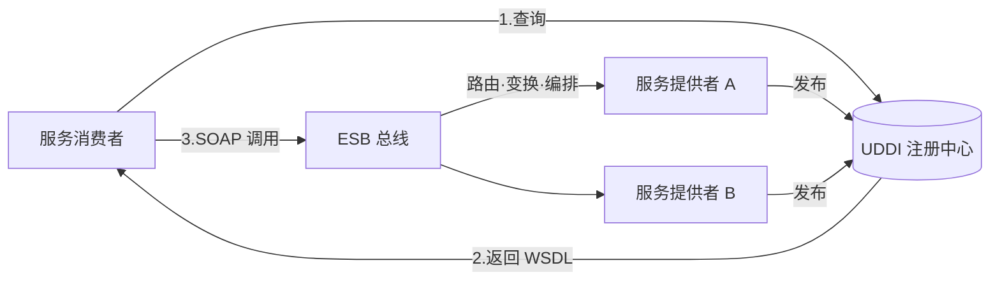
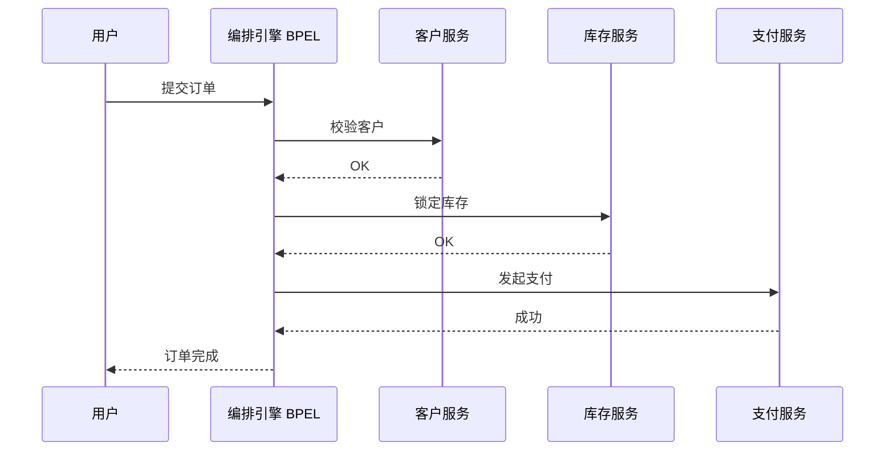
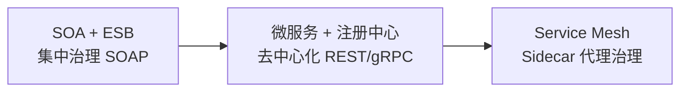

# 14 · 案例：面向服务架构 SOA（教材第 15 章）

> 案例分析高频考点之一。本章笔记覆盖：场景识别 → 核心知识点 → 典型架构图 → 高频考点速查 → 关联题索引 → 易错点。
> 教材参考：《系统架构设计师教程（第 2 版）》第 15 章「面向服务架构设计理论与实践」。

## 1. 场景识别（怎么从题干判断这是本章题）

### 关键词信号

- **业务关键词**：企业级集成、多系统协同、业务流程编排、跨部门跨组织接口、银行/电信/政务集成。
- **技术关键词**：Service、ESB、SOAP、WSDL、UDDI、WS-*（WS-Security、WS-Reliable Messaging、WS-Transaction、WS-Policy、BPEL）、XML、契约优先、服务注册、服务编排（Orchestration）/ 编制（Choreography）、服务粒度、契约版本。
- **数据特征**：异构系统对接（Java + .NET + 大型机）、多协议（HTTP/JMS/MQ）、消息以 XML 为主。

### 典型业务背景

1. 银行核心系统外围接入：网银 / 手机银行 / ATM / 第三方支付通过 ESB 总线访问核心账务服务。
2. 电信运营商 BOSS 系统集成 CRM / 计费 / 客服 / 渠道，按业务流程编排跨域调用。
3. 政务一网通办：跨委办局服务能力以契约对外发布，由 BPM 引擎编排为"一件事"流程。
4. 制造企业 ERP+MES+CRM 集成，公共服务（客户、订单、库存）通过 SOA 治理对外提供。
5. 旧系统现代化：把 EJB / 大型机程序封装为 Web Service 对外暴露，逐步替换。

## 2. 核心知识点

### 2.1 概念定义

**面向服务架构（SOA）** 是一种以"**服务**"为基本单元构建分布式系统的架构风格。服务具备 **自治、松耦合、可重用、契约化** 特征，通过标准化协议对外暴露能力，由 **服务消费者 / 服务提供者 / 服务注册中心** 三方组成调用闭环。

### 2.2 主要分类 / 分层

**SOA 七大特性（教材必考）**：

1. **服务可重用**：一次设计、多处使用。
2. **松耦合**：服务消费者不感知提供者的实现细节，仅依赖契约。
3. **明确定义的接口**：契约（WSDL）描述输入、输出、操作、绑定。
4. **无状态**：每次调用自包含，便于弹性。
5. **可发现**：通过注册中心（UDDI）查找。
6. **自治**：服务独立开发、部署、运行、演进。
7. **可组合**：通过编排或编制组合成更大的业务流程。

**SOA 参考体系结构（5 层）**：

| 层 | 内容 |
|---|---|
| 业务流程层 | BPEL 编排、BPMN 建模 |
| 服务层 | 业务服务、企业服务 |
| 服务组件层 | 实现服务的组件（EJB / Spring Bean） |
| 应用层 | 现有应用系统 |
| 资源层 | 数据库、消息、文件、遗留系统 |

### 2.3 关键技术特征

**WS-* 协议族**：

| 协议 | 角色 |
|---|---|
| **SOAP** | 基于 XML 的消息封装协议，含 Envelope/Header/Body |
| **WSDL** | 服务契约描述（操作、消息、绑定、端点） |
| **UDDI** | 服务注册与发现（黄页） |
| WS-Security | 消息级安全（签名、加密、令牌） |
| WS-ReliableMessaging | 可靠消息（至少一次、有序） |
| WS-AtomicTransaction | 分布式事务 |
| WS-Policy | 策略声明（QoS、安全） |
| **BPEL** | 业务流程编排语言 |

**ESB（企业服务总线）核心能力**：

- 消息路由（基于内容、规则）
- 协议转换（HTTP↔JMS↔SOAP↔REST）
- 消息变换（XSLT、数据映射）
- 服务编排（流程聚合）
- 监控与治理（SLA、配额、审计）

**编排 vs 编制（教材高频对比）**：

| 维度 | 编排 Orchestration | 编制 Choreography |
|---|---|---|
| 控制中心 | 集中（中央编排引擎，如 BPEL） | 分布式（无中心，靠消息约定） |
| 视角 | 单一控制者视角 | 多方对等协作视角 |
| 可追溯性 | 强 | 弱（需事件日志拼接） |
| 灵活性 | 控制者修改即可 | 需多方协商 |
| 适用 | 跨部门企业流程 | 跨企业 B2B 协同 |

### 2.4 与相关概念的边界（SOA vs 微服务）

| 维度 | SOA | 微服务 |
|---|---|---|
| 服务粒度 | 粗（业务级、企业级服务） | 细（业务子域、单一职责） |
| 通信 | ESB 集中式总线（智能管道） | 轻量协议去中心化（哑管道智能端点） |
| 数据 | 常共享数据库 | 每服务独立数据库 |
| 协议 | SOAP / WS-* / XML | REST / gRPC / JSON |
| 部署 | 重量级应用服务器 | 容器 / K8s |
| 治理 | 集中（ESB 内置） | 分散（注册中心 + 客户端 + Mesh） |
| 团队 | 中心化架构组 | 自治团队（康威定律） |
| 演进 | 自顶向下集中规划 | 自底向上演进 |

**Service Mesh 是新形态的 SOA 治理**：将治理能力下沉到 Sidecar，实现"基础设施层 ESB"，避免 ESB 单点。

## 3. 典型架构图 / 流程图

### 3.1 SOA 三角模型 + ESB



### 3.2 服务编排（BPEL）流程



### 3.3 SOA → 微服务 → Service Mesh 演进



## 4. 高频考点速查表

| 考点 | 典型问法 | 关键答案要点 |
|---|---|---|
| SOA 定义 | "SOA 核心思想" | 服务为单元，松耦合、契约化、可重用、可组合 |
| 七大特性 | "SOA 有何特征" | 重用/松耦合/契约/无状态/可发现/自治/可组合 |
| WSDL 作用 | "为什么要 WSDL" | 契约先行，描述操作和绑定，跨语言互通 |
| UDDI 作用 | "服务怎么发现" | 注册中心黄页，支持白页/黄页/绿页查询 |
| ESB 职责 | "ESB 提供什么能力" | 路由/变换/协议转换/编排/监控/安全 |
| 编排 vs 编制 | "Orchestration 和 Choreography 区别" | 集中 vs 去中心；前者强控制后者强协作 |
| SOA vs 微服务 | "二者本质差异" | 治理位置（智能管道 vs 哑管道）+ 粒度 + 团队 |
| 服务粒度 | "服务粒度如何确定" | 业务能力闭环、复用度、自治边界三维度 |
| ESB 单点风险 | "ESB 集中式弊端" | 单点故障、性能瓶颈、组织瓶颈 |
| WS-Security | "如何保证消息安全" | 消息级签名加密+令牌（SAML/UsernameToken） |
| 服务版本治理 | "接口升级如何兼容" | 契约版本、并存运行、消费者灰度迁移 |
| BPEL 作用 | "如何描述业务流程" | XML 编排语言，调用 Web Service 顺序 / 并行 / 异常 |
| 旧系统封装 | "遗留系统如何 SOA 化" | 适配器封装为 Web Service，逐步剥离 |

## 5. 关联题（双向索引）

- **案例题**：→ `past-papers/case-types/03-style-comparison.md`（架构风格含 SOA）；`past-papers/case-types/05-microservice-refactor.md`（SOA→微服务演进）。
- **论文题**：→ `past-papers/paper-topics/07-soa.md`（SOA 专题）；`past-papers/paper-topics/11-enterprise-integration.md`。
- **选择题**：→ `exam-bank/10-architecture-styles.md`；`exam-bank/15-microservice-cloud-native.md`。
- **范文参考**：→ `past-papers/paper-samples/05-microservice-cloud-native.md`。

## 6. 易错点 + 反套路

### 6.1 概念混淆

- ❌ SOA = Web Service → ✅ Web Service 是 SOA 的一种实现技术，SOA 也可用 REST / 消息实现。
- ❌ ESB = SOA → ✅ ESB 是 SOA 的常见基础设施，但 SOA 不等于 ESB。
- ❌ SOA 等同微服务 → ✅ 治理位置、粒度、技术栈、组织模式都不同。
- ❌ 把"服务编排"和"服务编制"当同义词 → ✅ 编排集中（BPEL）、编制去中心（事件协作）。
- ❌ 服务一定要无状态 → ✅ 设计上推荐无状态以利伸缩，但状态可以下沉到数据库/缓存。

### 6.2 答题陷阱

- ❌ 画 SOA 架构忘了注册中心 → ✅ Consumer-Registry-Provider 三角缺一不可。
- ❌ 把所有 SOA 题目都答成"用 ESB" → ✅ 互联网级场景倾向去中心化（Service Mesh）。
- ❌ 强调粗粒度服务 = 性能更好 → ✅ 粒度过粗失去重用与自治；过细引发分布式复杂度。
- ❌ 改造完直接退役老系统 → ✅ 合理用 Strangler Fig（绞杀者）渐进替换。

### 6.3 高分句模板

- "在【银行核心+多渠道接入】场景下，应优先采用【SOA + ESB】，通过【契约化（WSDL）+ 集中治理 + 安全（WS-Security）】保证异构系统互通；同时关注 ESB 单点与性能瓶颈，规划演进到去中心化 Service Mesh。"
- "采用 BPEL 进行服务编排可将跨域业务流程显式建模，提升业务可视化与可追溯性；对于跨企业协作则采用基于事件的服务编制，避免单方控制。"
- "针对遗留 EJB 系统，采用适配器封装为 Web Service 对外暴露能力，先 SOA 化、再渐进微服务化（Strangler Fig），降低改造风险。"

### 6.4 速记口诀

> "**SOA 七特性**：重松契无发自组（重用·松耦合·契约·无状态·可发现·自治·可组合）；**SOAP/WSDL/UDDI** 老三样；**ESB** 一身六艺：路由变换协议编排监控安全；**编排集中编制分散**；**SOA→微服务→Mesh** 是治理下沉的演进。"

## 7. 答题模板（补充资料）

### 7.1 SOAP 消息结构（WSDL 配套）

```
<soap:Envelope>
  <soap:Header>
    <!-- WS-Security 签名/令牌 -->
  </soap:Header>
  <soap:Body>
    <!-- 业务数据 / Fault 错误 -->
  </soap:Body>
</soap:Envelope>
```

WSDL 关键元素：

| 元素 | 含义 |
|---|---|
| `<types>` | 数据类型（XSD） |
| `<message>` | 消息（含 part） |
| `<portType>` | 抽象操作集合 |
| `<binding>` | 协议与编码绑定（SOAP/HTTP/JMS） |
| `<service>` | 端点位置 |

### 7.2 服务粒度评估三维度

设计服务粒度时按以下维度评估：

1. **业务能力闭环度**：能否独立交付一个业务结果？
2. **复用度**：是否被多个上层场景调用？
3. **自治度**：是否拥有独立数据 / 独立部署 / 独立演进的能力？

> 三维度都满足 → 粗粒度业务服务；其中数据强耦合 → 考虑共享数据服务而非业务服务。

### 7.3 SOA 治理体系（教材重点）

SOA 治理 = 架构 + 流程 + 工具 + 度量：

| 维度 | 关键内容 |
|---|---|
| 设计时治理 | 服务规范、契约审查、生命周期管理、版本策略 |
| 运行时治理 | SLA 监控、流控、熔断、灰度、安全审计 |
| 服务仓库 | 注册中心 + 元数据库 + 文档 |
| 组织保障 | 架构委员会、服务负责人 DRI、技术债跟踪 |
| 度量指标 | 复用次数、调用量、可用性、平均响应、变更频率 |

### 7.4 旧系统 SOA 化策略

遗留系统改造路径：

1. **直接封装**：在现有系统外加 Web Service 适配层，最快但难治本。
2. **抽取服务**：识别核心能力按 DDD 抽取出独立服务，逐步剥离。
3. **数据先行**：先建立数据共享服务（主数据/元数据/参考数据），统一再治应用。
4. **绞杀者（Strangler Fig）**：在新系统不断接管功能，老系统逐步退役。
5. **重写**：评估投入产出比，必要时彻底重写并按 SOA 规范设计。

