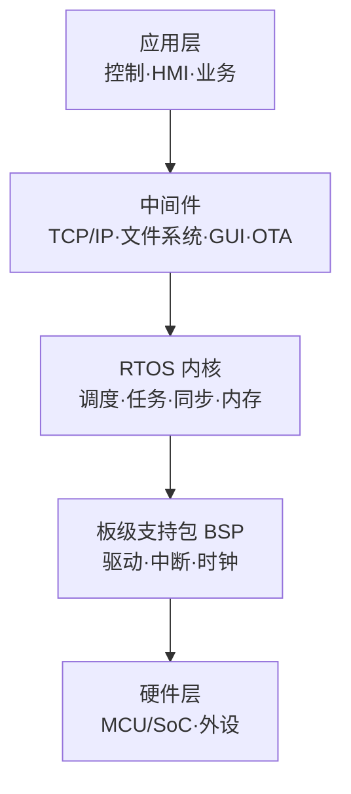
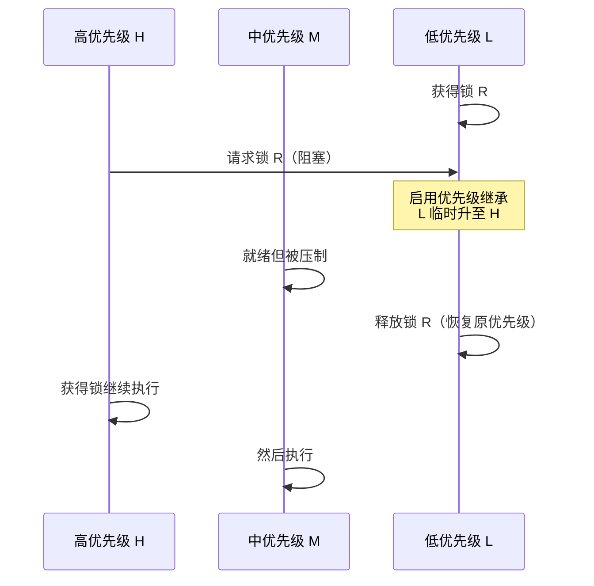

# 15 · 案例：嵌入式系统架构（教材第 17 章）

> 案例分析高频考点之一。本章笔记覆盖：场景识别 → 核心知识点 → 典型架构图 → 高频考点速查 → 关联题索引 → 易错点。
> 教材参考：《系统架构设计师教程（第 2 版）》第 17 章「嵌入式系统架构设计理论与实践」。

## 1. 场景识别（怎么从题干判断这是本章题）

### 关键词信号

- **业务关键词**：车载（ADAS / 仪表 / 网关）、工业控制（PLC / DCS）、医疗设备（监护仪 / 输液泵）、消费电子（智能家居 / 可穿戴）、航空航天、轨道交通、机器人、IoT 终端。
- **技术关键词**：实时性（硬实时 / 软实时）、RTOS、VxWorks / FreeRTOS / RT-Linux / QNX / RT-Thread / SylixOS、调度（RMS / EDF / 优先级反转 / 优先级继承 / 优先级天花板）、AADL / UML-MARTE / SysML、构件组装、安全关键标准 DO-178C、IEC 61508、ISO 26262、看门狗、双机热备。
- **数据特征**：小内存（KB~MB）、专用 SoC / MCU、严格时间约束（μs~ms）、长期运行（年级别 MTBF）、高可靠（10⁻⁹/h 失效率）。

### 典型业务背景

1. 汽车 ECU 软件：动力控制、转向、制动需要硬实时（μs 级响应）+ ISO 26262 ASIL-D 认证。
2. 飞机航电系统：DO-178C Level A 适航，多余度备份。
3. 工业 PLC：扫描周期 1ms~10ms，确定性调度。
4. 输液泵 / 心电监护：IEC 62304 医疗软件等级，故障安全。
5. 智能家居网关：Linux + 容器，软实时，固件 OTA 升级。

## 2. 核心知识点

### 2.1 概念定义

**嵌入式系统** = 以应用为中心，以计算机技术为基础，软硬件可裁剪，对功能、可靠性、成本、体积、功耗有严格要求的专用计算机系统。**实时系统（Real-Time System）** 的正确性不仅取决于结果，还取决于结果产生的时间。

### 2.2 主要分类 / 分层

**实时性分类**：

| 类别 | 截止时间 | 错过后果 | 典型场景 |
|---|---|---|---|
| 硬实时 Hard | 必须严格满足 | 灾难性 | 飞控、ABS、机器人控制 |
| 固实时 Firm | 偶尔错过可容忍但价值清零 | 数据丢失 | 视频帧、传感器采样 |
| 软实时 Soft | 错过性能下降 | 用户体验差 | 多媒体播放、HMI |

**嵌入式架构模式**：

1. **循环轮询（Polling）**：单循环依次查询任务，简单但实时性差。
2. **前后台（Foreground/Background）**：中断处理紧急（前台），主循环处理慢任务（后台）。
3. **事件触发（Event-Triggered）**：中断/事件驱动，响应快。
4. **时间触发（Time-Triggered）**：固定周期表，确定性最强（航空 TTA）。
5. **多任务 RTOS**：抢占式优先级调度。

**嵌入式系统层次（自下而上）**：硬件层（CPU/MCU/SoC + 外设） → BSP 板级支持包 → RTOS 内核 → 中间件（TCP/IP、文件系统、GUI） → 应用层。

### 2.3 关键技术特征

**RTOS 调度算法**：

| 算法 | 全称 | 优先级分配 | 可调度判定 |
|---|---|---|---|
| **RMS** | Rate Monotonic Scheduling | 周期越短优先级越高 | $\sum (C_i/T_i) \le n(2^{1/n}-1)$，n→∞ 趋于 0.693 |
| **EDF** | Earliest Deadline First | 截止时间越早越先执行 | $\sum (C_i/T_i) \le 1$（更紧凑） |
| DM | Deadline Monotonic | 相对截止时间短优先 | 适合 D≠T |
| FIFO | 先到先服务 | — | 非实时 |

> RMS 是静态优先级，EDF 是动态优先级。EDF 利用率上限为 100%，但开销大、过载行为差。

**优先级反转与对策**：

- 现象：高优先级 H 等低优先级 L 持有的锁，被中优先级 M 抢占 L，导致 H 间接等 M。
- 对策：**优先级继承（PIP）**——L 临时继承 H 的优先级；**优先级天花板（PCP）**——锁固定为最高使用者优先级。

**建模语言**：

| 语言 | 用途 |
|---|---|
| **AADL** | 架构分析与设计语言（航空、汽车），描述构件组装与非功能属性 |
| **UML-MARTE** | UML 建模与分析实时嵌入式系统的扩展 |
| SysML | 系统工程建模（含需求、行为、参数图） |

**安全关键标准**：

| 行业 | 标准 | 等级 |
|---|---|---|
| 通用功能安全 | IEC 61508 | SIL 1~4 |
| 汽车 | ISO 26262 | ASIL A~D |
| 航空 | DO-178C | DAL A~E |
| 医疗 | IEC 62304 | A/B/C |
| 铁路 | EN 50128 | SIL 1~4 |

### 2.4 与相关概念的边界

- **嵌入式 Linux vs RTOS**：Linux 适合软实时与丰富中间件；RTOS 适合硬实时与小体积。
- **MCU vs MPU**：MCU 集成存储和外设、运行 RTOS 或裸机；MPU 跑 Linux 等通用 OS。
- **构件组装 vs 微服务**：嵌入式构件强调静态绑定、确定性；微服务强调动态发现、弹性。

## 3. 典型架构图 / 流程图

### 3.1 嵌入式分层架构

### 3.2 RMS 任务调度示例

```mermaid
gantt
    title RMS 抢占式调度（T1=4 周期最高优先级）
    dateFormat X
    axisFormat %s
    section T1 周期4
    T1 :a1, 0, 1
    T1 :a2, 4, 1
    T1 :a3, 8, 1
    section T2 周期6
    T2 :b1, 1, 2
    T2 :b2, 6, 2
    section T3 周期12
    T3 :c1, 3, 1
    T3 :c2, 9, 2
```

### 3.3 优先级反转 + 继承时序

## 4. 高频考点速查表

| 考点 | 典型问法 | 关键答案要点 |
|---|---|---|
| 嵌入式特征 | "嵌入式四特征" | 专用、实时、资源受限、可靠（+功耗） |
| 实时分类 | "硬实时 vs 软实时" | 错过截止时间是否灾难；硬实时必须确定 |
| RTOS 选型 | "为什么选 VxWorks 而非 Linux" | 硬实时、确定性调度、认证基础 |
| RMS 判定 | "三个周期任务能否调度" | 利用率公式 + 周期短优先级高 |
| EDF | "EDF 优势" | 利用率 100%；动态优先级；过载抖动大 |
| 优先级反转 | "案例如何避免" | 优先级继承 PIP / 天花板 PCP |
| 看门狗 | "为何要 WDT" | 防止程序跑飞，定期喂狗超时复位 |
| 双机热备 | "热备 vs 冷备 vs 温备" | 切换时间不同；热备同步运行 |
| AADL | "AADL 用来做什么" | 描述构件组装、非功能属性、可分析 |
| 安全标准 | "汽车软件用什么" | ISO 26262 ASIL，按危害程度分级 |
| 功耗优化 | "如何省电" | 主频动态调整、深睡眠、外设关停、协处理 |
| 构件组装 | "嵌入式构件特点" | 静态绑定、可分析、形式化验证 |
| 软硬件协同 | "划分原则" | 性能/成本/灵活性权衡，关键路径硬化 |
| 引导启动 | "Bootloader 作用" | 初始化、加载内核、固件升级、签名校验 |

## 5. 关联题（双向索引）

- **案例题**：→ `past-papers/case-types/08-embedded-components.md`（嵌入式构件组装专题）；`past-papers/case-types/01-architecture-evaluation.md`（含实时性评估）。
- **论文题**：→ `past-papers/paper-topics/03-reliability-design.md`（可靠性设计含嵌入式）；`past-papers/paper-topics/08-component-based.md`。
- **选择题**：→ `exam-bank/02-os-concepts.md`（含 RTOS 调度）；`exam-bank/11-quality-attributes.md`（实时性属性）。
- **范文参考**：→ `past-papers/paper-samples/03-reliability-design.md`。

## 6. 易错点 + 反套路

### 6.1 概念混淆

- ❌ "实时 = 快" → ✅ 实时强调"确定性"（按时），不是"速度快"。
- ❌ Linux 一定不能做嵌入式 → ✅ 软实时与多媒体场景大量使用；硬实时则配合 RT-Preempt 或专用 RTOS。
- ❌ RMS = EDF → ✅ RMS 静态、EDF 动态；EDF 利用率高但过载差。
- ❌ 优先级反转靠提优先级解决 → ✅ 用 PIP / PCP 协议；盲目改优先级会破坏调度模型。
- ❌ MCU = MPU → ✅ MCU 集成度高跑 RTOS；MPU 跑 Linux 等通用 OS。

### 6.2 答题陷阱

- ❌ 画分层图忘了 BSP → ✅ BSP 是 OS 与硬件之间的桥梁，必画。
- ❌ 调度题套公式不写过程 → ✅ 写出周期/执行时间表 + 利用率计算 + 结论。
- ❌ 安全标准张冠李戴 → ✅ 汽车 ISO 26262、航空 DO-178C、医疗 IEC 62304，不要混。
- ❌ "上 RTOS 就硬实时" → ✅ 还要看驱动中断延迟、锁实现、内存分配是否确定性。

### 6.3 高分句模板

- "在【车载 ECU 制动控制】场景下，应优先采用【硬实时 RTOS（VxWorks）+ RMS 调度 + 优先级继承协议】，因为【μs 级确定性响应、ISO 26262 ASIL-D 认证基础、可形式化分析】，并通过看门狗 + 双 MCU 冗余保证失效安全。"
- "针对优先级反转风险，采用优先级继承协议（PIP）使持锁低优先级任务临时继承等待者的优先级，避免高优先级任务被中等任务间接阻塞。"
- "对于【医疗输液泵】采用 IEC 62304 Class C 等级 + 故障安全状态机设计，确保单点故障不会造成超剂量输注。"

### 6.4 速记口诀

> "**专实资可**（专用·实时·资源受限·可靠）四特征；**轮询·前后台·事件·时间·RTOS** 五模式；**RMS 静 EDF 动**；**PIP 继承 PCP 天花板**；**汽车 26262·航空 178C·医疗 62304** 安全分级；**AADL/MARTE** 是建模利器。"

## 7. 答题模板（补充资料）

### 7.1 RMS 可调度性判定例题模板

> 例：T1=(C=1,T=4)、T2=(C=2,T=6)、T3=(C=2,T=12)，是否可调度？

解题步骤：

1. **计算 CPU 利用率**：U = 1/4 + 2/6 + 2/12 = 0.25 + 0.333 + 0.167 ≈ 0.75。
2. **代入 RMS 上界公式**：n=3，上界 = 3·(2^(1/3) − 1) ≈ 0.779。
3. **比较**：U=0.75 < 0.779 → 可调度（充分条件）。
4. **若超过上界**：再用响应时间分析法（RTA）验证，因 RMS 上界是充分非必要。

### 7.2 软硬件协同设计取舍

| 维度 | 硬化（FPGA/ASIC） | 软件实现 |
|---|---|---|
| 性能 | 高（并行、流水线） | 受 CPU 限制 |
| 灵活性 | 低（硬件改动周期长） | 高（可 OTA 升级） |
| 成本 | 一次性 NRE 高、量产单价低 | NRE 低，量产边际成本高 |
| 功耗 | 低（专用电路） | 高 |
| 适用 | 关键路径（DSP / 加解密 / 视频编解码） | 业务逻辑 / HMI |

### 7.3 嵌入式可靠性技术

| 机制 | 用途 |
|---|---|
| 看门狗 WDT | 防程序跑飞，超时不喂复位 |
| 双 MCU 主备 | 主备同步，主故障切换 |
| TMR 三模冗余 | 三套并行投票表决 |
| ECC 内存 | 检测/纠正单/双比特错 |
| BIT（自检） | 上电自检 / 周期自检 / 启动自检 |
| Failsafe 状态机 | 异常时进入安全状态（停车/断电） |
| 形式化验证 | 数学证明无死锁、无竞态 |

### 7.4 嵌入式开发流程（V 模型）

V 模型左侧（设计）：需求分析 → 系统设计 → 详细设计 → 编码。

V 模型右侧（验证）：单元测试 → 集成测试 → 系统测试 → 验收测试。

每个左侧阶段对应右侧验证活动；安全关键标准（DO-178C / ISO 26262）要求每个阶段都有可追溯的需求-设计-实现-测试链。

