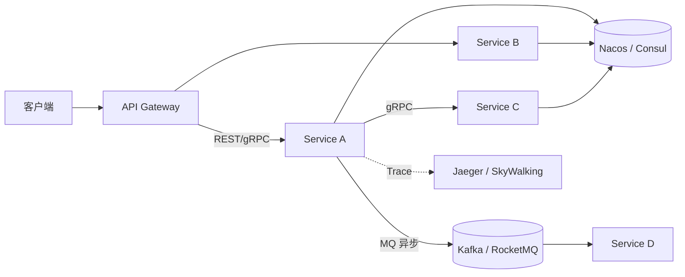
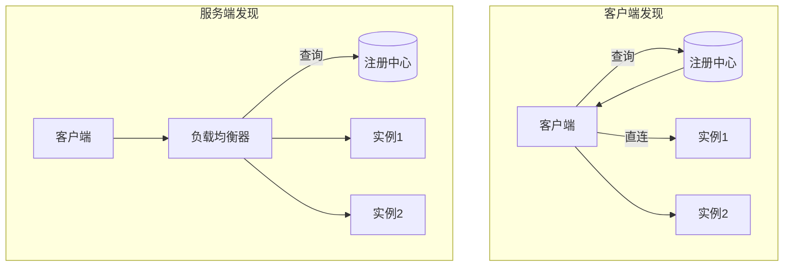
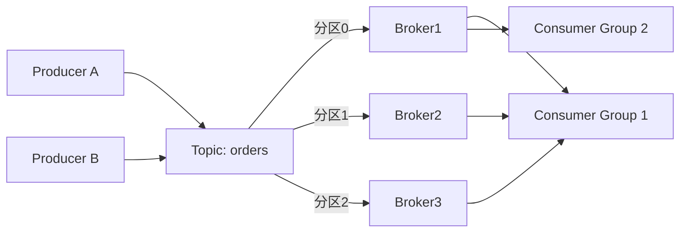
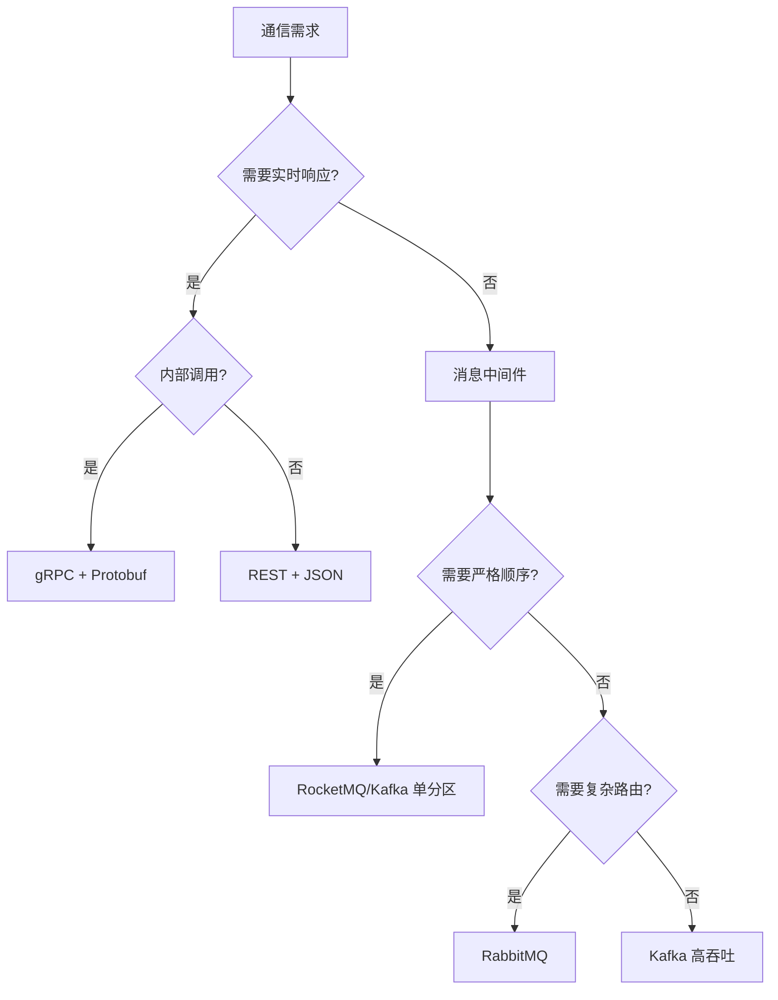

# 16 · 案例：通信系统架构（教材第 17 章节选 / 通信架构）

> 案例分析高频考点之一。本章笔记覆盖：场景识别 → 核心知识点 → 典型架构图 → 高频考点速查 → 关联题索引 → 易错点。
> 教材参考：《系统架构设计师教程（第 2 版）》第 17 章「通信系统架构」相关章节，以及第 14 章微服务通信内容。

## 1. 场景识别（怎么从题干判断这是本章题）

### 关键词信号

- **业务关键词**：服务间通信、跨系统调用、推送 / 长连接、IM 消息、订单广播、行情推送、IoT 设备上报、电信级可用性、移动端弱网。
- **技术关键词**：RPC / REST / GraphQL、gRPC / Thrift / Dubbo / Motan / Tars、HTTP/1.1 / HTTP/2 / HTTP/3 (QUIC)、WebSocket / SSE、长轮询、消息队列（Kafka / RocketMQ / RabbitMQ / Pulsar / NSQ）、服务发现（Nacos / Consul / Eureka / ZooKeeper）、Protobuf / Thrift IDL / Avro。
- **数据特征**：QPS 高、时延敏感（ms~亚秒）、消息体积差异大、可能丢失或重复、需顺序或事务保证。

### 典型业务背景

1. 电商：订单服务 → 库存 / 优惠 / 物流多服务调用，下单链路 RT < 200ms。
2. 即时通讯：千万级长连接，毫秒级推送（WebSocket + 自建网关）。
3. 证券行情：百万级订阅推送，UDP / 二进制协议追求极低延迟。
4. IoT：百万设备 MQTT 上报，Kafka 缓冲 + Flink 实时处理。
5. 微服务架构：服务注册发现 + gRPC + 链路追踪。

## 2. 核心知识点

### 2.1 概念定义

**通信架构** 关注分布式系统中"组件如何高效、可靠、安全地交换数据"。涉及通信范式（同步/异步、请求响应/发布订阅）、协议选择、序列化、连接管理、可靠性、安全。

### 2.2 主要分类 / 分层

**通信范式分类**：

| 范式 | 描述 | 典型 |
|---|---|---|
| 同步请求-响应 | 调用方等待结果 | REST / RPC / gRPC |
| 异步请求-响应 | 立即返回，回调或轮询取结果 | CompletableFuture、回调 |
| 发布-订阅 | 多消费者按主题接收 | Kafka / RocketMQ / RabbitMQ |
| 流式 | 长连接持续推送 | WebSocket / SSE / gRPC Stream |
| 广播 | 单发多收 | UDP 组播、行情 |

**RPC vs REST vs GraphQL（教材必考）**：

| 维度 | RPC（gRPC） | REST | GraphQL |
|---|---|---|---|
| 风格 | 调用本地方法的抽象 | 资源 + HTTP 动词 | 查询语言（前端按需） |
| 协议 | HTTP/2 + Protobuf | HTTP/1.1 + JSON | HTTP + JSON |
| 性能 | 高（二进制 + 多路复用） | 中 | 中（解析复杂） |
| 可读性 | 低（二进制） | 高 | 高 |
| 跨语言 | 强（IDL 生成） | 强（无依赖） | 较强 |
| 流式 | 双向 Stream | 不擅长（SSE/WS 补充） | 订阅 Subscription |
| 适用 | 内部服务、高性能 | 公网 API、浏览器 | 前端 BFF / 字段选择 |

**消息队列对比（高频对比题）**：

| MQ | 模型 | 吞吐 | 延迟 | 顺序 | 事务 | 典型场景 |
|---|---|---|---|---|---|---|
| **Kafka** | 分布式日志 | 极高（百万 TPS） | ms 级 | 分区内 | 生产者事务 | 大数据/日志/流处理 |
| **RocketMQ** | 主题+队列 | 高（十万级） | ms | 严格顺序队列 | 事务消息 | 金融、电商交易 |
| **RabbitMQ** | AMQP | 中（万级） | μs~ms | 单队列 | 支持 | 复杂路由、传统业务 |
| **Pulsar** | 计算-存储分离 | 极高 | ms | 分区内 | 支持 | 多租户、跨地域 |
| **ActiveMQ** | JMS | 低 | ms | 单队列 | 支持 | 传统 J2EE |

**长连接技术**：

| 技术 | 方向 | 协议 |
|---|---|---|
| WebSocket | 双向 | HTTP 升级，全双工 |
| SSE（Server-Sent Events） | 单向（服务端→客户端） | HTTP 长连接 + text/event-stream |
| 长轮询 | 客户端拉 | HTTP，无需特殊协议 |
| MQTT | 双向 | TCP，IoT 标准 |
| HTTP/2 Server Push | 单向 | HTTP/2 |

### 2.3 关键技术特征

- **序列化**：JSON（人类可读）/ Protobuf（紧凑高效）/ Thrift / Avro（带 Schema 演进）/ Hessian。
- **服务发现**：客户端发现（Eureka / Ribbon）vs 服务端发现（K8s Service / LB）；强一致性（ZooKeeper / etcd）vs 最终一致（Eureka / Nacos AP 模式）。
- **可靠性**：超时、重试（指数退避）、熔断（Hystrix / Sentinel）、限流（令牌桶 / 漏桶）、幂等。
- **可观测性**：链路追踪（OpenTelemetry / SkyWalking / Jaeger / Zipkin）、Trace ID 透传。
- **安全**：mTLS、OAuth2、Token 透传、消息签名加密。
- **电信级可用性**：5 个 9 = 99.999% = 年宕机 ≤ 5 分 15 秒，6 个 9 = 31.5 秒。

### 2.4 与相关概念的边界

- **服务发现 vs 负载均衡**：发现解决"在哪"，LB 解决"挑哪个"。
- **同步 RPC vs 异步消息**：强一致选 RPC + 分布式事务；最终一致选消息 + 对账。
- **gRPC 与 REST**：gRPC 适合内部高性能；REST 适合开放公网。
- **MQ 与 RPC**：MQ 解耦生产/消费、削峰、广播；RPC 强一致同步交互。

## 3. 典型架构图 / 流程图

### 3.1 微服务通信全景

### 3.2 服务发现两种模式

### 3.3 Kafka 发布订阅模型

## 4. 高频考点速查表

| 考点 | 典型问法 | 关键答案要点 |
|---|---|---|
| RPC vs REST | "如何选" | 内部高性能选 gRPC；对外公网选 REST |
| GraphQL 价值 | "为什么用 GraphQL" | 前端按需取字段，减少 over-fetch / under-fetch |
| 同步 vs 异步 | "下单何时用消息" | 解耦、削峰、最终一致；强一致用 RPC + TCC |
| Kafka vs RabbitMQ | "选型理由" | 吞吐/有序/事务/路由复杂度匹配场景 |
| 顺序消息 | "如何保证有序" | 分区/队列内有序 + 单消费者 + 业务幂等 |
| 消息丢失 | "如何防止" | 生产端 ack、Broker 持久化副本、消费端手动 ack |
| 消息重复 | "如何防止" | 幂等键 + 去重表 / Bloom；消费端记录 offset |
| 服务发现 | "客户端 vs 服务端" | 客户端少一跳但侵入；服务端透明但多一跳 |
| 长连接 | "WebSocket vs SSE" | WS 双向，SSE 单向；SSE 简单但仅服务端推送 |
| 高可用 5 个 9 | "如何达到" | 多活、自动切换、监控告警、容灾演练 |
| 限流策略 | "令牌桶 vs 漏桶" | 令牌桶允许突发，漏桶平滑输出 |
| 熔断降级 | "区别" | 熔断断路保护，降级提供兜底（默认值/缓存） |
| 链路追踪 | "Trace ID 怎么传" | HTTP Header 透传 + MQ Header；SDK 自动注入 |
| QUIC / HTTP3 | "优势" | 0-RTT、多路复用无队头阻塞、连接迁移 |
| 序列化对比 | "Protobuf 优势" | 体积小、跨语言、Schema 演进、性能高 |

## 5. 关联题（双向索引）

- **案例题**：→ `past-papers/case-types/06-messaging-caching.md`（消息缓存专题）；`past-papers/case-types/05-microservice-refactor.md`（含服务通信）。
- **论文题**：→ `past-papers/paper-topics/05-microservice-cloud-native.md`；`past-papers/paper-topics/11-enterprise-integration.md`。
- **选择题**：→ `exam-bank/15-microservice-cloud-native.md`；`exam-bank/10-architecture-styles.md`。
- **范文参考**：→ `past-papers/paper-samples/05-microservice-cloud-native.md`。

## 6. 易错点 + 反套路

### 6.1 概念混淆

- ❌ "REST = HTTP" → ✅ REST 是架构风格（资源/无状态/统一接口），HTTP 是常见承载。
- ❌ gRPC = Protobuf → ✅ gRPC 是 RPC 框架，Protobuf 是其默认序列化；可换 JSON。
- ❌ Kafka 一定保证全局有序 → ✅ 仅分区内有序，跨分区无序。
- ❌ 同步调用更可靠 → ✅ 同步链路越长，雪崩概率越高；异步可削峰增韧性。
- ❌ WebSocket 适合所有推送 → ✅ 单向推送 SSE 更轻；浏览器外可用 MQTT/AMQP。

### 6.2 答题陷阱

- ❌ 选 MQ 不分析顺序、事务、吞吐三要素 → ✅ 必须三维度匹配场景。
- ❌ 答"用 Eureka"忘了 AP/CP 选择 → ✅ Eureka AP、ZooKeeper CP，按一致性需求选。
- ❌ 限流写成"加缓存" → ✅ 限流是流量入口策略，与缓存正交。
- ❌ "用 gRPC 性能就好"忽视调试成本 → ✅ 二进制不可读，需配合反射/Postman 等工具。

### 6.3 高分句模板

- "在【内部服务高性能调用】场景下，应优先采用【gRPC + Protobuf + HTTP/2 多路复用】，相较 REST/JSON 性能提升 3~5 倍；对外公网仍采用 REST 以兼容浏览器与第三方。"
- "针对【订单广播 + 削峰】采用【Kafka 分区有序 + 消费者组水平扩展】，配合幂等键与本地消息表实现最终一致性，满足十万 TPS 下游解耦需求。"
- "通过【Nacos AP 模式 + 客户端负载均衡（Ribbon）】实现服务发现，相较强一致 ZooKeeper 在网络分区下可用性更高，符合互联网级 99.99% 可用性要求。"

### 6.4 速记口诀

> "**RPC 性能 REST 通用 GraphQL 按需**；**Kafka 高吞 RocketMQ 顺序 RabbitMQ 路由 Pulsar 多租户**；**WebSocket 双向 SSE 单向 MQTT 物联**；**Nacos AP·ZK CP**；**5 个 9 五分钟，6 个 9 三十秒**。"

## 7. 答题模板（补充资料）

### 7.1 高可用计算公式

| 等级 | 可用性 | 年宕机时间 |
|---|---|---|
| 2 个 9 | 99% | 3.65 天 |
| 3 个 9 | 99.9% | 8.76 小时 |
| 4 个 9 | 99.99% | 52.56 分钟 |
| 5 个 9 | 99.999% | 5.26 分钟 |
| 6 个 9 | 99.9999% | 31.5 秒 |

> 串联 N 个组件可用性：A_total = A1 × A2 × ... × An（衰减明显）。
> 并联（主备）可用性：A_total = 1 − (1−A1)·(1−A2)（指数提升）。

### 7.2 服务通信选型决策树

### 7.3 弱网与移动端通信优化

| 场景 | 对策 |
|---|---|
| 高延迟 | HTTP/2 多路复用、HTTP/3 (QUIC) 0-RTT |
| 丢包重传 | QUIC 应用层重传、消息端到端 ACK |
| 弱信号断流 | 长连接心跳 + 自动重连 + 离线消息补偿 |
| 流量敏感 | Protobuf / 增量同步 / 差量更新 |
| 多端不一致 | 全链路时序戳 + 客户端冲突合并（OT/CRDT） |

### 7.4 限流与熔断核心算法

- **令牌桶**：固定速率生成令牌，请求消耗令牌；允许短时突发到桶容量。
- **漏桶**：请求入桶，桶按固定速率出，平滑流量。
- **滑动窗口**：精确统计 N 秒内请求数，比固定窗口更准。
- **熔断三态**：Closed（正常）→ Open（断路）→ Half-Open（试探），由错误率/慢调用率触发。
- **降级策略**：返回缓存 / 默认值 / 静态页 / 排队提示，需配合监控告警。

