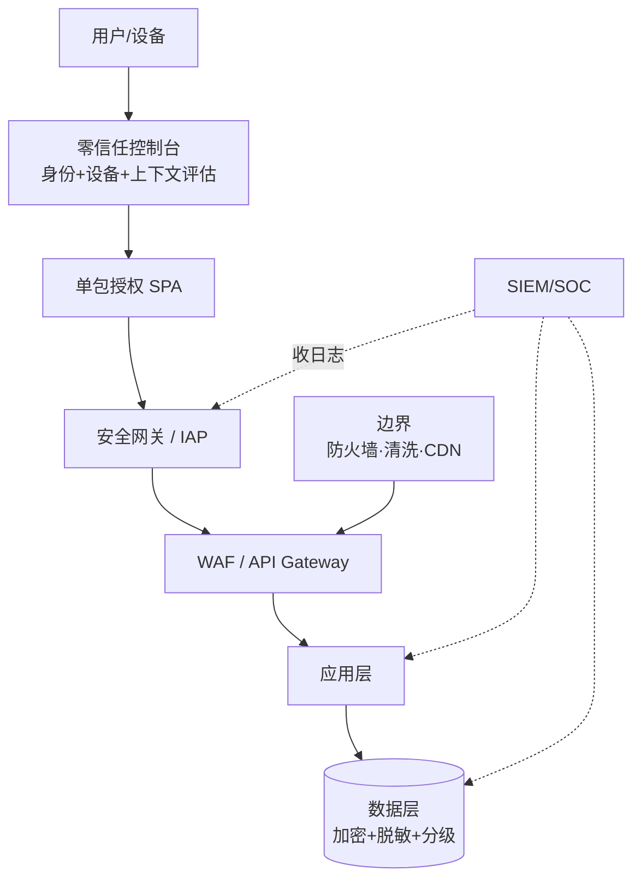
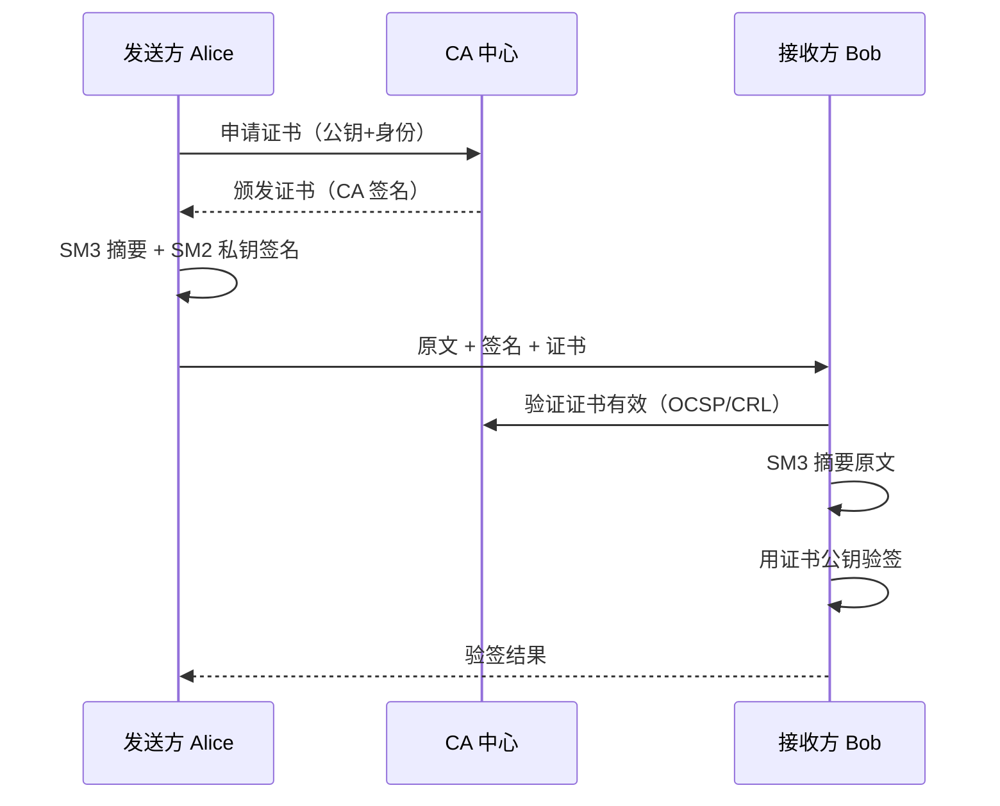
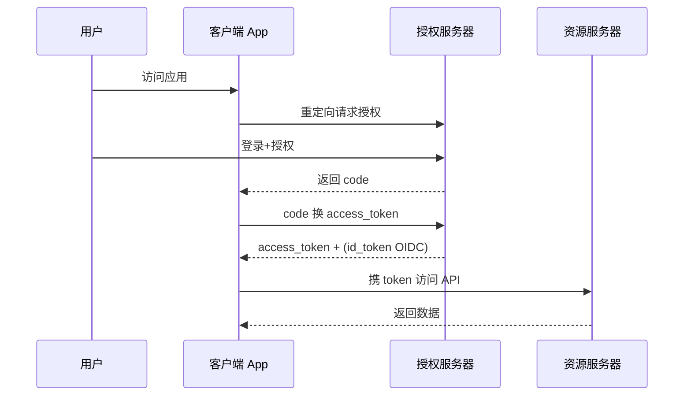

# 17 · 案例：安全架构（教材第 14 章信息安全 / 第 18 章扩展）

> 案例分析高频考点之一。本章笔记覆盖：场景识别 → 核心知识点 → 典型架构图 → 高频考点速查 → 关联题索引 → 易错点。
> 教材参考：《系统架构设计师教程（第 2 版）》第 14 章「信息安全架构设计理论与实践」（含等保 2.0、零信任、密码学）。

## 1. 场景识别（怎么从题干判断这是本章题）

### 关键词信号

- **业务关键词**：金融、政务、医疗、工业、关键信息基础设施、个人信息保护、电子合同、数字签名、电子政务、电子取证、勒索病毒、APT 攻击。
- **技术关键词**：CIA 三性、PDR / PPDR / PDRR、STRIDE / DREAD、零信任 SDP / BeyondCorp、等保 2.0、关基保护、密码法、个保法、数据安全法、PKI / CA / 数字证书、国密 SM2/SM3/SM4/SM9、对称/非对称、HMAC、TLS / mTLS、OAuth2.0 / OIDC / SAML、IAM、4A、堡垒机、WAF、IDS / IPS、SIEM / SOC、SOAR、DLP、UEBA。
- **数据特征**：合规性强（法规驱动）、敏感数据分级、需审计追溯、攻防对抗。

### 典型业务背景

1. 银行网银：等保 2.0 三级 + 国密改造，TLS 改 GMSSL，CA 用国密 SM2 证书。
2. 政务"一网通办"：零信任 SDP，公民身份认证 + 多因子。
3. 医疗 HIS：患者数据脱敏、按角色最小权限、操作审计。
4. 工业互联网：OT/IT 融合下的边界防护、纵深防御、关基定级。
5. 互联网企业：SaaS OAuth2.0/OIDC + RBAC + WAF + DDoS 清洗。

## 2. 核心知识点

### 2.1 概念定义

**信息安全** 三要素 **CIA**：

- **C 机密性 Confidentiality**：未授权不可读。
- **I 完整性 Integrity**：未授权不可改、被改可发现。
- **A 可用性 Availability**：授权用户按需可访问。

扩展为 **CIA + 真实性 + 不可抵赖性 + 可追溯性**（六性）。

**安全架构核心模型**：

- **PDR / PPDR / PDRR**：保护（Protection）→ 检测（Detection）→ 响应（Response）→ 恢复（Recovery），强调"无绝对安全，靠时间窗口对抗"：$P_t > D_t + R_t$。
- **纵深防御**：边界 → 网络 → 主机 → 应用 → 数据五层多重防御。
- **零信任 Zero Trust**：Never trust, always verify；无默认信任域，每次访问都鉴权 + 持续评估。

### 2.2 主要分类 / 分层

**威胁建模 STRIDE**：

| 威胁 | 全称 | 对应 CIA |
|---|---|---|
| **S**poofing | 身份伪造 | 真实性 |
| **T**ampering | 数据篡改 | 完整性 |
| **R**epudiation | 抵赖 | 不可抵赖性 |
| **I**nformation Disclosure | 信息泄露 | 机密性 |
| **D**enial of Service | 拒绝服务 | 可用性 |
| **E**levation of Privilege | 权限提升 | 授权 |

**风险评估 DREAD**：Damage / Reproducibility / Exploitability / Affected users / Discoverability，每项 1-10 打分取均值。

**等保 2.0 五级**（GB/T 22239-2019）：

| 级别 | 名称 | 描述 | 典型对象 |
|---|---|---|---|
| 一级 | 自主保护 | 自主测评 | 普通信息系统 |
| 二级 | 指导保护 | 行业指导 | 一般电子政务 |
| 三级 | 监督保护 | 监管测评 | 银行、税务、电力 |
| 四级 | 强制保护 | 强制监督 | 国家关键基础设施 |
| 五级 | 专控保护 | 专门部门控制 | 国家秘密相关 |

> 等保 2.0 = "一个中心三重防护"：安全管理中心 + 安全计算环境 / 区域边界 / 通信网络。

**国密算法**：

| 算法 | 类型 | 用途 | 对应国际算法 |
|---|---|---|---|
| **SM1** | 对称分组 | 硬件实现，国家机密 | AES |
| **SM2** | 非对称（ECC） | 签名、加密、密钥协商 | RSA / ECDSA |
| **SM3** | 散列 | 摘要、HMAC | SHA-256 |
| **SM4** | 对称分组 | 数据加密 | AES |
| **SM9** | 标识密码 IBC | 基于身份签名加密 | — |
| ZUC（祖冲之） | 流密码 | 4G/5G 通信 | SNOW |

**PKI 体系**：

- **CA**（Certificate Authority）：签发证书。
- **RA**（Registration Authority）：受理审核。
- **CRL / OCSP**：吊销列表 / 在线状态查询。
- **X.509**：证书格式标准。
- 信任链：根 CA → 中间 CA → 终端证书。

**身份与访问控制**：

| 机制 | 描述 |
|---|---|
| OAuth 2.0 | 授权框架（access_token），含 4 种 grant：授权码 / 简化 / 密码 / 客户端 |
| OIDC | 在 OAuth2 上加身份层（id_token，JWT） |
| SAML 2.0 | 企业 SSO，基于 XML 断言 |
| RBAC | 基于角色 |
| ABAC | 基于属性（更细粒度） |
| **4A** | 账号 / 认证 / 授权 / 审计 |

### 2.3 关键技术特征

**纵深防御层次对照表**：

| 层 | 威胁 | 对策 |
|---|---|---|
| 边界 | DDoS、扫描 | 防火墙、清洗、CDN、WAF、抗 D |
| 网络 | 嗅探、横向移动 | VPN、零信任、微隔离、IDS/IPS |
| 主机 | 漏洞、提权 | HIDS、补丁、加固基线、EDR |
| 应用 | 注入、XSS、CSRF、反序列化 | 参数化、CSP、Token、白名单 |
| 数据 | 泄露、篡改 | 加密、脱敏、分级、DLP、水印 |
| 身份 | 凭据窃取 | MFA、SSO、最小权限、口令策略 |
| 运维 | 内部威胁 | 堡垒机、审计、双人复核 |

**零信任三大核心**：身份是新边界、设备是访问主体、持续验证（信任不持久）。落地形态 **SDP**（Software Defined Perimeter，单包授权 SPA）/ **MSG**（微隔离）/ **IAP**（身份感知代理）。

### 2.4 与相关概念的边界

- **PDR vs PPDR**：PPDR 加 Policy（策略）于首位，强调策略驱动。
- **零信任 vs 纵深防御**：纵深防御按"层"，零信任按"会话"；二者可叠加。
- **STRIDE vs OWASP Top 10**：STRIDE 是建模分类法；OWASP 是 Web 应用十大风险清单。
- **等保 vs 关基保护**：等保覆盖一般信息系统；关基（CIIP）针对关键信息基础设施，要求更严。

## 3. 典型架构图 / 流程图

### 3.1 纵深防御 + 零信任融合架构

### 3.2 PKI 数字签名 + 验签流程

### 3.3 OAuth 2.0 授权码模式

## 4. 高频考点速查表

| 考点 | 典型问法 | 关键答案要点 |
|---|---|---|
| CIA 三性 | "请说明三大目标" | 机密 / 完整 / 可用 |
| PDR 模型 | "Pt 与 Dt+Rt 关系" | Pt > Dt+Rt 才安全；引出检测响应必要性 |
| STRIDE | "识别系统威胁" | 6 类威胁 + 对应资产 + 对策 |
| 零信任 | "为什么从纵深防御演进" | 内网不再可信、远程办公、云化 |
| 等保 2.0 | "三级和四级区别" | 监督 vs 强制；测评频率与控制点 |
| 一中心三重防护 | "等保 2.0 框架" | 安全管理中心 + 计算/边界/通信 |
| 国密用途 | "SM2/SM3/SM4 区别" | SM2 非对称、SM3 散列、SM4 对称 |
| 数字签名 | "如何防抵赖" | 私钥签名 + 公钥验证 + 时间戳 |
| PKI 信任链 | "证书可信依赖什么" | 根 CA + 中间 CA + 端实体证书 |
| OAuth2 vs OIDC | "区别" | OAuth2 授权、OIDC 在其上加身份认证 |
| SSO | "实现方案" | CAS / SAML / OIDC，结合 IAM |
| 数据分级 | "如何分级" | 按敏感度（公开/内部/机密/绝密）定加密策略 |
| 数据脱敏 | "静态 vs 动态" | 静态批量改库；动态运行时按权限脱敏 |
| WAF | "防什么" | OWASP Top 10：注入、XSS、CSRF、命令执行 |
| DDoS 防御 | "层次" | 流量清洗（运营商）+ CDN + 限速 + 限连 |
| 密钥管理 | "KMS 作用" | 密钥生命周期：生成/分发/轮换/销毁/审计 |
| 应急响应 | "事件流程" | 准备/检测/抑制/根除/恢复/复盘 |

## 5. 关联题（双向索引）

- **案例题**：→ `past-papers/case-types/07-security-architecture.md`（安全专题）；`past-papers/case-types/01-architecture-evaluation.md`（含安全质量属性）。
- **论文题**：→ `past-papers/paper-topics/04-security-design.md`；`past-papers/paper-topics/02-architecture-evaluation.md`。
- **选择题**：→ `exam-bank/21-security.md`；`exam-bank/06-ip-and-standards.md`（含密码法、个保法）。
- **范文参考**：→ `past-papers/paper-samples/04-security-design.md`。

## 6. 易错点 + 反套路

### 6.1 概念混淆

- ❌ 把"加密"等同于"安全" → ✅ 加密只解决机密性，还需完整性、可用性、可追溯。
- ❌ HTTPS = 安全 → ✅ HTTPS 仅传输加密，不防应用层注入、未授权访问、内部泄露。
- ❌ SM2 用来加密大数据 → ✅ SM2 是非对称，用于签名/密钥协商；大数据用 SM4。
- ❌ 零信任 = 不要边界 → ✅ 零信任补充而非替代边界，纵深+零信任可叠加。
- ❌ 等保备案 = 通过测评 → ✅ 备案是登记，三级以上需第三方测评。
- ❌ JWT 一定安全 → ✅ JWT 只是格式，需配合签名密钥管理 + 短有效期 + 撤销机制。

### 6.2 答题陷阱

- ❌ 画安全架构只画 WAF/防火墙 → ✅ 必须分层：边界/网络/主机/应用/数据/身份/运维。
- ❌ 答"加 CA 证书"忘了证书撤销 → ✅ CRL / OCSP 必须配套。
- ❌ 鉴权方案只写 RBAC → ✅ 复杂场景叠加 ABAC / 数据级权限 / 行级权限。
- ❌ 把审计当日志 → ✅ 审计需完整、不可抵赖、长期保存、可检索。

### 6.3 高分句模板

- "在【金融三级等保 + 国密改造】场景下，应优先采用【纵深防御 + 零信任 SDP + GMSSL（SM2/SM3/SM4）】组合，因为【可对抗 STRIDE 全谱威胁，满足等保 2.0 一中心三重防护要求，且符合密码法对关键信息基础设施的国密强制要求】。"
- "针对【个人信息保护】采用【数据分级（GB/T 35273）+ 静态脱敏入仓 + 动态脱敏按角色 + 全链路审计】，落实个保法第 51 条最小必要原则。"
- "采用【OAuth 2.0 授权码 + PKCE + OIDC 身份层】支持开放平台第三方接入，配合短期 access_token + 长期 refresh_token + 撤销端点形成完整生命周期管理。"

### 6.4 速记口诀

> "**CIA** 三性，**PDR/PPDR/PDRR** 时间窗；**STRIDE** 六威胁、**DREAD** 五维评估；**等保 2.0 五级·一中心三重防护**；**国密 SM2 非对称·SM3 散列·SM4 对称·SM9 标识**；**PKI 信任链 + CRL/OCSP**；**OAuth2 授权 + OIDC 认证 + SAML 企业 SSO**；**4A 账认授审**。"
