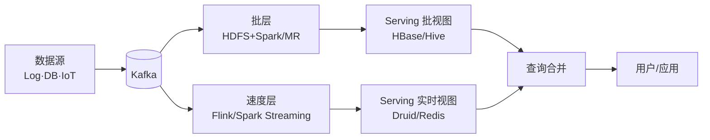
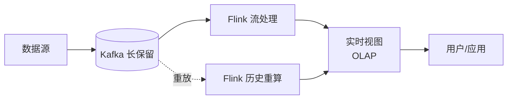
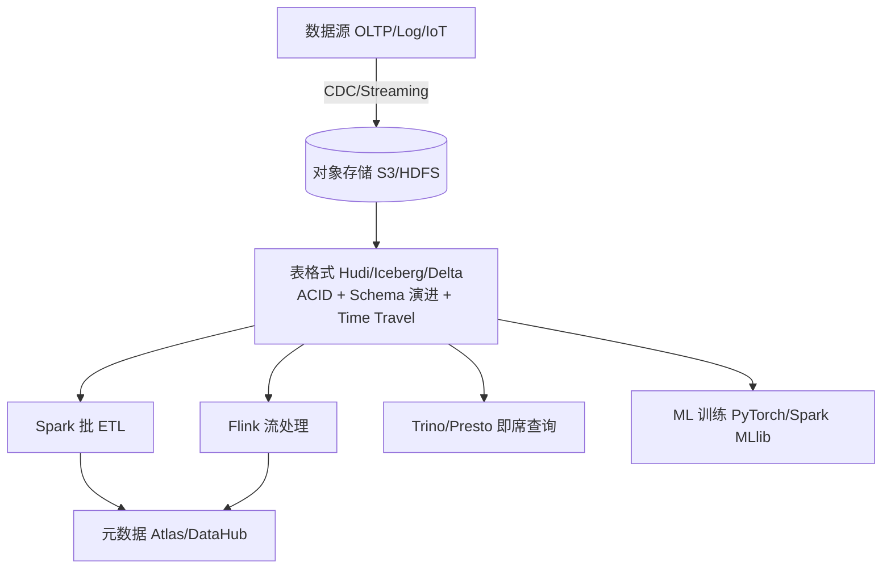
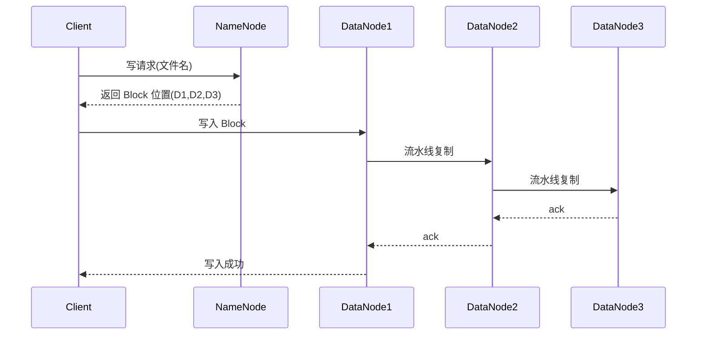

# 18 · 案例：大数据架构（教材第 18 章）

> 案例分析高频考点之一。本章笔记覆盖：场景识别 → 核心知识点 → 典型架构图 → 高频考点速查 → 关联题索引 → 易错点。
> 教材参考：《系统架构设计师教程（第 2 版）》第 18 章「大数据架构设计理论与实践」。

## 1. 场景识别（怎么从题干判断这是本章题）

### 关键词信号

- **业务关键词**：海量数据、用户画像、推荐系统、风控反欺诈、实时大屏、运营报表、商业智能 BI、湖仓一体、数据中台、数据资产、特征工程、机器学习。
- **技术关键词**：Hadoop、HDFS / MapReduce / YARN、Hive、HBase、Spark / Flink / Storm、Kafka / Pulsar、Lambda / Kappa 架构、数据湖（Hudi / Iceberg / Delta Lake）、数据仓库、Lakehouse、OLAP（Druid / ClickHouse / Doris / StarRocks / Kylin）、ETL / ELT、CDC、Airflow / DolphinScheduler、5V。
- **数据特征**：TB~PB 级、结构化/半结构化/非结构化混合、读多写多、批量+实时混合负载。

### 典型业务背景

1. 电商：实时大屏（秒级 GMV）+ 离线 T+1 报表 + 用户画像 + 推荐。
2. 互联网风控：毫秒级欺诈识别（Flink + 规则引擎 + 模型）。
3. 运营商话单：每天百亿级话单 ETL 入仓，月底批量结算。
4. 金融监管：跨机构数据汇聚，T+0 实时反洗钱预警。
5. 政务大数据：跨委办局数据汇聚共享，建设公共数据资源体系。

## 2. 核心知识点

### 2.1 概念定义

**大数据 5V 特征**（教材必考）：

| V | 含义 | 量级 |
|---|---|---|
| **Volume** 海量 | 数据规模大 | TB~EB |
| **Velocity** 高速 | 产生与处理速度快 | 实时秒级、流式 |
| **Variety** 多样 | 结构化+半结构化+非结构化 | JSON/图片/视频/日志 |
| **Value** 价值 | 总量大但价值密度低 | 需挖掘 |
| **Veracity** 真实 | 数据质量参差需治理 | 噪声/缺失/不一致 |

### 2.2 主要分类 / 分层

**Lambda 架构（三层并存）**：

| 层 | 职责 | 典型技术 |
|---|---|---|
| Batch Layer 批处理层 | 全量、准确、高延迟 | HDFS + MapReduce / Spark |
| Speed Layer 速度层 | 增量、实时、低延迟 | Storm / Flink / Spark Streaming |
| Serving Layer 服务层 | 合并查询批 + 实时视图 | HBase / Druid / Redis |

> 优点：兼顾准确与实时；缺点：双套代码（Batch + Stream）维护成本高、结果合并复杂。

**Kappa 架构**：仅保留流式层，所有数据都进消息系统（Kafka），需要重算时重放历史。优点：架构统一；缺点：长周期重算压力大、对存储要求高。

**Data Lakehouse 湖仓一体**：在数据湖（HDFS / S3）之上叠加事务层（Hudi / Iceberg / Delta Lake），同时支持 SQL OLAP + ML，做到"一份存储两种用法"。

**Hadoop 生态核心**：

| 组件 | 角色 |
|---|---|
| **HDFS** | 分布式文件系统（NameNode + DataNode + SecondaryNN/Standby） |
| **MapReduce** | 分布式批计算（Map → Shuffle → Reduce） |
| **YARN** | 资源调度（ResourceManager + NodeManager + ApplicationMaster + Container） |
| Hive | SQL on Hadoop，元数据 + HQL → MR/Spark/Tez |
| HBase | 列簇式 NoSQL（基于 HDFS+ZK），随机读写 |
| ZooKeeper | 协调服务、选主、配置 |

**计算引擎对比**：

| 引擎 | 模式 | 延迟 | 状态 | 典型场景 |
|---|---|---|---|---|
| MapReduce | 批 | 分钟~小时 | 无 | 离线 ETL（已弱化） |
| Spark Core | 批（RDD/DAG） | 秒~分钟 | 有限 | 通用批计算 |
| Spark Streaming | 微批 | 秒级 | 有 | 准实时 |
| **Flink** | 流（事件时间+水印） | ms~亚秒 | 强（Checkpoint） | 真正实时、Exactly-Once |
| Storm | 流 | ms | 弱 | 老一代流式 |

**OLAP 引擎选型**：

| 引擎 | 模型 | 优势 | 场景 |
|---|---|---|---|
| Druid | 时序+预聚合 | 高并发实时 | 大屏、监控 |
| ClickHouse | 列存单机/分布式 | 极速聚合 | 即席查询、BI |
| Doris / StarRocks | MPP 列存 | SQL 标准、Join 强 | 多维分析 |
| Kylin | 立方体预计算 | 维度查询毫秒级 | 固定报表 |

### 2.3 关键技术特征

- **数据湖三大表格式**：Hudi（更新友好、CDC 强）/ Iceberg（开放标准、Snapshot 隔离）/ Delta Lake（Databricks 生态）。共同提供 ACID、时间旅行、Schema 演进。
- **流批一体**：Flink 通过统一 API + Checkpoint 实现批流融合；Spark 3 + Delta 也在融合。
- **数据治理**：元数据管理（Atlas / DataHub）、数据质量、血缘、分级分类、安全脱敏。
- **数据中台**：业务能力 + 数据资产 + 算法服务的共享平台，强调复用与服务化。
- **MPP vs Hadoop**：MPP（Greenplum / Teradata）单表强、扩展受限；Hadoop 生态弹性扩展、SQL 性能逐步追平。

### 2.4 与相关概念的边界

- **数据湖 vs 数据仓库**：湖 Schema-on-Read 灵活但治理弱；仓 Schema-on-Write 严格但僵化；Lakehouse 折衷。
- **Lambda vs Kappa**：Lambda 双链路；Kappa 单流链路重放。
- **OLTP vs OLAP**：OLTP 事务为主行存；OLAP 分析为主列存。
- **批计算 vs 流计算**：批是有界数据集合，流是无界连续；Flink 视批为流的特例。

## 3. 典型架构图 / 流程图

### 3.1 Lambda 架构

### 3.2 Kappa 架构（流统一）

### 3.3 湖仓一体（Lakehouse）参考架构

### 3.4 HDFS 读写流程

## 4. 高频考点速查表

| 考点 | 典型问法 | 关键答案要点 |
|---|---|---|
| 5V 特征 | "大数据有何特征" | Volume/Velocity/Variety/Value/Veracity |
| Lambda vs Kappa | "二者区别和选型" | 双链路 vs 单流；准确 vs 简化 |
| HDFS 架构 | "NameNode/DataNode 职责" | NN 存元数据，DN 存数据块；副本通常 3 |
| HDFS HA | "如何避免单点" | Active/Standby NN + JournalNode + ZKFC |
| YARN | "资源调度组件" | RM + NM + AM + Container |
| MapReduce | "Shuffle 流程" | Map → 分区排序合并 → 拉取 → Reduce |
| Spark vs MR | "Spark 为何快" | 内存计算、DAG、宽窄依赖优化 |
| Flink vs Spark Streaming | "实时差异" | Flink 真流、事件时间+水印；Spark 微批 |
| Exactly-Once | "如何保证" | Checkpoint + 两阶段提交 + 幂等 sink |
| 数据倾斜 | "Map/Reduce 倾斜怎么处理" | 加盐、二次聚合、Map 端 Combiner、调倾斜 Key |
| 数据湖三件套 | "Hudi/Iceberg/Delta 区别" | 更新友好/开放标准/Databricks 生态 |
| OLAP 选型 | "实时大屏选什么" | Druid 时序+预聚合，高并发亚秒 |
| 数据治理 | "中台需治理什么" | 元数据/质量/血缘/分级/安全/标准 |
| ETL vs ELT | "湖仓时代差异" | E→L→T，T 推到湖内做（算力下沉） |
| CAP 在数据库 | "HBase / Cassandra" | HBase CP、Cassandra AP |
| 批流一体 | "如何统一" | Flink 流批 API 统一 + Lakehouse 存储统一 |

## 5. 关联题（双向索引）

- **案例题**：→ `past-papers/case-types/09-big-data-architecture.md`（大数据专题）；`past-papers/case-types/02-database-design.md`（含 NoSQL/分库分表）。
- **论文题**：→ `past-papers/paper-topics/06-big-data-nosql.md`（大数据 + NoSQL 专题）；`past-papers/paper-topics/01-architecture-design.md`。
- **选择题**：→ `exam-bank/03-database.md`（数据库 + NoSQL 含大数据相关题）。
- **范文参考**：→ `past-papers/paper-samples/01-architecture-design.md`（含大数据相关范文）。

## 6. 易错点 + 反套路

### 6.1 概念混淆

- ❌ 把"大数据 = Hadoop" → ✅ Hadoop 是经典栈，但大数据还含 Spark/Flink/MPP/湖仓等。
- ❌ 数据湖 = 数据仓库改名 → ✅ 湖 Schema-on-Read，仓 Schema-on-Write，思想根本不同。
- ❌ Kappa 取代 Lambda → ✅ 长周期复杂业务仍用 Lambda；Kappa 适合纯流式场景。
- ❌ Flink = 流，Spark = 批 → ✅ Flink 流批一体；Spark 也支持流（微批/Continuous）。
- ❌ HBase 是关系数据库 → ✅ HBase 是列簇式 NoSQL，没有事务跨行 ACID（旧版本）。

### 6.2 答题陷阱

- ❌ 画 Lambda 忘了 Serving 层 → ✅ 三层缺一不可，否则前端无法查询。
- ❌ HDFS 副本 = 容灾 → ✅ 副本是高可用，跨机房才是容灾。
- ❌ "用 Spark 替换所有 MR" 一刀切 → ✅ 简单 ETL 仍可 MR；Spark 更适合迭代式与内存敏感。
- ❌ 数据治理只强调"清洗" → ✅ 治理是体系：标准+组织+流程+平台+度量。

### 6.3 高分句模板

- "在【实时大屏 + 离线报表】混合场景下，应优先采用【Lambda 架构 + Flink 速度层 + Spark 批层 + Druid Serving 层】，因为【兼顾准确性与实时性，可在分钟内回放历史并叠加实时增量】，并通过 Lakehouse 演进逐步向 Kappa 收敛降低双套维护成本。"
- "针对【数据倾斜】采用【加盐打散 + 二次聚合 + Map 端 Combiner】组合手段，配合 Spark 自适应执行（AQE）将运行时长从 4h 降至 30min。"
- "构建数据中台应落实【元数据 + 数据质量 + 血缘 + 分级分类 + 安全脱敏】五位一体治理，配合 OneID/OneModel/OneService 统一数据资产化输出能力。"

### 6.4 速记口诀

> "**5V**：量速变值真；**Lambda 三层**（批+速+服）·**Kappa 单流**；**HDFS（NN/DN）+ MR + YARN（RM/NM/AM/Container）** 是 Hadoop 三件套；**Hive 离线·HBase 随机·Druid 大屏·ClickHouse 即席·Doris MPP**；**Hudi 改·Iceberg 开放·Delta DB**；**Flink 真流 + Checkpoint Exactly-Once**。"
