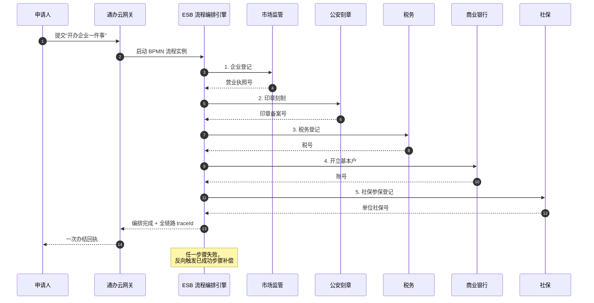

# 案例题型 03 · 架构风格对比与选型

> 高频题型，约两年一次，25 分。

## 考点分布

- 给出业务场景，从若干架构风格中**选型 + 说明理由**
- 对比**两种风格**的**优缺点**
- 填表（风格特点 / 通信方式 / 适用场景）

## 核心风格速查（必背）

| 风格 | 核心概念 | 代表 | 优点 | 缺点 | 适用 |
|---|---|---|---|---|---|
| **管道-过滤器** | 数据流线性处理 | UNIX / 编译器 | 可重用、并行 | 交互弱、性能一般 | 批处理、ETL |
| **分层** | 逐层调用 | OS / OSI | 解耦、可替换 | 性能损失 | 复杂业务系统 |
| **C/S** | 客户端-服务器 | 传统应用 | 管控集中 | 客户端升级难 | 企业内网 |
| **B/S** | 浏览器-服务器 | Web 应用 | 零客户端 | 富交互弱 | 互联网 |
| **事件驱动** | 事件发布订阅 | GUI / MQ | 松耦合、可扩展 | 调试难、顺序难保 | 实时通知、异步 |
| **黑板 / 数据仓库** | 共享数据中心 | AI 推理 / 编译器 | 数据一致 | 瓶颈、单点 | 专家系统 |
| **解释器 / 虚拟机** | 解释执行 | JVM / 规则引擎 | 灵活 | 性能一般 | 脚本、DSL |
| **MVC / MVP / MVVM** | UI 层分离 | Spring / Vue | 职责清晰 | 中小场景略重 | Web / GUI |
| **SOA** | 粗粒度服务 | ESB | 跨系统集成 | 治理复杂 | 企业级集成 |
| **微服务** | 细粒度自治 | Spring Cloud | 独立部署 | 分布式复杂 | 互联网规模 |
| **REST** | 资源 + HTTP | OpenAPI | 通用、可缓存 | 实时差 | Web API |

## 答题模板

### 问题 1：从场景选择风格

**四步法**：
1. **识别关键需求**（高并发？强交互？实时？批处理？）
2. **候选风格**（列 2–3 个）
3. **对比优缺点**
4. **给结论 + 理由**（贴合题干的数字 / 场景）

**标准答法示例**：
> "系统需处理**每日 10 亿条日志**的 ETL 任务，关键需求为**吞吐量**和**可扩展性**。
> 候选：**管道-过滤器** vs **事件驱动**。
> - 管道-过滤器：线性流处理，易并行，适合批处理。
> - 事件驱动：异步解耦，但调试复杂。
> 最终选 **管道-过滤器**，因为日志处理是**顺序数据流**，可通过 **Flume → Kafka → Flink** 管道完成，吞吐可达 **百万 QPS**。"

### 问题 2：填表对比

**技巧**：
- 交互方式：**同步 / 异步 / 事件**
- 耦合度：**紧 / 松**
- 数据流：**推 / 拉**
- 扩展性：**水平 / 垂直**

### 问题 3：混合架构

**多数真实系统是混合的**，例如：
- **分层 + 微服务**：每层内部是微服务
- **事件驱动 + 微服务**：服务间通过 MQ 通信
- **MVC + REST**：后端 MVC 输出 REST

## 万能高分句

- "针对**高并发**和**实时响应**需求，选用**事件驱动 + 发布订阅**风格，基于 Kafka 实现服务间**松耦合**"
- "**管道-过滤器** 风格天然支持**并行处理**和**构件复用**，适合本系统的 ETL 批处理场景"
- "**分层**风格将系统划分为**表现 / 业务 / 数据访问** 三层，各层**通过接口解耦**，任一层可独立替换"
- "综合采用**微服务（业务层）+ 事件驱动（通信层）+ 分层（服务内部）** 混合架构"

## 常见陷阱

| ❌ | ✅ |
|---|---|
| 只选一个风格 | 现实系统**多风格混合** |
| 没有对比 | 明确"为什么不选 X" |
| 不结合题干数据 | **引用题干的 QPS / 用户量** |
| 优缺点平均 | 突出**最关键的 1–2 点** |

---

## 模拟案例题

> ⚠️ **自主命题**：题干场景为基于公开考点改编的虚构案例，避免版权风险；技术参数贴合真实工程实践。建议先**严格 25 分钟限时**作答，再对照参考答案。

### 模拟题 1 · 政务一网通办 SOA vs 微服务选型（25 分）

**【题干】**（约 820 字）

某省级政务服务平台"**通办云**"承接全省 **17 个地市、158 个区县**的政务服务事项统一办理，覆盖**社保、税务、住建、民政、市场监管、公安、卫健**等 16 个委办厅局共 **2300 项事项**。平台年访问量 **8.2 亿次**，日均申报 **180 万件**，节假日复工首日峰值 **QPS 1.6 万**，年可用性要求 **99.95%**，需符合**等保三级 + 政务云专有云**部署要求。建设方为省政务服务局牵头、外包给央企子公司联合体（**A 公司主导，B、C 公司分包**），团队规模 **65 人**（含厅局对接专员 18 人），建设周期 **22 个月**。

平台现状与挑战：

1. 现有省级老系统是 2017 年建成的"政务直通车"，采用**集中式 SOA 架构**——基于 Oracle SOA Suite 的 ESB 总线 + WebService 接口，已接入 12 厅局共 800 项事项，但**新厅局接入周期普遍超过 4 个月**、ESB 单点压力日均 12 万 TPS 接近瓶颈；
2. 各厅局数据**绝对不允许跨域共享**——社保数据不能流入税务，必须靠**接口调用**编排服务，**禁止建中心化大数据库**；
3. 业务流程编排极其复杂——典型"开办企业一件事"涉及**市场监管登记 → 公安刻章 → 税务办税 → 银行开户 → 社保参保**共 5 个跨厅局环节，每环节由不同厅局系统响应，需要**事务编排 + 失败补偿**；
4. 厅局系统**异构严重**：8 家用 Java、3 家用 .NET、2 家用 Python、1 家是国产信创（华为 ARM + 麒麟 OS），协议有 SOAP/REST/JSON-RPC/Thrift 混杂；
5. 政务事项**变更频繁**——根据政策调整，每季度约 40% 事项流程要重新配置；
6. 年终审计要求**全链路调用日志保留 10 年**，可追溯每一次跨厅局调用的请求方/响应方/参数/结果。

架构师提出两个候选方案：**方案 A** 沿用并升级 SOA（升级到 Apache ServiceMix + Camel 编排），**方案 B** 重构为微服务（Spring Cloud Alibaba + Nacos + Sentinel + Seata）。请基于本场景做架构风格选型论证。

**【小问】**（合计 25 分）

**问 1**（10 分）：从 **服务粒度、技术异构性、流程编排、数据一致性、团队组织、运维复杂度** 6 个维度对比 SOA 与微服务，给出本场景下每个维度的适配性评分（1-5 分制），并解释每条评分依据。

**问 2**（8 分）：给出**最终选型方案**——可以是纯 SOA、纯微服务、或**混合架构**，必须明确：（1）整体风格定位（4 分）；（2）关键技术组件清单（参照题干已有技术栈）（4 分）。

**问 3**（7 分）：针对"开办企业一件事"5 厅局编排场景，对比 **ESB 集中编排** vs **Saga 分布式编排**，并给出本案推荐方案及落地图（用 Mermaid 序列图）。

---

**【参考答案】**

**问 1**：6 维度对比评分（约 380 字）

| 维度 | SOA 方案 A | 微服务方案 B | 本场景关键考量 |
|---|---|---|---|
| **服务粒度** | 3/5（粗粒度业务服务） | 4/5（围绕事项细分） | 2300 事项需细粒度，微服务略优 |
| **技术异构性** | **5/5**（ESB 协议适配天然支持） | 3/5（需要 Sidecar 适配） | **8 厅局协议异构 → SOA 强项** |
| **流程编排** | **5/5**（BPEL/Camel 集中编排成熟） | 3/5（分布式编排 + Saga 复杂） | "开办企业"5 环节链长 → SOA 优 |
| **数据一致性** | 4/5（XA + WS-AT） | 3/5（最终一致 + Saga 补偿） | 政务零容忍丢单，强一致更稳 |
| **团队组织** | 3/5（中心化团队 + 总线团队） | **5/5**（厅局自治符合政务条块） | **65 人跨 3 公司 + 18 厅局自治** → 微服务匹配康威定律 |
| **运维复杂度** | **5/5**（单 ESB 易监控） | 2/5（注册中心+网关+追踪堆栈复杂） | 政务运维工程师能力有限 → SOA 优 |
| **加权平均** | **25/30 ≈ 4.2** | 20/30 ≈ 3.3 | SOA 更适配本案 |

**评分依据要点**：
- **技术异构 5/5**：ESB 通过适配器承接 SOAP/REST/JSON-RPC/Thrift 是其核心价值，微服务需每厅局加 Sidecar 反而增复杂度；
- **流程编排 5/5**：5 厅局事务编排正是 SOA 的"业务流程层"设计原意，Saga 在跨厅局补偿权限上极难协调；
- **团队组织 5/5（微服务）**：18 厅局对接专员 + 各厅局自治诉求强烈，微服务的"去中心化"恰好对齐组织结构。

**问 2**：最终选型 — 混合架构（约 240 字）

**整体定位**：**SOA 主干 + 微服务边缘 + 事件驱动旁路**的三段式混合架构。

理由：① 跨厅局编排（强协议适配 + 流程编排 + 强一致）走 SOA 主干，发挥 ESB 优势；② 省级"通办云"自身的运营服务（用户中心、消息中心、申报模板、智能客服）走微服务，享受快速迭代红利；③ 高并发查询（事项查询、办件进度、电子证照核验）走事件驱动的读写分离 CQRS，降低主干压力。

**关键技术组件**：

| 层 | 风格 | 组件 | 用途 |
|---|---|---|---|
| 接入层 | 微服务 | API 网关（Spring Cloud Gateway）+ Nacos | 全平台流量入口、多租户路由 |
| 协议适配层 | SOA | Apache ServiceMix + Camel + WSO2 | 跨厅局协议转换 SOAP↔REST↔Thrift |
| 流程编排层 | SOA | Camel BPEL 或 Activiti BPMN 引擎 | "开办企业"5 厅局编排 |
| 业务服务层 | 微服务 | Spring Boot + Dubbo（信创节点 ARM 兼容） | 用户中心、申报模板等 |
| 事件总线 | 事件驱动 | RocketMQ（事项进度变更、审计日志） | 通知、CQRS 同步 |
| 治理层 | 共用 | Sentinel + SkyWalking + ELK | 限流、追踪、10 年日志 |
| 数据层 | 各自治 | 各厅局保留原数据库（绝对不集中） | 等保三级 + 厅局数据主权 |

**问 3**：编排方案对比 + 推荐（约 200 字）

| 维度 | ESB 集中编排 | Saga 分布式编排 |
|---|---|---|
| 调用方式 | ESB 顺序调用 5 厅局，统一记录状态 | 5 厅局自管子事务 + 补偿 |
| 失败补偿 | ESB 反向触发已成功步骤的回滚 | 各步骤自实现 compensate 接口 |
| 编排可视化 | BPMN 图直观可改 | 代码分散难以全局观 |
| 跨组织协调 | 1 个改造点（ESB） | **5 个厅局都要改** |
| 推荐度 | ✅ **本案推荐** | ❌ 跨组织 Saga 协调困难 |

**推荐方案：ESB 集中编排（BPMN 流程引擎）**。理由：① 政务跨厅局变更需走文件审批，让 5 厅局同时改 Saga 接口几乎不可行；② 集中编排可由省政务局统一管控、统一审计，符合"全链路日志 10 年"诉求；③ 流程季度调整 40% 时只改 BPMN 图，无需厅局配合发版。

---

**【评分要点】**

| 得分项 | 分值 | 关键词/要求 |
|---|---|---|
| 6 维度对比齐全 | 6 分 | 缺一维扣 1 分 |
| 每维度评分含依据 | 4 分 | 没说"为什么"扣 0.5 分/条 |
| 选混合架构而非纯 SOA/纯微服务 | 2 分 | 选纯一种最多得 4 分 |
| 三段式分层清晰 | 2 分 | 必须区分主干/边缘/旁路 |
| 关键技术组件 ≥ 6 项 | 2 分 | 必含 ESB+网关+MQ |
| 信创合规考虑 | 2 分 | 提"麒麟/ARM"加 1 分 |
| ESB vs Saga 对比表 | 3 分 | 必须列 5+ 维度 |
| Mermaid 编排序列图 | 3 分 | 必含起止+5 厅局+补偿提示 |
| 推荐含跨组织协调论证 | 1 分 | 必提"5 厅局协同难度" |

**常见扣分点**：
- ❌ 直接选纯微服务——忽视政务"协议异构 + 跨组织"现实，丢 6+ 分
- ❌ 评分不结合题干数字（如团队 65 人、2300 事项、5 厅局编排）——视为空泛对比
- ❌ 编排选 Saga 不论证——本案 Saga 反而更复杂
- ❌ 忽略数据主权——把厅局数据集中存储，违反政务红线

**高分技巧**：
- 提出"康威定律"对应"组织结构 → 架构选择"，体现架构方法论高度
- 引用"等保三级 / 信创 / 政务云"等行业规范，证明具备领域经验
- 用具体的"开办企业 5 环节"做编排论证，比泛泛而谈"政务流程"得分高

---

### 模拟题 2 · 实时风控引擎 管道-过滤器 vs 事件驱动（25 分）

**【题干】**（约 800 字）

某互联网消费金融公司"惠安金科"为旗下信用卡、消费贷、扫码付三条业务线提供统一**实时反欺诈风控引擎**。业务规模：日均交易 **6800 万笔**、活动峰值 **QPS 4.5 万**、欺诈率 0.038%、风控决策**端到端 ≤ 80ms**（P99）、年可用性 **99.99%**。团队 **28 人**，建设周期 **9 个月**。

风控决策完整流程包含 7 个环节：

1. **数据接入**：接收交易请求（HTTP/Dubbo），含交易方、金额、设备指纹、地理位置；
2. **数据补全**：调用画像服务、设备库、黑名单库、人行征信查询缺失字段；
3. **规则评分**：基于 Drools 加载 800+ 条专家规则（金额阈值、频率限制、地理跳变等），输出规则得分；
4. **机器学习模型**：基于 XGBoost + LSTM 双模型实时打分（毫秒级）；
5. **图谱关联**：基于 Neo4j 查询同设备/同 IP/同收款人的关联欺诈团伙；
6. **决策融合**：综合规则、模型、图谱三方分数生成最终决策（通过/拒绝/二次校验/人工审核）；
7. **结果落库 + 异步通知**：决策结果同步返回业务方，异步落库 + 推送至下游审计、对账、大数据。

架构师小赵考虑两种架构风格：

- **方案 A：管道-过滤器**——7 环节构成线性管道，每环节实现统一接口（input/output），数据流式经过；
- **方案 B：事件驱动**——每环节作为独立 Kafka Topic 消费者，环节间用事件解耦；

公司技术栈：JDK 17 + Spring Boot 3 + Kafka 3.5 + Flink 1.18 + Redis Cluster + ClickHouse。

**【小问】**（合计 25 分）

**问 1**（10 分）：分别从 **延迟特性、可并行性、错误处理、可扩展性、可观测性** 5 个维度对比管道-过滤器 vs 事件驱动，每维度给出本场景下的优劣判断（**含量化对比**）。

**问 2**（8 分）：选择最终方案——可以是纯一种风格、或混合架构。必须给出（1）核心选型理由（4 分）；（2）混合架构边界划分（哪些环节走管道、哪些走事件）（4 分）。

**问 3**（7 分）：针对"端到端 ≤ 80ms P99"目标，给出**至少 4 条性能优化战术**（含战术类别），并量化预估每条战术的延迟节省。

---

**【参考答案】**

**问 1**：5 维度对比（约 360 字）

| 维度 | 管道-过滤器 | 事件驱动 | 本场景偏好 |
|---|---|---|---|
| **延迟特性** | ✅ **同步内存调用，延迟约 5-15ms 总开销** | ❌ Kafka Producer→Consumer **每跳约 8-15ms**，7 跳累计 **56-105ms** 直接超 80ms | **管道胜**，本场景对延迟极敏感 |
| **可并行性** | ⚠️ 默认串行，需在过滤器内部实现并发（如规则与模型可并行） | ✅ 天然多消费者并行，每 Topic 独立扩缩 | 事件驱动略优 |
| **错误处理** | ⚠️ 单环节异常需 try-catch + 短路，整链失败需回退 | ✅ Kafka 死信队列 + 自动重试机制成熟 | 事件驱动优 |
| **可扩展性** | ⚠️ 整管道部署在同一进程，**横向扩容只能整体扩** | ✅ 每环节独立扩容（如模型服务 + GPU、图谱服务 + Neo4j 集群） | 事件驱动显著优 |
| **可观测性** | ✅ 单进程内 traceId 透传简单 | ⚠️ 跨 Kafka 链路追踪需 SkyWalking + Kafka 插件 | 管道略优 |

**关键量化结论**：
- 7 环节走纯事件驱动 = **最差 105ms** > 80ms 目标 → **不可取**
- 7 环节走纯管道（同步）= **15ms 内** → 满足目标
- **混合**：把同步性强的"接入→补全→规则→模型→图谱→决策"6 步打包为单进程管道（约 50ms），决策后"落库+下游通知"走事件驱动异步分发，整体 < 80ms 达标。

**问 2**：选型 — 混合架构（约 230 字）

**最终选型：管道-过滤器为主体（前 6 环节）+ 事件驱动为旁路（第 7 环节）**

（1）**选型理由**：① 80ms P99 是**绝对硬指标**——欺诈引擎延迟过高会被业务方降级跳过失去价值；② 7 环节中前 6 步存在**强数据依赖链**（补全完成才能规则评分，规则+模型完成才能决策融合），强依赖适合管道而非异步；③ 第 7 步"落库 + 异步通知"对延迟不敏感、扇出多（审计、对账、大数据），适合事件驱动 Kafka 多订阅。

（2）**混合架构边界**：

| 环节 | 风格 | 落地形式 |
|---|---|---|
| 1. 接入 | 管道入口 | API 网关 + 入参校验 Filter |
| 2. 数据补全 | 管道 | 并行 Filter（画像/设备/征信并发调用） |
| 3. 规则评分 | 管道 | Drools 内嵌进程内 |
| 4. ML 模型 | 管道 | 模型常驻内存（毫秒级） |
| 5. 图谱关联 | 管道 | Neo4j Bolt 长连接池 |
| 6. 决策融合 | 管道出口 | 加权融合 + 返回业务方 |
| **--- 同步管道 ≈ 50ms ---** |  |  |
| 7a. 异步落库 | 事件驱动 | Kafka Topic `risk-decision-log` |
| 7b. 下游通知 | 事件驱动 | 同 Topic 多消费者（审计/对账/大数据） |

**问 3**：性能优化战术（约 250 字）

| 战术 | 类别 | 落地 | 延迟节省 |
|---|---|---|---|
| **数据补全并行调用** | 并发 | 第 2 步画像/设备/征信由串行改 CompletableFuture 并行，取最长链路 | **节省 15-25ms** |
| **多级缓存** | 缓存 | 用户画像 Caffeine（L1） + Redis（L2），命中率 92%；设备指纹/黑名单全量加载到本地 | **节省 8-12ms** |
| **模型预加载 + GPU/SIMD 推理** | 减少计算 | XGBoost 进程内推理；LSTM 走 ONNX Runtime + AVX-512 向量化 | **节省 10-15ms** |
| **图谱关联近端缓存** | 缓存 | 高频团伙关联结果在 Caffeine 缓存 5 秒，热数据命中率 70% | **节省 5-8ms** |
| **协议优化** | 减少计算路径 | 接入层从 HTTP/JSON 改 Dubbo/Hessian2 二进制；TCP keepAlive | **节省 3-5ms** |
| **决策结果异步化** | 异步 + 事件驱动 | 落库与下游通知改 Kafka 异步，**主链路无需等待** | **节省 10-20ms** |

合计累计节省 **51-85ms**，从初版 ~120ms 优化至 **P99 ≈ 50-60ms**，留 20ms 余量保障 80ms 目标。

---

**【评分要点】**

| 得分项 | 分值 | 关键词/要求 |
|---|---|---|
| 5 维度对比齐全 | 5 分 | 缺一维扣 1 分 |
| 每维度含量化数字 | 3 分 | 没量化扣 1 分/维 |
| 7 环节累计延迟测算 | 2 分 | 必须算出 56-105ms 触发选型 |
| 选混合架构 | 2 分 | 选纯事件驱动直接判错 |
| 选型理由扣紧 80ms 硬指标 | 2 分 | 没引 80ms 扣 2 分 |
| 边界划分含具体环节 | 4 分 | 表格不全扣分 |
| 战术 ≥ 4 条 | 4 分 | 每条 1 分 |
| 战术含类别 + 量化节省 | 3 分 | 缺类别或量化每条扣 0.5 分 |

**常见扣分点**：
- ❌ 选纯事件驱动——80ms 硬指标做不到
- ❌ 把"机器学习模型"放 Kafka 异步——模型分数是决策融合输入，必须同步
- ❌ 战术只列名词不给量化——"加缓存"是空话，必须 "Caffeine + Redis 命中率 92% 节省 8-12ms"
- ❌ 决策结果不做异步——前 6 步管道完成就该返回业务方，落库可异步

**高分技巧**：
- 用"延迟预算分配表"（接入 1ms / 补全 12ms / 规则 5ms / 模型 8ms / 图谱 6ms / 融合 3ms / 返回 2ms = 37ms）展示工程量化思维
- 提及"模型 ONNX + AVX-512 / GPU 推理"等业界前沿优化，加印象分
- 引用"康威定律"或"风控引擎延迟超阈值会被业务方降级"等业务后果，体现架构师的产品视角
