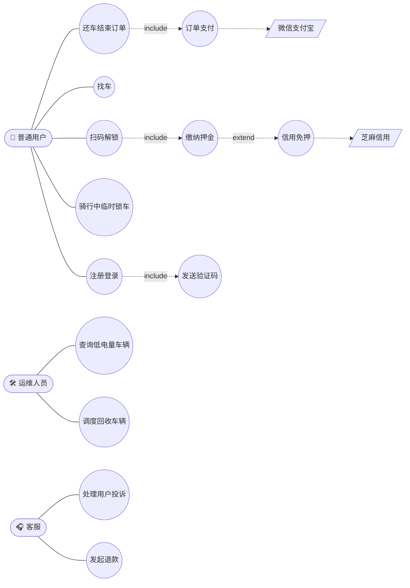
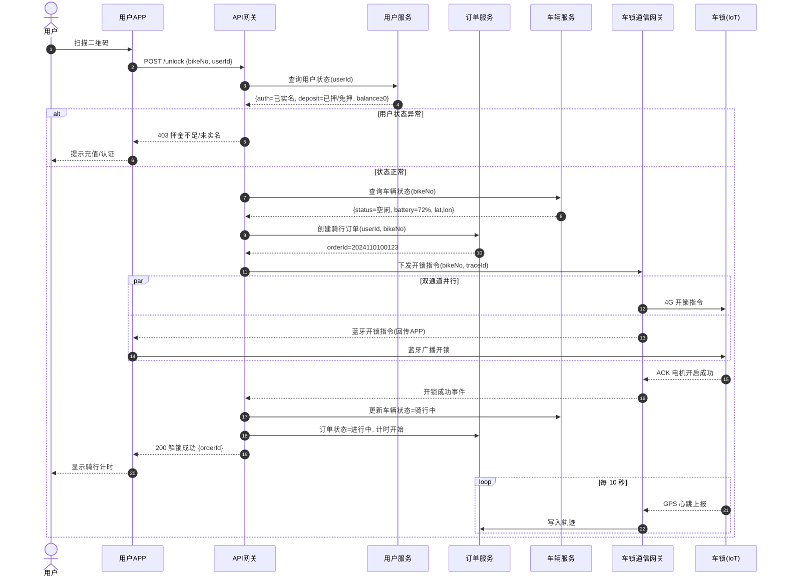
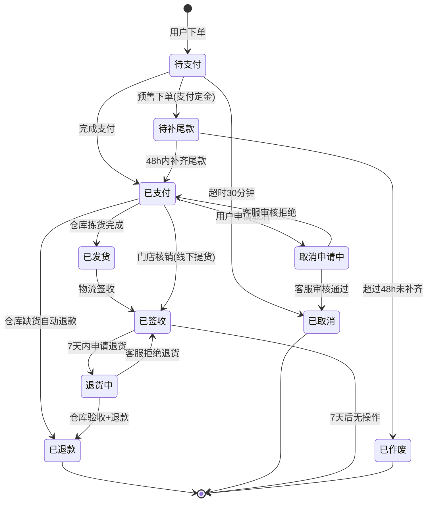
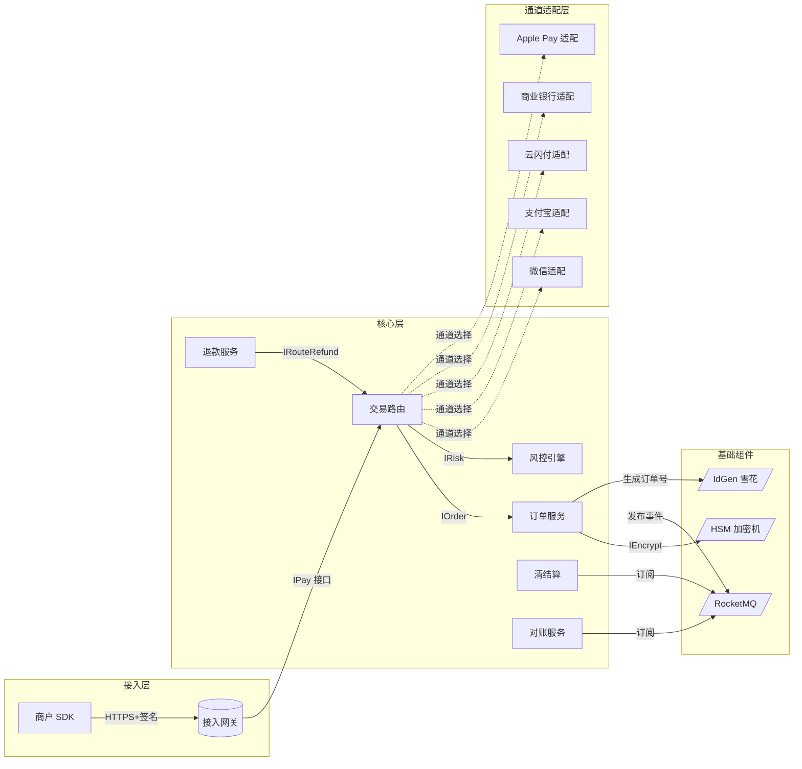
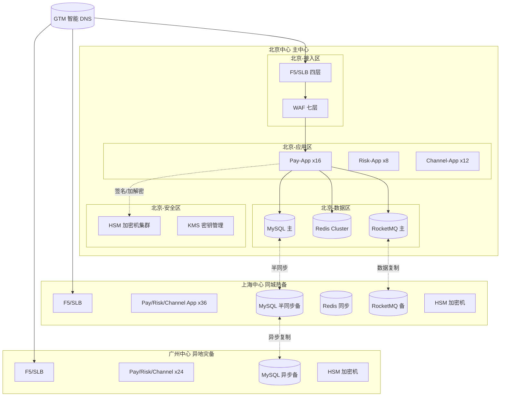

# 案例题型 04 · UML 建模与分析

> 约两年一次，常与面向对象设计结合出题，25 分。

## 考点分布

- 补全**用例图** / **类图** / **时序图** / **状态图**
- 判断类之间的关系（泛化 / 实现 / 依赖 / 关联 / 聚合 / 组合）
- 用 UML 描述业务流程
- 设计模式识别（与题型 10 联动）

## UML 14 种图分类（必背）

### 结构图（7 种）

1. **类图**（Class）⭐⭐⭐⭐⭐
2. 对象图（Object）
3. **组件图**（Component）
4. **部署图**（Deployment）⭐⭐⭐
5. **包图**（Package）
6. 组合结构图
7. Profile 图

### 行为图（7 种）

1. **用例图**（Use Case）⭐⭐⭐⭐⭐
2. **活动图**（Activity）⭐⭐⭐
3. **状态图**（State）⭐⭐⭐
4. **顺序 / 时序图**（Sequence）⭐⭐⭐⭐⭐
5. 通信图（Communication）
6. 定时图（Timing）
7. 交互概览图

## 类图六大关系（必背）

| 关系 | UML 符号 | 语义 | 强度 |
|---|---|---|---|
| **泛化**（继承） | 空心三角实线 ▷—— | is-a | 强 |
| **实现**（接口） | 空心三角虚线 ▷╌╌ | 实现接口 | 强 |
| **关联** | 实线 —— | 长期关系 | 中 |
| **聚合** | 空心菱形 ◇—— | 整体-部分（可分离） | 中 |
| **组合** | 实心菱形 ◆—— | 整体-部分（共存亡） | 强 |
| **依赖** | 虚线箭头 ╌╌> | 使用 / 临时 | 弱 |

**口诀**：**泛化继承实现接，关联聚合组合别，依赖临时用一下**

## 用例图要素

- **参与者**（Actor，小人）
- **用例**（椭圆）
- **包含**（<<include>>）：**必须**调用
- **扩展**（<<extend>>）：**可选**调用
- **泛化**：参与者 / 用例继承

## 时序图要素

- **生命线**（虚线）
- **激活条**（小矩形）
- **同步消息**（实心箭头）
- **异步消息**（细线箭头）
- **返回**（虚线箭头）
- **自调用 / 循环 / 分支**（Combined Fragment：loop, alt, opt）

## 状态图要素

- **起始状态**（实心圆）
- **终止状态**（同心圆）
- **状态**（圆角矩形）
- **转移**（箭头，标事件 / 守护条件 / 动作）

## 答题模板

### 问题 1：识别类关系

**套路**：
- 看题干动词 + 关键字
- "**由...组成**" / "**包含**"（不可分离）→ **组合**
- "**有**" / "**拥有**"（可分离）→ **聚合**
- "**是一种**" → **泛化**
- "**使用**" → **依赖**
- "**引用**" / "**关联**" → **关联**

### 问题 2：补全用例图

**套路**：
1. 参与者 = 题干中的角色（用户、管理员、第三方系统）
2. 用例 = 动词短语（"下单"、"支付"、"查询"）
3. 通用流程 → **<<include>>**
4. 可选 / 异常流程 → **<<extend>>**

### 问题 3：补全时序图

**套路**：
- 从左到右：**用户 → 控制器 → 服务 → DAO → DB**
- 标注每步**方法名 + 参数**
- 异常分支用 **alt**
- 循环用 **loop**

## 万能高分句

- "**订单**与**订单项**是**组合关系**：订单被删除时订单项一并删除（**共存亡**）"
- "**商品**与**分类**是**聚合关系**：分类删除后商品仍可存在"
- "**下单**用例通过 **<<include>>** 包含**校验库存**和**扣减积分**，通过 **<<extend>>** 扩展**使用优惠券**"
- "时序图以用户发起下单为起点，经过 **Controller → OrderService → InventoryService**，最终持久化到 DB，整条链路的关键耗时点为..."

## 常见陷阱

| ❌ | ✅ |
|---|---|
| 聚合组合混淆 | **整体删除时部分是否存活** |
| include/extend 反了 | include **必须**，extend **可选** |
| 时序图不画返回 | 每次同步调用都有**返回**线 |
| 状态图没起止 | 必须有**起始 + 终止**状态 |
| 类图属性方法缺 | 核心类要标**属性 + 方法签名** |

---

## 模拟案例题

> ⚠️ **自主命题**：题干场景为基于公开考点改编的虚构案例，避免版权风险；技术参数贴合真实工程实践。建议先**严格 25 分钟限时**作答，再对照参考答案。

### 模拟题 1 · 共享单车系统 用例图 + 时序图（25 分）

**【题干】**（约 780 字）

某共享出行公司"行无忧"运营在 **38 个一二线城市**的共享单车业务，注册用户 **2400 万**，活跃骑行用户 **480 万**，全网投放车辆 **120 万辆**，日均骑行订单 **310 万单**，骑行高峰（早晚通勤）QPS 峰值 **1.8 万**。后端架构师团队 **24 人**，正在对核心骑行链路做 UML 建模评审。

业务核心流程：

1. **注册/登录**：用户用手机号注册，需短信验证码；老用户支持手机号一键登录或微信授权登录；
2. **押金/充值**：新用户首次骑行需缴 **199 元**押金或开通信用免押（接入芝麻信用 ≥ 650 分）；
3. **找车扫码**：APP 内地图显示 100 米范围内所有可用车辆（GPS 网格查询）；用户走到车前扫描车把上**二维码**或输入**车牌号**解锁；
4. **解锁**：APP 调用解锁接口 → 服务端校验用户状态、押金、车辆状态 → **下发蓝牙/4G 双通道开锁指令**至车锁 → 车锁电机开启 → 上报开锁成功事件；
5. **骑行中**：车辆每 10 秒上报 GPS 位置，服务端实时记录骑行轨迹；用户可随时**临时锁车**（不结束订单），重新扫码继续骑行；
6. **还车**：用户停车在**电子围栏停车点**内，按下车锁机械按钮 → 车锁上报关锁事件 → 服务端结束订单 → 计费（基础费 1.5 元 + 时长费 0.5 元/15 分钟）；
7. **支付**：订单生成后从用户账户余额、芝麻信用账期或微信/支付宝免密代扣中扣款；
8. **运维场景**：运维人员通过运维端 APP 查看低电量车辆、违停车辆，调度卡车回收/搬运；客服在客服端处理报修、投诉、退款。

参与角色：**普通用户、运维人员、客服**；接入的外部系统：**芝麻信用、微信/支付宝、短信网关、地图服务、车锁通信网关**。

**【小问】**（合计 25 分）

**问 1**（10 分）：用 Mermaid 画出该系统的**用例图**，要求：（1）至少标识 **3 个 Actor**（普通用户、运维人员、客服）和 **2 个外部系统**（4 分）；（2）至少包含 **8 个用例**（4 分）；（3）正确使用 **<<include>>** 和 **<<extend>>**（2 分），并文字说明每个 include/extend 的判定理由。

**问 2**（10 分）：用 Mermaid 时序图详细描述"**用户扫码解锁骑行**"完整链路，参与者至少包括：用户 APP、API 网关、订单服务、用户服务、车辆服务、车锁通信网关、车锁。要求展示**至少 12 条消息**、含**返回消息**、含**条件分支**（如押金不足走异常路径）。

**问 3**（5 分）：题干提到"用户可临时锁车后重新扫码继续骑行"，分析这一交互对**车辆**与**订单**两类对象关系的影响：是 1:1 还是 1:N？为什么不在临时锁车时结束订单？给出 200 字以内分析。

---

**【参考答案】**

**问 1**：用例图（约 280 字）

**关系判定理由**：

| 关系 | 判定 | 理由 |
|---|---|---|
| 注册登录 **<<include>>** 发送验证码 | include | 注册必须发送验证码，是**必经子流程** |
| 扫码解锁 **<<include>>** 缴纳押金 | include | 首次骑行必须先押金，强制前置 |
| 缴纳押金 **<<extend>>** 信用免押 | extend | 信用免押是押金的**可选替代分支**（仅 ≥650 分用户） |
| 还车结束订单 **<<include>>** 订单支付 | include | 还车必触发支付（不可绕过） |

**问 2**：扫码解锁时序图（约 350 字）

**问 3**：车辆与订单的关系分析（约 180 字）

**关系判定**：车辆 ↔ 订单是 **1:N**（一辆车在历史维度对应多个订单），但在**任意时刻**最多关联 **1 个进行中订单**（业务约束 1:1）。

**为什么临时锁车不结束订单**：① 用户场景需求——例如骑车去便利店买水，10 分钟后继续，若每次锁车都结束订单，用户需重新扫码、重新计费、累计起步价，体验极差；② 计费连续性——临时锁车期间仍按时长计费（约 50% 折扣），保留订单状态实现连续计费；③ 车辆占用——临时锁车后车辆仍归当前用户专用（5 分钟内拒绝其他用户解锁），通过订单关联保护用户骑行优先权；④ 业务建模——这表明**订单生命周期跨越多次车锁开关**，状态机比简单 1:1 关系更能精确描述。

---

**【评分要点】**

| 得分项 | 分值 | 关键词/要求 |
|---|---|---|
| 用例图含 ≥ 3 Actor + 2 外部系统 | 4 分 | 缺 1 个扣 1 分 |
| 用例数 ≥ 8 | 4 分 | 缺 1 个扣 0.5 分 |
| include / extend 各 ≥ 1 | 2 分 | 反用扣 2 分 |
| 时序图参与者 ≥ 7 | 3 分 | 缺车锁通信网关或车锁扣分 |
| 时序消息 ≥ 12 | 3 分 | 含返回线 |
| 含异常分支（押金不足） | 2 分 | 没 alt 扣 2 分 |
| 含蓝牙+4G 并行（par） | 2 分 | 没体现双通道扣 1 分 |
| 1:1 vs 1:N 判定准确 | 2 分 | 缺"任意时刻 1:1，历史 1:N"扣 1 分 |
| 临时锁车不结束订单理由 | 3 分 | 必须含"计费连续性 + 用户体验 + 车辆占用"≥2 个维度 |

**常见扣分点**：
- ❌ include 和 extend 用反——"信用免押"写成 include（实际可选，应 extend）
- ❌ 时序图不画返回消息——同步调用必须双向
- ❌ 缺异常分支——押金不足 / 车辆离线等场景必画
- ❌ 1:N 关系简单写"一对多"不区分历史/当前——视为概念不清

**高分技巧**：
- 用 par 块体现"蓝牙+4G 双通道"工程细节，加分点
- 加 loop 块体现"GPS 心跳每 10 秒上报"，体现 IoT 系统建模深度
- 在用例图中区分"参与角色 Actor"和"外部系统 Actor"用不同符号

---

### 模拟题 2 · 订单全生命周期状态机图（25 分）

**【题干】**（约 760 字）

某 B2C 综合电商"宜物优品"自营商城，注册用户 **3500 万**，年 GMV **180 亿**，日均订单 **62 万笔**，大促日峰值 **180 万笔**，订单子团队 **16 人**，正在重构订单中心，目标支撑全渠道订单（线上 + 门店自提 + O2O）的统一状态管理。

订单完整生命周期涉及如下事件与转换：

1. 用户下单生成订单，初始状态 **待支付**；订单 **30 分钟未支付**自动取消（超时事件）；
2. 用户在 30 分钟内完成支付 → **已支付**（同时锁定库存）；
3. 已支付订单 → 仓库拣货 → **已发货**（推送物流单号）；
4. 已发货 → 物流签收事件 → **已签收**；
5. 已签收 7 天内用户可发起 **退货申请** → **退货中**；客服审核：（a）通过 → 用户寄回 → 仓库验收 → **已退款**（终态）；（b）拒绝 → 回到 **已签收** 状态；
6. 已支付状态下用户可发起 **取消申请**（如不想要了），需客服审核：（a）通过 → 退款 → **已取消**（终态）；（b）拒绝 → 回到 **已支付**；
7. **缺货异常**：仓库拣货发现库存不足，自动触发 **缺货退款** → 系统自动回滚库存 → **已退款**（终态）；
8. 大促期间允许 **预售订单**：下单后立即支付 **定金**（10%-20%），状态 **待补尾款**，活动结束后系统通知用户在 **48 小时内** 补齐尾款，超时则定金不退、订单作废 → **已作废**（终态）；
9. 部分订单（线下门店自提）支持 **门店核销**：用户到店出示核销码，门店端扫码 → 订单直接进入 **已签收** 状态，跳过物流环节；
10. 终态订单不可逆，但**所有终态**（已签收/已退款/已取消/已作废）均可被客服强制重开（仅作弊单/客诉特例，不在常规状态机中体现）。

技术栈：Spring Boot + Spring Statemachine 4 + MySQL + RocketMQ。

**【小问】**（合计 25 分）

**问 1**（12 分）：用 Mermaid `stateDiagram-v2` 完整绘制该订单状态机图，要求：（1）至少包含 **8 个状态**（4 分）；（2）正确标注事件 / 守卫条件（如 `[超时30分钟]`）（4 分）；（3）必须有**起始与终止状态**（2 分）；（4）含至少 **2 处条件分叉**（如客服审核通过/拒绝）（2 分）。

**问 2**（8 分）：分析（1）"待支付 → 已取消（超时）" 与 "已支付 → 已取消（人工取消）" 两个 **取消** 行为的差异（4 分）；（2）"取消申请通过 → 已取消" 在并发场景下，可能与"已发货"事件**竞态**——分析该竞态场景并给出**业务规则与技术方案**（4 分）。

**问 3**（5 分）：状态机用代码实现时通常采用 **状态模式 / 表驱动 / 状态机框架** 三种方式，结合本系统 **62 万笔/日 + 大促 180 万** 规模，给出推荐方案及理由（200 字以内）。

---

**【参考答案】**

**问 1**：状态机图（约 320 字）

**问 2**：取消差异 + 竞态分析（约 280 字）

（1）**两个"取消"的差异**：

| 维度 | 待支付 → 已取消（超时） | 已支付 → 已取消（人工） |
|---|---|---|
| 触发主体 | 系统定时任务（被动） | 用户主动申请 + 客服审核 |
| 资金流向 | **无支付，无退款** | **有支付，需触发退款** |
| 库存影响 | 仅释放预占库存 | 释放已锁定库存 |
| 是否需审核 | 否 | 是（防恶意退款） |
| 状态前置 | 直接 待支付 → 已取消 | 待支付（中间）→ 取消申请中 → 已取消 |
| RocketMQ 事件 | 仅库存释放 | 库存释放 + 退款 + 通知财务 + 售后通知 |

（2）**竞态场景**：用户在仓库拣货阶段（已支付状态）申请取消，客服正在审核期间，仓库恰好完成拣货并触发"已发货"事件——此时若 "取消通过" 与 "已发货" 几乎同时到达，状态机可能**先变 已发货 后又被改成 已取消**，造成"已发货却退款"的业务事故。

**业务规则**：① "取消申请中"状态对**已发货事件**做**抑制**——拣货完成事件到达时检查订单是否处于 取消申请中，若是则**暂停发货** + 等待客服审核结果；② 客服审核通过前，仓库**不得贴单出库**。

**技术方案**：① 数据库行锁 + 状态机的"卫语句"——`UPDATE orders SET status=已发货 WHERE id=? AND status=已支付`，若 status 已变 取消申请中 则受影响行数 = 0，发货失败；② RocketMQ 顺序消息按 orderId 哈希到同一队列，避免乱序；③ 引入 `version` 乐观锁防止 ABA。

**问 3**：状态机实现选型（约 180 字）

**推荐：表驱动 + Spring Statemachine 框架混合**。理由：① 62 万笔/日 + 大促 180 万峰值，**性能要求高**——状态模式下大量状态类（每状态 1 个 Class）膨胀且 GC 压力大；② **业务变更频繁**——电商订单状态规则常变（如新增预售、O2O 提货），表驱动（状态转换表存数据库或配置中心）支持热更新；③ **可视化与审计**——Spring Statemachine 提供 BPMN 类似的可视化工具，便于产品/客服理解；④ 框架内置事件持久化、并发锁、监听器机制，免去自研。落地：Spring Statemachine 定义状态枚举 + JPA Entity 持久化转换历史，转换条件用 SpEL 表达式存储到 `state_transition_rule` 表，支持动态加载。

---

**【评分要点】**

| 得分项 | 分值 | 关键词/要求 |
|---|---|---|
| 状态数 ≥ 8 | 4 分 | 缺 1 个扣 0.5 分 |
| 起始 + 终止 | 2 分 | 没 [*] 扣 2 分 |
| 事件 + 守卫齐全 | 4 分 | 缺"超时30分钟""48h""客服审核"扣分 |
| 条件分叉 ≥ 2 | 2 分 | 取消审核+退货审核 |
| 两类取消差异表 ≥ 4 维度 | 4 分 | 缺"资金流向"扣 1 分 |
| 竞态场景描述清晰 | 2 分 | 必须举出具体时序 |
| 业务规则 + 技术方案 | 2 分 | 必含行锁/版本号/顺序消息 |
| 实现选型含规模论证 | 3 分 | 必须扣紧 62 万/180 万 |
| 选型理由含 ≥ 3 维度 | 2 分 | 性能/可变性/可视化 |

**常见扣分点**：
- ❌ 漏画"待补尾款"或"门店核销"等次要分支——题干明确给出必须画
- ❌ 终态没有 [*] 终止标记——状态机基础违规
- ❌ 把"超时取消"和"人工取消"混为一个"已取消"不分析差异——丢 4 分
- ❌ 实现选型只说"用 Spring Statemachine"不论证——视为没思考

**高分技巧**：
- 状态机图加颜色或注释突出**终态**（约定俗成的双圈或文字标注），评卷老师一目了然
- 竞态分析用"行锁 + 顺序消息 + 乐观锁"三件套覆盖，体现并发理论功底
- 提到"BPMN 类似可视化工具"或"卫语句 Guard"等术语，体现框架熟悉度

---

### 模拟题 3 · 支付网关 组件图 + 部署图（25 分）

**【题干】**（约 800 字）

某综合金融科技公司"惠通支付"为电商、出行、酒旅、教育等 **8 大行业 1.2 万商户**提供统一聚合支付网关，对接渠道含 **微信支付、支付宝、银联云闪付、各大商业银行 Pay、Apple Pay** 共 28 个外部支付通道。日均交易笔数 **2200 万**、峰值 QPS **3.6 万**、单笔金额上限 **5 万元**、交易**端到端 P99 < 500ms**、年可用性 **99.99%**、支付失败率 **< 0.05%**，需通过 **PCI-DSS 三级认证**、**等保三级**及人行**支付牌照**合规。团队 **42 人**（开发 28 + 测试 8 + DBA 3 + 安全 3），建设周期 **15 个月**。

系统主要内部组件：

1. **接入层**：商户 SDK（Android/iOS/H5/小程序/服务端 SDK 五种形态）、HTTPS 接入网关；
2. **核心层**：交易路由（按商户偏好/通道成功率/费率智能选择最佳通道）、订单服务、风控引擎、对账服务、清结算服务、退款服务；
3. **通道适配层**：每个外部支付通道一个 ChannelAdapter（28 个），统一适配协议差异；
4. **数据存储**：MySQL（订单/交易主库 + 16 库 64 表分片）、Redis Cluster（会话+幂等键）、ClickHouse（交易明细分析）、HBase（流水档案 7 年归档）；
5. **基础设施**：Nacos、RocketMQ、SkyWalking、Prometheus、ELK、HSM 加密机；
6. **跨地域多活**：北京 + 上海 + 广州**三地三中心**，单中心故障 RTO < 60s。

**【小问】**（合计 25 分）

**问 1**（10 分）：用 Mermaid 画出支付网关核心**组件图**，要求：（1）至少识别 **8 个组件**（4 分）；（2）正确标注**接口**（提供接口/请求接口）（3 分）；（3）含组件间的**依赖关系**或**装配关系**（3 分）。

**问 2**（10 分）：用 Mermaid 画出**部署图**，要求：（1）展示**三地三中心**多活部署（4 分）；（2）至少标识 **接入区 / 应用区 / 数据区 / 安全区** 四类节点（4 分）；（3）标注关键中间件部署位置（HSM 加密机、RocketMQ 集群、MySQL 主备）（2 分）。

**问 3**（5 分）：从组件图角度分析"**交易路由**"组件作为聚合支付的**核心抽象**，体现了哪些**架构原则**（≥3 个，如 SRP、OCP、DIP 等），并各举一例。

---

**【参考答案】**

**问 1**：组件图（约 280 字）

**接口设计**：
- `IPay`：支付主入口（接入网关 → 交易路由提供）；
- `IOrder`：订单生命周期（路由 → 订单服务）；
- `IRisk`：风控决策（路由 → 风控）；
- `IChannel`：所有 ChannelAdapter 实现的统一接口（28 实现共一个接口）；
- `IEncrypt`：与 HSM 交互的加解密接口；

**装配关系**：交易路由通过 IChannel 接口对 28 个通道适配器**面向接口装配**，新增通道只需新增一个 Adapter 实现 IChannel，无需改路由代码。

**问 2**：部署图（约 320 字）

**说明**：
- **多活策略**：北京主、上海同城热备（半同步复制 RTO < 30s）、广州异地灾备（异步复制 RTO < 60s）；
- **接入区**：F5 + WAF + 抗 DDoS（清洗中心）；
- **应用区**：Pod 部署在 K8s，按服务横向 16/8/12 副本；
- **数据区**：MySQL 半同步 + Redis 主从 + MQ 多副本；
- **安全区**：HSM 加密机**物理隔离**，每中心独立部署（密钥不出本中心）；
- **GTM 智能 DNS** 健康检查驱动流量切换。

**问 3**：架构原则分析（约 220 字）

| 原则 | 在交易路由中的体现 |
|---|---|
| **单一职责（SRP）** | 交易路由**只负责"通道选择决策"**，不做支付执行（交给适配器）、不做风控（交给风控引擎）、不做账务（交给清结算）；规则引擎、费率计算、成功率统计是其内聚关注点 |
| **开闭原则（OCP）** | 新增微信支付分付/数字人民币等新通道时，**只新增 ChannelAdapter 实现 IChannel 接口**，路由组件代码无需修改——对扩展开放、对修改关闭 |
| **依赖倒置（DIP）** | 路由依赖**抽象 IChannel 接口**而非具体的 WeixinAdapter / AliAdapter；高层模块（路由）不依赖低层（适配器具体实现），二者都依赖抽象 |
| **里氏替换（LSP）** | 任意 ChannelAdapter 都能在不破坏路由逻辑的前提下替换——所有 Adapter 必须返回统一的 ChannelResponse 结构 |

---

**【评分要点】**

| 得分项 | 分值 | 关键词/要求 |
|---|---|---|
| 组件图 ≥ 8 个组件 | 4 分 | 必含路由/订单/风控/适配器 |
| 接口标注（IPay/IChannel） | 3 分 | 缺接口名扣 1 分 |
| 装配/依赖关系 | 3 分 | 必须用箭头表达 |
| 部署图三地三中心 | 4 分 | 缺一中心扣 1 分 |
| 四类节点完整 | 4 分 | 接入/应用/数据/安全 各 1 分 |
| 关键中间件标位置 | 2 分 | HSM 必标"物理隔离" |
| 架构原则 ≥ 3 个 | 3 分 | 每条 1 分 |
| 每原则附具体例子 | 2 分 | 没例子扣 1 分 |

**常见扣分点**：
- ❌ 组件图把适配器画为类（用 class 符号）——应该用组件符号
- ❌ 部署图缺 HSM 安全区——支付系统必备项
- ❌ 没标"半同步 / 异步"复制方式——多活方案不完整
- ❌ 架构原则只列名词没结合本场景举例——属于背书

**高分技巧**：
- 用 Mermaid 的 subgraph 区分三地三中心，渲染清晰
- 接口命名"I 前缀 + 业务动词"（IPay/IChannel/IRisk）符合工程规范
- HSM "物理隔离 + 密钥不出中心" 是 PCI-DSS 三级认证关键，必须明确写出

---

## 2022 下半年真题 · 试题二（煤矿安全预警系统：DFD + ER + 数据字典）

> 来源：2022 年 11 月 系统架构设计师案例分析 试题二
> 公开真题回忆版，仅供学习参考。

### 【题干场景】

某煤矿建设项目开发**安全预警系统**，核心功能：项目信息维护、影响因素录入、事故录入、安全评价、预警分析等。架构师采用**结构化方法**做需求分析，需补全数据流图（DFD）、ER 图，并说明数据字典作用。

### 【问题 1】（9 分）数据流图补充 + 数据平衡原则

**补充要点**：
- DFD 必含 4 类元素：**外部实体（方框）** / **数据流（箭头）** / **加工/处理（圆/框）** / **数据存储（双线）**
- 补全 6 处空白需根据题干"项目维护/影响录入/事故录入/评价/预警"5 大功能链识别**输入 → 处理 → 输出**链路
- 典型补充：外部实体（管理员/煤矿工程师/上级监管）、数据存储（项目库/事故库/评价规则库）

**数据平衡原则（必背 4 条）**：
1. **父图与子图平衡**：父图某加工的输入输出 = 子图所有输入输出之和
2. **加工的输入输出平衡**：加工的输出数据必须能从输入数据推导出来
3. **数据流命名一致**：父图子图同名数据流必须含义一致
4. **数据存储读写守恒**：所有数据存储必须既有读、也有写（除非是外部初始化）

### 【问题 2】（9 分）补全总体 ER 图实体

**典型 6 大实体**：

| 实体 | 关键属性 |
|---|---|
| **项目** | 项目编号、项目名称、煤矿名、建设阶段 |
| **影响因素** | 因素编号、类别、风险等级、阈值 |
| **事故记录** | 事故编号、发生时间、影响范围、损失 |
| **安全评价** | 评价编号、评分、评价人、时间 |
| **预警事件** | 预警编号、级别、触发条件、响应人 |
| **用户** | 用户ID、姓名、角色、权限 |

**关系标注**：
- 项目 **1:N** 影响因素
- 项目 **1:N** 事故记录
- 事故记录 **N:1** 安全评价
- 影响因素 **1:N** 预警事件

### 【问题 3】（7 分）DFD 与数据字典作用

| 工具 | 在需求分析的作用 | 在设计阶段的作用 |
|---|---|---|
| **数据流图（DFD）** | 描绘系统**功能流程**与数据流向，帮助识别加工、存储、外部实体 | 作为**模块划分依据**：每个加工对应一个程序模块 |
| **数据字典（DD）** | 对 DFD 中**数据流、数据存储、加工**做严格定义（名称、组成、值域、约束） | 作为**数据库设计依据**：DD 的数据存储 → 数据库表；数据元素 → 字段 |

**两者关系**：DFD 给"骨架"（功能拓扑），DD 给"血肉"（数据细节），**互补不可缺**。

### 【采分关键词】

DFD 4 元素 / 父子图平衡 / 加工输入输出推导 / 数据字典定义 / 实体-关系 / 1:N 标注

### 【常见扣分点】

- ❌ DFD 补全只画箭头不命名——必须给数据流名（如"事故信息""预警结果"）
- ❌ ER 关系少标基数（1:N / N:M）——必扣分
- ❌ 数据字典作用只说"定义数据"——必须分需求/设计两阶段答
