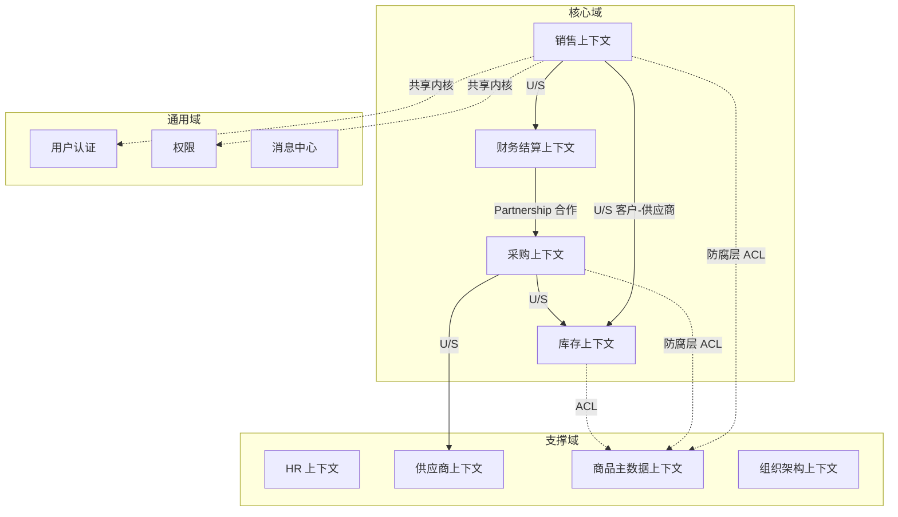
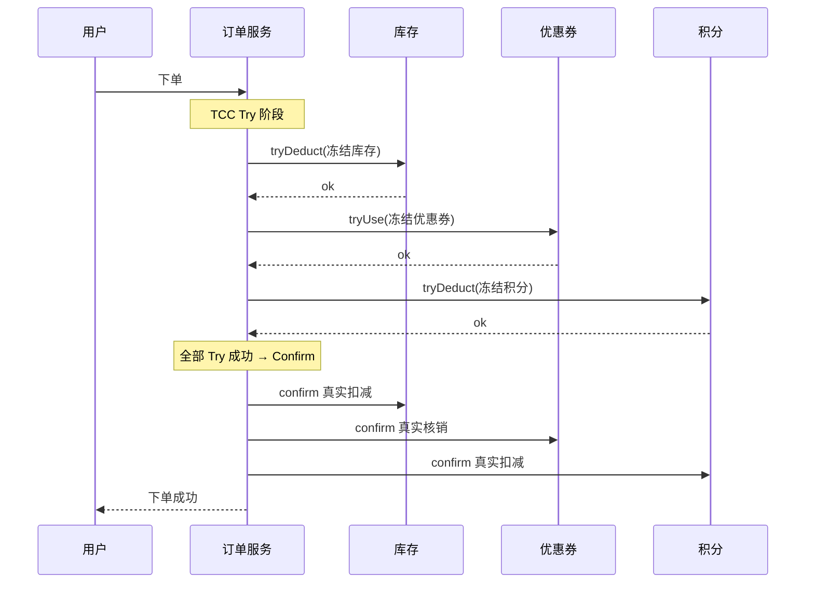
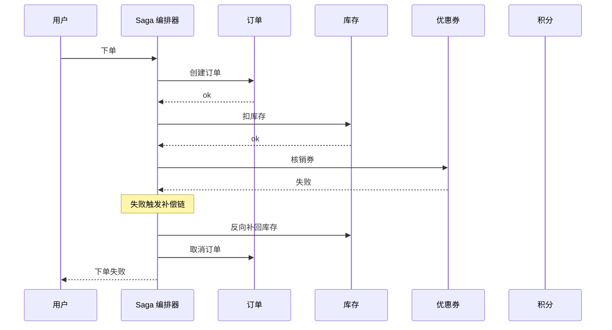

# 案例题型 05 · 微服务拆分与重构

> 高频题型，近 5 年出现多次，25 分。

## 考点分布

- 从**单体**架构识别拆分点
- 选用**拆分原则**（DDD 限界上下文 / 业务能力）
- 描述**服务治理**手段（注册、熔断、限流、链路追踪）
- 分布式事务方案选型（2PC / TCC / Saga / 本地消息表）
- 数据一致性问题

## 核心理论速查

### DDD 四层架构

```
表现层 → 应用层 → 领域层 ⭐ → 基础设施层
       （用例编排） （聚合根/实体/值对象/领域服务） （持久化/外部）
```

### 微服务拆分原则

1. **单一职责**
2. **限界上下文**（Bounded Context）
3. **业务能力**驱动
4. **Database Per Service**
5. **团队自治**（Two-Pizza Team）
6. **数据独立、共享数据通过接口**

### 治理组件（K 必记）

| 类别 | 代表 |
|---|---|
| 注册中心 | **Nacos** / Eureka / Consul |
| 网关 | **Spring Cloud Gateway** / Kong |
| 熔断限流 | **Sentinel** / Hystrix / Resilience4j |
| 配置中心 | **Apollo** / Nacos |
| 链路追踪 | **SkyWalking** / Jaeger / Zipkin |
| 服务网格 | **Istio** / Linkerd |

### CAP 定理

- **C**onsistency / **A**vailability / **P**artition Tolerance
- 分布式**必选 P**，AP（MongoDB/Cassandra）vs CP（ZooKeeper/Etcd）

### 分布式事务方案

| 方案 | 一致性 | 性能 | 复杂度 | 适用 |
|---|---|---|---|---|
| 2PC / XA | 强 | 差 | 中 | 传统金融 |
| TCC | 强 | 中 | 高 | 核心交易 |
| Saga | 最终 | 好 | 中 | 长流程 |
| 本地消息表 | 最终 | 好 | 低 | 一般业务 |
| MQ 事务消息 | 最终 | 好 | 低 | RocketMQ |

## 答题模板

### 问题 1：识别拆分边界

**套路**：
1. 画出**业务能力**地图（用户 / 商品 / 订单 / 支付 / 物流 / 库存）
2. 每个能力 = 一个**限界上下文** = 一个微服务
3. 数据库**私有**
4. 通信方式：**同步 REST/gRPC + 异步 MQ**

### 问题 2：给拆分方案

**标准模板**：
> 依据 **DDD 限界上下文**，将单体拆分为：
> - **用户服务**（账户、认证、权限）
> - **商品服务**（SKU、类目、库存）
> - **订单服务**（下单、查询）
> - **支付服务**（多渠道支付）
> - **物流服务**（发货、追踪）
>
> 每个服务**独立数据库**，通过 **API Gateway** 统一入口，**Nacos** 注册发现，**Sentinel** 熔断限流，**RocketMQ** 处理异步事件。

### 问题 3：分布式事务设计

**模板**：
> 下单 → 扣库存 → 扣积分 → 支付 → 发货
> - **下单扣库存**：**TCC**（try 预扣 / confirm 确认 / cancel 回滚）
> - **订单 → 物流通知**：**本地消息表 + MQ**，保证最终一致
> - **支付回调**：**幂等 + 重试**

### 问题 4：数据一致性

**模板**：
- **写入一致**：主库写，通过**Canal 监听 binlog** 同步到 ES / 缓存
- **读一致**：**Cache Aside** 模式，先删缓存再更库
- **跨服务一致**：**Saga / 本地消息表**

## 万能高分句

- "基于 **DDD 限界上下文**将单体拆分为 **10 个业务微服务 + 5 个基础服务**"
- "核心支付交易采用 **TCC** 保证强一致，辅助通知场景用**本地消息表 + MQ** 实现最终一致"
- "服务治理通过 **Nacos（注册）+ Sentinel（熔断限流）+ SkyWalking（链路追踪）**"
- "遵循 **Database Per Service**，服务间不共享库，通过**接口**交换数据"

## 常见陷阱

| ❌ | ✅ |
|---|---|
| 拆太细 / 太粗 | **限界上下文**决定粒度 |
| 共享数据库 | **Database Per Service** 是红线 |
| 不谈治理 | **熔断 / 限流 / 追踪** 必写 |
| 分布式事务一把梭 | **场景选方案**：强一致 TCC / 最终一致 MQ |
| 忽视容量 | 每个服务都应估**QPS / 实例数** |

---

## 模拟案例题

> ⚠️ **自主命题**：题干场景为基于公开考点改编的虚构案例，避免版权风险；技术参数贴合真实工程实践。建议先**严格 25 分钟限时**作答，再对照参考答案。

### 模拟题 1 · 老 ERP 单体到 DDD 限界上下文拆分（25 分）

**【题干】**（约 820 字）

某大型连锁零售集团"康源百货"运营**全国 318 家直营门店 + 1240 家加盟店**，年营收 **220 亿元**，员工 **3.6 万**。集团于 2014 年自建的 ERP 系统已运行 **11 年**，承载采购、库存、销售、财务、HR、供应链协同等全部内部业务。该系统是基于 **Java EE 6 + EJB 3 + Oracle 11g** 的**集中式单体**，部署在 **3 台物理机集群**上，代码总量 **480 万行**、接口数 **3700 个**、数据库表 **1280 张**，研发团队历经 5 任技术负责人，**架构债积累严重**。

当前痛点：

1. **发布缓慢**：单次发版编译 **40 分钟 + 测试 2 天 + 上线窗口仅周日凌晨**，年发布频次仅 18 次；
2. **故障影响面大**：促销活动期间任一模块抛异常都可能拖垮整个 ERP，2024 年因 OOM 故障 7 次，单次平均影响 **2.5 小时**；
3. **协同效率低**：财务与供应链团队改不同模块共用 1 个代码仓，**合并冲突日均 8 次**；
4. **新业务难以承载**：2024 年新增直播电商和社区团购业务，与传统 ERP 强耦合，开发周期 **6 个月**仍上不了线；
5. **数据库瓶颈**：Oracle 单库连接数常态 **800 + 峰值 1500**，CPU 长期 75%+，已到扩容上限。

集团 CTO 决定 2025 年启动 **18 个月**为期的 ERP 微服务化重构，预算 **6800 万**，组建专项团队 **85 人**（含 3 个外部咨询团队），技术栈定为 Spring Cloud Alibaba + Nacos + Sentinel + SkyWalking + RocketMQ + MySQL 8 + TiDB + Kubernetes。

业务架构师团队按 **DDD（领域驱动设计）** 方法对业务做了梳理：核心域包含**销售、采购、库存、财务**；支撑域包含**HR、供应商、商品主数据、组织架构**；通用域包含**用户认证、权限、消息、文件、字典**。其中"销售"内部又可细分**门店 POS、电商订单、批发订单、促销活动**等子域。

**【小问】**（合计 25 分）

**问 1**（10 分）：基于 DDD **战略设计**给出限界上下文（Bounded Context）划分图：（1）至少识别 **8 个限界上下文**（4 分）；（2）画出**上下文映射图（Context Map）**标注上下游关系（合作 Partnership / 客户-供应商 Customer-Supplier / 防腐层 ACL / 共享内核 Shared Kernel 等），用 Mermaid 表达（4 分）；（3）说明哪些上下文应优先拆分、哪些可延后（2 分）。

**问 2**（8 分）：选取**销售**和**库存**两个限界上下文做**战术设计**：（1）识别销售域的**聚合根**（如订单、客户、商品）（4 分）；（2）说明销售与库存**通信方式**——同步 RPC vs 异步事件（含选型理由）（4 分）。

**问 3**（7 分）：单体 → 微服务的**渐进式拆分**路径——给出 4 个阶段（含里程碑、风险点、回滚预案），按工程实践排序，避免 **Big Bang** 重构。

---

**【参考答案】**

**问 1**：限界上下文划分（约 320 字）



**8+ 限界上下文清单**：销售、采购、库存、财务结算、HR、供应商、商品主数据、组织架构（再加用户认证/权限/消息可达 11 个）。

**关系类型说明**：
- **客户-供应商（Customer-Supplier U/S）**：销售依赖库存（占用库存），库存为上游、销售为下游；
- **合作（Partnership）**：财务与采购紧密协同（应付账款），双向依赖；
- **防腐层（ACL）**：商品主数据频繁变更，销售/采购/库存通过 ACL 防止主数据模型污染本域；
- **共享内核（Shared Kernel）**：用户认证 + 权限模型在多上下文共用。

**优先级**：
- **优先拆分**：销售、库存、商品主数据、用户认证（高频变更 + 故障频繁 + 新业务依赖）；
- **延后拆分**：HR、组织架构（变更频率低、独立性已较强，可放第二批）；
- **暂不拆分**：财务核心账务模块（监管严、风险高，留到第三阶段稳态后处理）。

**问 2**：销售战术设计 + 通信方式（约 280 字）

（1）**销售域聚合根识别**：

| 聚合根 | 边界 | 内部实体 / 值对象 |
|---|---|---|
| **订单（Order）** | 一次销售交易的完整生命周期 | OrderItem（实体）、ShippingAddress（值对象）、PromotionApplied（值对象） |
| **客户（Customer）** | 客户档案 | Address（值对象）、ContactInfo（值对象）、MemberLevel（值对象） |
| **促销活动（Promotion）** | 一次促销规则的定义和效果 | PromotionRule（实体）、ApplicableProducts（值对象集合） |

**注意**：商品（Product）**不**作为销售域聚合根——它属于商品主数据上下文，销售域只通过 ProductId（值对象）引用。

（2）**通信方式选型**：

| 场景 | 同步 RPC | 异步事件 | 选型 |
|---|---|---|---|
| 下单时**预占库存** | ✅ Dubbo/gRPC 调用 | ❌ 异步无法立即知道结果 | **同步**（订单服务 → 库存服务，需立即返回成功失败） |
| 订单**取消时释放库存** | ⚠️ 同步会拖慢取消流程 | ✅ MQ 发布 OrderCancelledEvent | **异步**（最终一致即可） |
| 订单**完成时通知财务结算** | ❌ 不该让销售依赖财务 | ✅ MQ 发布 OrderCompletedEvent | **异步事件驱动** |
| 库存**预警**触发采购建议 | ❌ 跨域强耦合 | ✅ MQ 发布 StockLowEvent | **异步**（事件溯源风格） |

**核心原则**：**同步用于强一致 + 实时反馈场景；异步事件驱动用于解耦 + 最终一致场景**。订单与库存预占用同步 RPC + TCC 三阶段，其他用 RocketMQ 事务消息。

**问 3**：渐进式拆分 4 阶段（约 240 字）

| 阶段 | 时长 | 里程碑 | 风险点 | 回滚预案 |
|---|---|---|---|---|
| **阶段 1：绞杀者代理** | 2-3 个月 | 在单体前部署 API 网关 + Nginx 路由层，对外接口不变，**透明代理**到单体；单体内部按上下文做**模块化重构**（不拆进程，先解耦代码） | 团队对网关不熟悉、性能损耗 5-10% | 网关回滚到 Pass-Through 模式 |
| **阶段 2：边缘上下文先拆** | 4-6 个月 | 拆出**用户认证 + 权限 + 商品主数据**（最独立、依赖最少）；新服务双写老库 + 新库，灰度切流（1% → 10% → 50% → 100%） | 双写不一致 | 切流回老库，关闭新服务 |
| **阶段 3：核心业务拆分** | 6-8 个月 | 拆**销售 + 库存 + 采购**核心业务；引入 RocketMQ 事件总线、TCC 强一致；旧模块以**防腐层**包装供过渡期使用 | 跨域事务、数据迁移失败 | 通过 binlog CDC 反向同步回老库，业务降级到老 ERP |
| **阶段 4：财务/HR 等收尾** | 3-4 个月 | 拆财务结算（监管模块谨慎处理）、HR、组织架构；**老 ERP 进入只读模式**，最终下线 | 历史数据迁移 | 老库保留 6 个月作冷备 |

**核心方法论**：① **绞杀者模式**（Strangler Fig Pattern）——新功能在新服务，老功能逐步迁移；② **双写过渡 + CDC 同步**确保新老库一致；③ **灰度切流**控制爆炸半径；④ **每阶段必须有可回退路径**，禁止 Big Bang。

---

**【评分要点】**

| 得分项 | 分值 | 关键词/要求 |
|---|---|---|
| 限界上下文 ≥ 8 个 | 4 分 | 必含核心/支撑/通用三类 |
| Context Map 含 ≥ 3 类关系 | 4 分 | U/S, ACL, Partnership 等 |
| 优先级分组 | 2 分 | 必须分"优先/延后/暂不" |
| 销售域聚合根 ≥ 3 个 | 4 分 | 缺值对象/实体扣 1 分 |
| 同步 vs 异步选型表 | 4 分 | 必含 4 种场景 |
| 4 阶段拆分含里程碑 | 4 分 | 缺一阶段扣 1 分 |
| 每阶段含风险 + 回滚 | 2 分 | 没回滚扣 1 分/阶段 |
| 提及绞杀者/双写/灰度 | 1 分 | 关键词命中加分 |

**常见扣分点**：
- ❌ 把"商品"当成销售域聚合根——商品归商品主数据上下文，销售只引用 ProductId
- ❌ 财务和销售通信用同步 RPC——应该 MQ 事件驱动，否则销售耦合财务
- ❌ 拆分路径写 Big Bang 一次性切换——架构师红线
- ❌ Context Map 只画方块没标关系类型——丢 4 分

**高分技巧**：
- 用"康威定律"论证拆分粒度对应组织结构——85 人 + 18 个月 + 多咨询团队，限界上下文必须对齐组织
- 提及"事件风暴（Event Storming）"作为限界上下文识别方法，体现 DDD 战略设计专业度
- 阶段 3 显式提"防腐层包装老服务"——展示对绞杀者+ACL 组合的理解

---

### 模拟题 2 · 订单一致性 TCC vs Saga vs 本地消息表（25 分）

**【题干】**（约 800 字）

某综合电商平台"优品荟"主营美妆、母婴、个护、家清四大品类，注册用户 **5800 万**、年 GMV **96 亿**、日订单 **150 万**、大促峰值 **480 万**、订单 P99 < 800ms、订单团队 **22 人**。系统架构基于 Spring Cloud Alibaba 微服务，核心服务共 14 个，下单链路涉及 **6 个核心服务**：

1. **订单服务**：创建订单主单、订单项、初始状态 待支付；
2. **库存服务**：预占库存（防止超卖），后续支付完成转为正式扣减；
3. **优惠券服务**：核销用户优惠券（一次性核销，需可回滚）；
4. **积分服务**：扣减用户积分（积分抵现），需可回滚；
5. **风控服务**：实时风控决策（同步），不参与事务（决策即返回，无副作用）；
6. **通知服务**：异步发送下单成功短信、APP 推送，**对一致性要求最低**。

业务规则：

1. 普通商品下单需保证**订单 + 库存 + 优惠券 + 积分**四方面**强一致**——任何一方失败都必须整体回滚，否则可能出现"订单建了但库存没扣""优惠券扣了但订单没建"等资损事故；
2. 风控决策同步在 50ms 内返回，作为流程**前置**校验，不进入事务边界；
3. 通知服务的短信/推送可以**最终一致**——即使丢了一条短信，对核心业务无影响；
4. 大促峰值 480 万订单 = **5556 TPS**，下单链路要求 **P99 < 800ms**。

架构师老李在评审会上提出三套方案：A. **全链路 TCC**；B. **Saga 编排**；C. **本地消息表 + 最终一致**。需评审会决议最终方案。

**【小问】**（合计 25 分）

**问 1**（12 分）：分别用 Mermaid 序列图描述 TCC、Saga、本地消息表三种方案在本场景下的**核心调用流程**（4 分/方案，共 12 分）。

**问 2**（8 分）：从 **一致性强度、性能开销、实现复杂度、补偿成本、运维难度** 5 个维度对比三种方案，并明确**本场景的推荐方案**（含选型理由）。

**问 3**（5 分）：针对推荐方案，给出**幂等性 + 异常补偿**的关键设计要点（≥3 条）。

---

**【参考答案】**

**问 1**：三种方案序列图（约 380 字）

**方案 A：TCC（Try-Confirm-Cancel）**



**方案 B：Saga 编排（基于事件 + 补偿）**



**方案 C：本地消息表 + RocketMQ 事务消息**

```mermaid
sequenceDiagram
    participant U as 用户
    participant O as 订单服务
    participant DB as 订单库
    participant MQ as RocketMQ
    participant N as 通知服务
    U->>O: 下单
    O->>DB: BEGIN; INSERT 订单 + INSERT 本地消息(订单事件); COMMIT
    DB-->>O: ok
    O-->>U: 下单成功
    par 异步发布
        O->>MQ: 投递订单事件
    end
    MQ-->>N: 消费 → 发短信/推送
    Note over O: 定时扫描器: 未投递成功的本地消息重投
```

**问 2**：5 维度对比 + 选型（约 220 字）

| 维度 | TCC | Saga | 本地消息表 |
|---|---|---|---|
| **一致性强度** | 强一致 | 最终一致 | 最终一致 |
| **性能开销** | ❌ 3 阶段 = 每事务 3 跳，约 +60-100ms | ⚠️ 编排器 + N 步骤，链长则慢 | ✅ 仅 1 跳 + 异步，几乎无开销 |
| **实现复杂度** | ❌ 每业务 3 套接口 | ⚠️ 编排器 + 补偿逻辑 | ✅ 单库事务 + 扫描器 |
| **补偿成本** | ⚠️ Cancel 接口需开发 | ⚠️ 每步需补偿接口 | ✅ 失败重投即可 |
| **运维难度** | ❌ 3 阶段悬挂/空回滚问题多 | ⚠️ 编排状态机调试难 | ✅ 简单可观测 |

**本场景推荐：混合方案 — TCC（订单+库存+券+积分四方）+ 本地消息表（通知）+ 风控同步前置**。理由：
- 题干明确"订单+库存+券+积分四方**强一致**"，资损红线 → **必须 TCC 不能用 Saga 最终一致**；
- 通知"最终一致即可" → 用本地消息表，性能最优；
- 5556 TPS + P99 < 800ms：TCC 三阶段约占 60-100ms，可控；
- 21 倍峰值（480 万 vs 22 万常态）需熔断兜底，对 TCC 网络抖动场景接入 Sentinel。

**问 3**：幂等性 + 异常补偿（约 170 字）

| 设计要点 | 落地方式 |
|---|---|
| **全局事务 ID + 幂等键** | 每次下单生成全局唯一 globalTxId（雪花 ID），下游所有 Try/Confirm/Cancel 接口以 globalTxId 作幂等键，重复请求**直接返回上次结果**而非重复执行 |
| **空回滚保护** | Cancel 阶段先查询 Try 是否执行过，若没有则直接返回成功（避免在网络延迟下"先 Cancel 后 Try"的悬挂事务） |
| **悬挂检查** | Try 阶段先检查是否已 Cancel，若已 Cancel 则**拒绝执行 Try**（防止 Cancel 后又来一个迟到的 Try） |
| **超时自动 Cancel** | 全局事务管理器（如 Seata-TCC）默认 30 秒超时未 Confirm 则自动 Cancel，并释放资源 |
| **对账兜底** | T+1 跑订单/库存/券/积分四方对账，差异告警人工介入 |

---

**【评分要点】**

| 得分项 | 分值 | 关键词/要求 |
|---|---|---|
| 三方案序列图齐全 | 12 分 | 每方案 4 分，缺一个方案扣 4 分 |
| 三图含返回消息 + 异常分支 | 含在上 | Saga 必须画失败补偿 |
| 5 维度对比表 | 5 分 | 缺一维扣 1 分 |
| 量化对比（如 +60-100ms） | 1 分 | 没量化扣 1 分 |
| 选混合方案（TCC + 本地消息） | 1 分 | 选纯 TCC 或纯 Saga 扣 1 分 |
| 选型理由扣紧"资损红线" | 1 分 | 必须提"强一致"业务约束 |
| 幂等 + 补偿 ≥ 3 条 | 4 分 | 必含"幂等键 + 空回滚 + 悬挂" |
| 提及对账兜底 | 1 分 | 加分项 |

**常见扣分点**：
- ❌ 全链路用本地消息表——违反"订单+库存+券+积分强一致"业务红线
- ❌ 用 Saga 处理财务级一致性——补偿链长且容易出错
- ❌ TCC 不写 Try/Confirm/Cancel 三阶段名词——视为概念不清
- ❌ 不提幂等性 + 空回滚——分布式事务必考点

**高分技巧**：
- 同时给"主链路 TCC + 旁路本地消息"组合，体现**因场景选方案**的成熟度
- 引用 Seata-TCC、RocketMQ 事务消息等具体框架，加印象分
- 提"21 倍峰值 + 熔断兜底"展示峰值场景下分布式事务的容量思考

---

### 模拟题 3 · 服务网格 Istio 落地决策（25 分）

**【题干】**（约 780 字）

某互联网金融科技公司"启航云"为中小银行提供 SaaS 化数字银行平台，服务 **38 家区域银行**，注册终端用户 **1900 万**、日交易 **1100 万笔**、峰值 QPS **2.4 万**、可用性 **99.99%**、需通过**金融行业等保三级 + 银保监监管 (银行业金融机构数据治理指引)**。系统采用 Spring Cloud Alibaba 微服务架构，已运行 5 年，**核心服务 78 个**，部署在自建 Kubernetes 集群（**6 集群 × 平均 80 节点**），团队 **120 人**，分 14 个业务小组。

当前 Spring Cloud 治理痛点：

1. **多语言困境**：78 个服务中 65 个 Java、9 个 Go（高并发风控）、3 个 Python（机器学习模型服务）、1 个 Node.js（运营管理后台）；非 Java 服务接入 Spring Cloud 治理（Nacos 注册、Sentinel 熔断、SkyWalking 追踪）需自研 SDK，**接入成本高 + 治理能力残缺**；
2. **治理逻辑侵入业务代码**：限流、熔断、重试逻辑写在业务方法注解上，每次调整需**改业务代码 + 重新发版**，年均 60+ 次治理调整；
3. **跨集群流量管控困难**：6 集群间灰度发布、A/B 测试、流量镜像等场景需运维**手动改 Nginx + 路由表**，调整周期 1-3 天；
4. **安全审计**：监管要求**所有服务间调用全链路 mTLS + 审计日志**，自研 SDK 实现成本极高；
5. **可观测性**：现有 SkyWalking 仅覆盖 Java 服务，多语言全链路视图缺失。

技术委员会启动**服务网格 Istio** 落地评估。CTO 要求架构师给出**详尽决策报告**——是否引入、如何分阶段、对现有 Spring Cloud 体系如何兼容、实际收益与代价。

**【小问】**（合计 25 分）

**问 1**（10 分）：从 **多语言治理、流量管控、安全合规、可观测性、运维成本** 5 个维度，分析 Istio 服务网格相对 Spring Cloud + 自研 SDK 的**收益与代价**（每维度含量化或具体数字）。

**问 2**（10 分）：给出 Istio **落地分阶段方案**，包含至少 4 个阶段（试点 → 推广 → 全量 → 演进），每阶段明确（1）目标范围（2）控制平面/数据平面部署（3）兼容现有 Spring Cloud 的策略（4）预期里程碑指标。

**问 3**（5 分）：架构师如何向 CTO 论证 **"是否值得引入"** —— 给出 **ROI 计算框架**和决策建议（200 字内）。

---

**【参考答案】**

**问 1**：5 维度收益与代价（约 350 字）

| 维度 | Spring Cloud + 自研 SDK | Istio 服务网格 | 收益 / 代价 |
|---|---|---|---|
| **多语言治理** | 65 Java 完整治理；13 非 Java 需自研 SDK，能力残缺；接入成本约 **3 人月/语言** | Sidecar 透明代理，业务**零侵入**，所有语言一视同仁 | **收益 +++**：13 个非 Java 服务节省 39 人月接入成本，治理能力对齐 |
| **流量管控** | 限流/熔断写注解，调整需改代码 + 发版，**1-3 天/次** × 60+次/年 = 60-180 工作日 | VirtualService/DestinationRule 配置即生效，**分钟级**生效 | **收益 +++**：年节省 90% 的治理调整人力 |
| **安全合规** | mTLS 需自研，审计日志需各服务实现 | **自动 mTLS** + 自动 RBAC + 全链路审计 | **收益 ++**：合规成本骤降，等保三级达标更容易 |
| **可观测性** | SkyWalking 仅 Java；多语言链路视图缺失 | Envoy 自动暴露 metrics/tracing/access log；多语言统一 | **收益 ++**：可观测覆盖 100% 服务 |
| **运维成本** | 中（Nacos/Sentinel/SkyWalking 三件套） | **高**：Istio 控制平面 + 数据平面 Sidecar 资源占用 +20%~30%；学习曲线陡峭、问题排查复杂；Sidecar 注入增加 P99 约 5-15ms | **代价 --**：每节点资源开销 +0.2 vCPU/0.5GB；运维需 2-3 名 Istio 专家 |

**净收益评估**：在多语言比例 ≥ 15% 且服务数 > 50 的场景下，Istio 综合收益显著为正。本场景 78 服务、13/78 = 17% 非 Java，符合阈值。

**问 2**：分阶段落地方案（约 320 字）

| 阶段 | 时长 | 目标 | 控制/数据平面 | 兼容策略 | 里程碑指标 |
|---|---|---|---|---|---|
| **阶段 1：试点** | 3 个月 | 选 1 个非核心业务（**运营管理后台 + 内部监控**，约 8 服务）做 PoC | Istio 1.20 控制平面单集群部署；试点服务 Pod 注入 Sidecar | Spring Cloud 服务**保留 Nacos 注册**；通过 Istio Gateway 桥接互通 | mTLS 100% 启用、P99 增加 < 15ms、运维事件 < 3 起 |
| **阶段 2：多语言优先** | 6 个月 | 把 13 个非 Java 服务（Go/Python/Node）全部接入网格 | Sidecar 注入；非 Java 服务**移除自研 SDK** | 非 Java 服务从 Nacos **迁移到 Istio 服务发现**；Java 服务仍保留 Nacos | 非 Java 服务治理覆盖率 100%、自研 SDK 维护工时归零 |
| **阶段 3：核心 Java 切换** | 8 个月 | 65 个 Java 服务**逐组**接入网格（按 14 业务组分批） | 6 集群全部部署 Istio；多集群联邦（Istio Multi-Cluster Mesh） | Spring Cloud 限流/熔断**渐进迁移**到 Istio VirtualService；Sentinel 仅保留业务级限流 | 所有服务接入 mTLS + 流量管控、灰度发布周期从 1-3 天 → 30 分钟 |
| **阶段 4：演进与精简** | 持续 | 关闭 Spring Cloud 治理组件、精简 Sidecar、引入 Ambient Mesh（无 Sidecar 模式）降低开销 | 评估 Istio Ambient（节点级代理） | Nacos 仅做配置中心保留，注册中心退役 | Sidecar 资源开销下降 50%、控制平面稳定 99.99% |

**问 3**：ROI 决策框架（约 200 字）

**ROI 计算公式**：`ROI = (年节省人力 + 合规收益 + 灰度速度提升 - 网格资源开销 - 运维专家工资 - 学习曲线损失) / 总投入`

**关键数据估算**：
- **节省**：39 人月（自研 SDK 省下）+ 90 工作日（治理调整加速）+ mTLS 自研省 30 人月 ≈ **169 人月/年**；
- **代价**：6 集群 × 80 节点 × 0.2 vCPU × 1 年云成本 ≈ **80 万**；2 名 Istio 专家 × 80 万 = **160 万**；学习曲线损失约 **40 人月**；
- **净收益（人月折算）**：169 - 40 = **129 人月/年**，按 50 万/人月计 = **645 万/年**；扣除资源 + 专家成本 240 万，**净收益约 400 万/年**。

**结论：建议引入**。在服务数 > 50、多语言比 > 15%、合规要求高三条同时满足时，Istio 净收益显著。但需保证**至少 2 名 Istio 专家在岗**和**6 个月以上充分 PoC**，否则回退率高。

---

**【评分要点】**

| 得分项 | 分值 | 关键词/要求 |
|---|---|---|
| 5 维度对比齐全 | 5 分 | 缺一维扣 1 分 |
| 每维度含量化 | 3 分 | 缺量化扣 1 分/维 |
| 净收益判断含阈值 | 2 分 | 必须给"多语言比 + 服务数"双阈值 |
| 4 阶段含时长 + 范围 | 4 分 | 缺一阶段扣 1 分 |
| 兼容 Spring Cloud 策略 | 3 分 | 必含 Nacos 共存 |
| 各阶段含里程碑指标 | 3 分 | 没指标扣 1 分/阶段 |
| ROI 公式 | 2 分 | 必须有公式而非空泛说"值得" |
| ROI 含具体金额估算 | 2 分 | 没数字扣 2 分 |
| 引入决策含前置条件 | 1 分 | "至少 2 名 Istio 专家"等 |

**常见扣分点**：
- ❌ 直接答"建议引入"不给量化论证——架构师决策应数据驱动
- ❌ 阶段 1 就把核心业务全切——风险失控
- ❌ 不提兼容 Spring Cloud——丢 3 分（题干明确已有 5 年 Spring Cloud 沉淀）
- ❌ 忽略 Sidecar 资源开销——不全面

**高分技巧**：
- 提及 Istio Ambient Mesh（无 Sidecar）演进——展示对前沿的把握
- 用 "多语言比 ≥ 15% + 服务数 > 50" 给出明确阈值，体现架构师定量决策习惯
- ROI 公式包含**机会成本**（学习曲线损失）+ **直接成本**（专家工资），论证更全面
