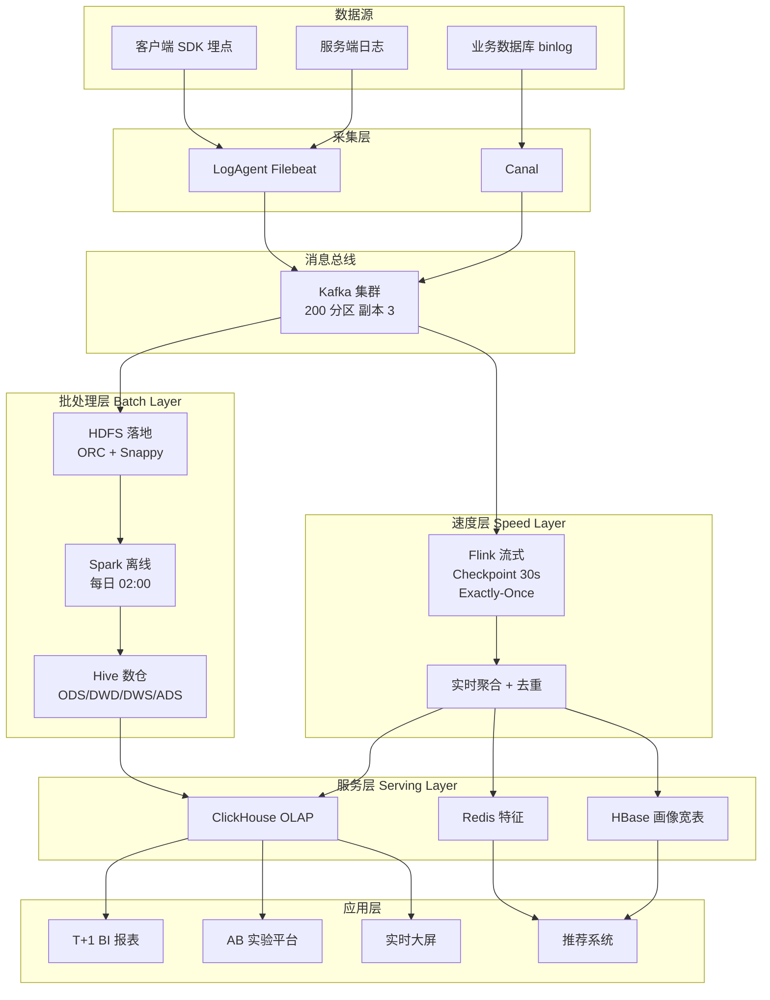

# 案例题型 09 · 大数据 / Web 架构设计

> 中频题型（新增趋势），近年考频上升，25 分。

## 考点分布

- 大数据**Lambda / Kappa** 架构选型
- 流式 vs 批处理
- NoSQL 选型（键值 / 列族 / 文档 / 图）
- Web 高并发架构（CDN / 反向代理 / 集群）
- 数据湖 vs 数据仓库

## 大数据架构核心

### Lambda vs Kappa

| 维度 | **Lambda** | **Kappa** |
|---|---|---|
| 层次 | 批 + 速度双层 | **仅流式** |
| 代表 | Hadoop + Storm/Flink | **Flink 统一** |
| 优势 | 准确 | **简化** |
| 劣势 | 两套代码 | 回填慢 |

### 大数据技术栈

| 环节 | 技术 |
|---|---|
| **采集** | Flume / Logstash / **Canal**（CDC） |
| **消息** | **Kafka** |
| **存储** | HDFS / S3 / **HBase** / **ClickHouse** |
| **计算批** | **Spark** / MapReduce |
| **计算流** | **Flink** / Storm |
| **OLAP** | **ClickHouse** / Druid / Kylin |
| **调度** | Airflow / DolphinScheduler |

### NoSQL 选型

| 类型 | 代表 | 适用 |
|---|---|---|
| 键值 | **Redis** | 缓存、排行榜 |
| 列族 | **HBase** / Cassandra | 海量稀疏数据（日志、IoT） |
| 文档 | **MongoDB** | 半结构化 JSON |
| 图 | **Neo4j** / JanusGraph | 社交、金融反欺诈 |
| 时序 | **InfluxDB** / TDengine | IoT、监控 |
| 搜索 | **Elasticsearch** | 全文检索 |

## Web 高并发架构

### 标准 4 层

```
客户端 → CDN → 接入层（Nginx/LVS）→ 应用层（微服务）
                                    → 数据层（缓存 + 库）
```

### 关键优化手段

| 层 | 优化 |
|---|---|
| **CDN** | 静态资源加速 |
| **接入** | LVS + Nginx + 限流（令牌桶） |
| **应用** | 集群 + 无状态 + 水平扩 |
| **缓存** | 多级（本地 Caffeine + Redis） |
| **DB** | 主从 + 分库分表（ShardingSphere） |
| **搜索** | ES |
| **异步** | MQ 削峰填谷 |

## 答题模板

### 问题 1：给出大数据架构

**标准答法**：
```
采集：业务日志 → Flume；DB 变更 → Canal
缓冲：Kafka（万级 QPS 削峰）
实时：Flink 流式计算 → 写入 ClickHouse
离线：Spark 夜间批处理 → HDFS / Hive
存储：冷数据 HDFS + 热数据 HBase + 实时查 ClickHouse
服务：Dubbo / gRPC 对外提供 API
调度：Airflow 管理批作业
治理：元数据（Atlas）+ 血缘 + 质量
```

### 问题 2：Lambda vs Kappa 选型

**套路**：
- 业务要求**历史回溯 + 实时**且接受复杂度 → **Lambda**
- 业务**主要看实时** + 简化运维 → **Kappa**
- 具体看**团队 Flink 成熟度**

### 问题 3：NoSQL 选型

**套路表**（答题时贴合场景）：
```
- 用户画像（海量稀疏）→ HBase
- 订单 JSON 文档 → MongoDB
- 社交关系 → Neo4j
- 实时热榜 → Redis
- IoT 监控 → InfluxDB
- 全文搜索 → Elasticsearch
```

### 问题 4：Web 高并发承载

**套路**：
```
QPS 10 万如何承载？
1. 接入层：Nginx 7 层 + LVS 4 层 → 5 万 QPS / 节点 × N 节点
2. 应用：无状态 + 集群 + 限流 1k QPS / 实例
3. 缓存：Redis Cluster 10 万 QPS / 分片 × 10 分片
4. DB：主从读写分离 + 分库分表
5. 异步：RocketMQ 削峰，秒级消化突增
```

## 万能高分句

- "采用 **Lambda 架构**：批层 Spark 保证准确，速度层 Flink 实时计算，**相互校正**"
- "OLAP 查询引擎选 **ClickHouse**，单查询 **亚秒级**，支持 **100 亿行**明细"
- "分库分表基于 **ShardingSphere**，按**用户 ID 哈希 64 库 × 8 表**，单表 < 500 万行"
- "通过 **CDN + 多级缓存 + 异步削峰** 支撑**双 11 峰值 QPS 50 万**"

## 常见陷阱

| ❌ | ✅ |
|---|---|
| 只讲 Hadoop | 必须 **实时 + 离线** 结合 |
| NoSQL 一把梭 | **按数据结构 + 场景** 选型 |
| 无治理 | **元数据 / 血缘 / 质量** 是核心 |
| Web 只讲缓存 | **接入 + 应用 + 缓存 + DB** 全链路 |
| 不谈容量估算 | QPS / TPS / 存储 要**量化**到分片 |

---

## 模拟案例题

> ⚠️ **自主命题**：题干场景为基于公开考点改编的虚构案例，避免版权风险；技术参数贴合真实工程实践。建议先**严格 25 分钟限时**作答，再对照参考答案。

### 模拟题 1 · 用户行为日志 Lambda 架构（25 分）

**【题干】**（约 820 字）

某头部短视频平台日活 **3 亿**，业务部门希望基于用户行为日志（曝光 / 点击 / 播放 / 点赞 / 评论 / 关注 / 完播）构建统一的"**用户行为分析平台**"，同时满足：① **离线 T+1 报表**（精算 KPI、留存、漏斗）；② **实时秒级看板**（双 11 大促直播间、广告主投放效果）；③ **AB 实验分析**（小时级实验报告）；④ **实时用户画像**（毫秒级特征写入推荐系统）。架构师 G 主导设计，团队规模 35 人（含 8 名数据架构师 + 5 名算法工程师），周期 12 个月。

数据规模：日均日志 **1500 亿条** / **80 TB**、峰值 **400 万条/秒**（晚间黄金时段）、单条平均 **500B**、保留**冷热分层**：热数据（30 天）4 TB ClickHouse；温数据（半年）500 TB HBase；冷数据（3 年）3 PB HDFS + ORC + Snappy。

G 提交的 Lambda 架构核心决策：

1. **采集层**：客户端 SDK 埋点 → LogAgent（Filebeat）→ **Kafka**（200 分区，副本 3，保留 7 天）；
2. **批处理层（Batch Layer）**：Kafka → HDFS（小时级写入 + ORC 列存 + Snappy 压缩）→ **Spark**（每日 02:00 凌晨调度）→ Hive ODS/DWD/DWS/ADS 四层数仓 → 报表层 ClickHouse；
3. **速度层（Speed Layer）**：Kafka → **Flink**（实时消费、Checkpoint 30s、Exactly-Once 语义）→ 实时计算结果 → ClickHouse / Redis / HBase；
4. **服务层（Serving Layer）**：批 + 流结果合并，ClickHouse 提供 OLAP 查询（亚秒级响应）、Redis 提供毫秒级特征查询、HBase 提供用户画像宽表；
5. **调度**：DolphinScheduler 管理 5000+ 离线任务、Airflow 跑跨集群任务；
6. **数据治理**：Atlas（元数据 + 血缘）、Great Expectations（数据质量）、Apache Ranger（权限）；
7. **监控**：批任务延迟 SLA 8 小时、流任务延迟 SLA 30 秒、数据质量异常率 < 0.1%。

业务方对架构提出 4 个质疑：① 为何不直接用 Kappa（仅流式）替代 Lambda 双层？② Spark 离线任务越来越慢（已经压到 4 小时）如何优化？③ Flink Exactly-Once 怎么保证？④ 实时与离线两份代码逻辑漂移怎么办？

**【小问】**（合计 25 分）

**问 1**（10 分）：用 **Mermaid 数据流图**画出本系统**完整的 Lambda 架构数据流**（采集 → 批层 / 速度层 → 服务层 → 应用层），并解释 **Lambda 三层模型**（批处理层、速度层、服务层）的职责分工。

**问 2**（6 分）：**Lambda vs Kappa** 选型对比——本系统为何选 Lambda 而不是 Kappa？请从**精确度、复杂度、回填能力、运维成本**4 维度分析。

**问 3**（5 分）：**Flink Exactly-Once 语义**如何实现？请描述 **Checkpoint + 2PC（Two-Phase Commit）+ 幂等 Sink** 的协同机制。

**问 4**（4 分）：**Lambda 架构两份代码**导致逻辑漂移是常见痛点，请给出至少 **2 种**业界解决方案（如 Apache Beam、Lambda → Kappa+ 演进、湖仓一体）。

---

**【参考答案】**

**问 1**：Lambda 架构数据流（约 280 字）



**Lambda 三层职责**：

| 层 | 职责 | 本架构落地 |
|---|---|---|
| **批处理层** | 全量数据精确计算，T+1 离线，作为**真相之源（Single Source of Truth）** | Spark + Hive 四层数仓，处理 80TB/日全量 |
| **速度层** | 增量数据实时计算，**牺牲精度换低延迟**，弥补批层时间窗口 | Flink + Kafka，秒级延迟，最近 N 分钟内数据 |
| **服务层** | 合并批 + 流结果，对外提供查询 | ClickHouse 同时容纳两层结果，按时间窗口拼接 |

**问 2**：Lambda vs Kappa 选型（约 250 字）

| 维度 | **Lambda** | **Kappa** |
|---|---|---|
| **精确度** | ✅ 批层全量精确，流层近似 | ⚠ 仅流式，依赖 Exactly-Once |
| **复杂度** | ❌ 双套代码，运维 2 套集群 | ✅ 单套代码，仅 Flink |
| **回填能力** | ✅ 批层重跑历史，1500 亿条 4 小时跑完 | ❌ 仅靠 Kafka 回放，3 PB 数据从头消费需 7+ 天 |
| **运维成本** | ❌ Spark + Flink 双团队 | ✅ 仅 Flink 团队 |

**本系统选 Lambda 的理由**：
1. **数据规模决定**——日 80TB / 累计 3PB，回填场景下 Kappa 重放 Kafka 需要 7+ 天，业务不可接受；离线 Spark 4 小时跑完更经济；
2. **精确度要求**——KPI 报表用于业务决策和 AB 实验显著性检验，必须**全量精确**而非近似；
3. **历史数据回溯**——分析师经常 SQL 查 1 年内任意时间段的数据立方体，Kappa 仅靠 Kafka 保留无法支持；
4. **成熟度**——Spark + Hive 数仓 10 年成熟，团队 30+ 数据工程师有沉淀；
5. **Kappa 适用场景** 是数据规模较小（< 10TB/日）+ 不需要重跑历史的纯流式业务（IoT、监控）。

**问 3**：Flink Exactly-Once 实现（约 220 字）

**Flink 通过 Checkpoint + 两阶段提交（2PC）+ 幂等 Sink 三件套保证 Exactly-Once**：

```
1. Checkpoint Barrier 注入
   JobManager 周期性（30s）发出 Barrier，从 Source 注入数据流
   Barrier 流经所有算子，触发 State 快照到分布式存储（HDFS/S3）

2. 两阶段提交（Sink 端）
   Phase 1 - PreCommit：
     Sink 收到 Barrier → 把缓冲数据写入"预提交"状态（如 Kafka Producer 开启事务）
     上报 JobManager "我已 PreCommit"

   Phase 2 - Commit：
     所有算子都 PreCommit 成功 → JobManager 触发全局 Commit
     Sink 提交事务（Kafka commitTransaction），数据真正可见
     若任一节点 PreCommit 失败 → 全局 Rollback，回到上一个 Checkpoint

3. 幂等 Sink 兜底
   即使 2PC 出错重发，Sink 端也要支持幂等：
   - Kafka：Producer 开启 transactional.id + idempotent
   - MySQL：使用 INSERT ... ON DUPLICATE KEY UPDATE
   - HBase：基于 RowKey 天然幂等
```

**故障恢复**：作业失败时，Flink 从最后成功 Checkpoint 恢复 State + Source 偏移量，重新计算 + 2PC，对外**精确一次**。

**问 4**：两份代码逻辑漂移解决方案（约 240 字）

**业界方案对比**：

| 方案 | 思路 | 代表 | 代价 |
|---|---|---|---|
| **Apache Beam（统一编程模型）** | 一份 Beam Pipeline 代码，通过 Runner 适配 Spark/Flink/Dataflow | Google Dataflow / Beam | 学习成本高，Beam 生态不如原生 |
| **Lambda → Kappa+（流批一体）** | 仅保留 Flink 一套，批处理用 **Flink Batch Mode**（基于 DataStream API），统一 SQL | 阿里 Blink → Flink | Flink 批量场景仍弱于 Spark，4 小时任务可能变 8 小时 |
| **湖仓一体（Lakehouse）** | 一套数据，用 Iceberg / Hudi 统一存储，Spark 批 + Flink 流共享数据，**SQL 统一** | Databricks Lakehouse / Apache Iceberg + Flink CDC | 需引入新存储格式，迁移成本 |
| **DSL + 多 Runner** | 内部自研业务 DSL，编译期自动生成 Spark / Flink 代码 | 头条 ByteHouse、阿里 ODPS | 自研投入大 |
| **代码同源 + 双 CI** | 共享 UDF 库，批/流主控制流分离但**核心计算逻辑一份**，CI 同步校验 | 中小厂常见 | 治标不治本 |

**本系统推荐演进路线**：第 1 年共享 UDF + 双 CI 兜底；第 2 年推进湖仓一体（Iceberg），统一 Spark + Flink SQL；第 3 年评估 Kappa+。

---

**【评分要点】**

| 得分项 | 分值 | 关键词/要求 |
|---|---|---|
| Mermaid 数据流图完整 | 5 分 | 必须含采集 / 批层 / 速度层 / 服务层 / 应用层 5 段 |
| 三层职责分工准确 | 3 分 | 必须答"真相之源" |
| 服务层合并机制 | 2 分 | 必须说批+流合并 |
| Lambda vs Kappa 4 维度对比 | 4 分 | 缺一维度扣 1 分 |
| 选 Lambda 理由 ≥ 2 条 | 2 分 | 必须答回填 + 精确度 |
| Flink Checkpoint Barrier | 2 分 | 必须出现 Barrier 注入 |
| 2PC PreCommit + Commit | 2 分 | 必须答两阶段 |
| 幂等 Sink 兜底 | 1 分 | 必须出现 Sink 幂等 |
| 解决方案 ≥ 2 种 | 2 分 | Beam / Kappa+ / 湖仓 等 |
| 演进路线含阶段 | 2 分 | 不能只列方案 |

**常见扣分点**：
- ❌ Lambda 三层混淆——批是真相，速度是近似补全
- ❌ 数据流图缺少 Kafka 中枢——Kafka 必须是采集与处理之间的解耦点
- ❌ Exactly-Once 只答 Checkpoint——必须答 2PC + 幂等
- ❌ Kappa 答"完全替代 Lambda"——大数据规模下回填代价不可接受
- ❌ 湖仓只提名词不说价值——必须说 Iceberg/Hudi 解决双代码

**高分技巧**：
- 引用 **Lambda 提出者 Nathan Marz《Big Data》一书**体现理论高度
- 量化对比："Spark 4 小时 vs Kappa 7 天"
- 提及 **Flink CDC + Iceberg 流批一体**最新实践
- Mermaid 图层次清晰、用 subgraph 分区，得分高

---

### 模拟题 2 · 数据湖仓一体 Lakehouse 架构（25 分）

**【题干】**（约 760 字）

某金融科技公司服务 200+ 商业银行做数据中台 SaaS，原有架构为**数据湖（HDFS + Parquet）+ 数据仓库（Greenplum）双轨**——数据湖存原始数据满足合规留存（7 年），数据仓库存清洗后数据支持 BI 分析。痛点凸显：① **数据冗余**（同一份数据存 2 份，500TB 翻倍）；② **延迟高**（湖到仓 ETL 耗时 4-8 小时）；③ **一致性差**（仓里 BI 看到的是昨天数据，湖里是今天的）；④ **运维 2 套集群**。

架构师 X 牵头推进 **数据湖仓一体（Lakehouse）** 改造，目标实现"一份数据、多种用途"。团队规模 28 人，周期 14 个月。

业务约束：
- 数据量：源系统 500+ 张表、日增 **2 TB**、累计 **800 TB**；
- 业务诉求：**ACID 事务**（金融场景必需）、**Schema Evolution**（业务字段频繁变更）、**Time Travel**（监管审计要求看 N 天前数据快照）、**流批一体**（实时风控 + 离线对账）；
- 性能：BI 查询 P95 **< 5 秒**、流写入延迟 **< 30 秒**；
- 合规：等保三级 + 银保监会数据安全要求。

X 提交的 Lakehouse 核心方案：

1. **存储格式选型**：在 **Apache Iceberg / Apache Hudi / Delta Lake** 三选一，最终选 **Iceberg**（生态开放、社区活跃、与 Flink/Spark/Trino 集成最佳）；
2. **存储底座**：HDFS（私有部署）+ 对接 S3 兼容对象存储（公有云）；
3. **计算引擎**：Spark（批量 ETL）+ Flink（流式写入）+ Trino（交互式 OLAP）+ StarRocks（高并发点查），共享 Iceberg 元数据；
4. **写入路径**：源系统 → Flink CDC → Kafka → Flink 流式写 Iceberg（小文件合并）+ Spark 每日批量 Compact；
5. **元数据**：Iceberg 自带元数据 + Apache Atlas 血缘 + Apache Polaris 统一目录服务；
6. **数据分层**：ODS（原始）→ DWD（明细）→ DWS（汇总）→ ADS（应用），全部基于 Iceberg 表；
7. **治理**：Iceberg Snapshot 支持 Time Travel 30 天 + 监管 7 年归档至冷存储；
8. **权限**：Apache Ranger 字段级 ACL + 列级脱敏。

**【小问】**（合计 25 分）

**问 1**（10 分）：什么是 **Lakehouse 数据湖仓一体架构**？请列出其**核心 5 大特性**，并说明它如何解决"数据湖 + 数据仓库双轨"的 4 大痛点。

**问 2**（8 分）：**Apache Iceberg / Apache Hudi / Delta Lake** 三种湖仓表格式对比——从 **ACID、Schema Evolution、Time Travel、流式写入、社区生态** 5 维度分析，并说明本系统选 Iceberg 的理由。

**问 3**（4 分）：**小文件问题**是 Lakehouse 的常见痛点（Flink 流式写产生大量小文件，HDFS NameNode 内存爆炸 + 查询慢），请给出至少 **3 种**治理方案。

**问 4**（3 分）：基于 Iceberg 的 **Time Travel** 如何实现？说明在金融审计场景的具体使用方式。

---

**【参考答案】**

**问 1**：Lakehouse 概念与 5 大特性（约 380 字）

**Lakehouse 定义**：将**数据湖的灵活性 + 数据仓库的事务性 / 性能**融合的新一代架构，构建在低成本对象存储（HDFS/S3）之上，通过新一代表格式（Iceberg/Hudi/Delta）提供 ACID 与高性能查询。

**核心 5 大特性**：

| # | 特性 | 含义 | 技术实现 |
|---|---|---|---|
| 1 | **ACID 事务** | 多并发读写一致性、写入原子性 | 元数据快照（Snapshot）+ MVCC + Optimistic Concurrency |
| 2 | **Schema Evolution** | 字段动态增删改、类型演进 | 表元数据版本化，向前 / 向后兼容 |
| 3 | **Time Travel** | 查询任意历史时刻快照 | Snapshot 链路 + 旧版本数据保留 N 天 |
| 4 | **流批一体** | 同一张表流写入 + 批查询、流读取 + 批写入 | 表格式同时支持 append/upsert，引擎共享元数据 |
| 5 | **开放格式** | Parquet/ORC 列存 + 多引擎共享，避免厂商锁定 | Iceberg 规范开源，Flink/Spark/Trino/Presto 都能读 |

**解决双轨 4 痛点**：

| 痛点 | Lakehouse 解法 |
|---|---|
| **数据冗余 500TB→1TB** | 一份数据，仓库不再单独存——节省 50% 存储成本 |
| **湖→仓 ETL 4-8h 延迟** | 实时流式写 Iceberg，BI 直接查湖，延迟降至秒级 |
| **一致性差** | ACID + Snapshot 保证读到的就是最新一致快照 |
| **运维 2 套集群** | 仅一套 Spark/Flink/Trino 共享 Iceberg，运维减半 |

**问 2**：Iceberg / Hudi / Delta Lake 对比（约 320 字）

| 维度 | **Apache Iceberg** | **Apache Hudi** | **Delta Lake** |
|---|---|---|---|
| **ACID** | ✅ 支持，乐观锁 | ✅ 支持，COW/MOR 双模式 | ✅ 支持，事务日志 |
| **Schema Evolution** | ✅ **最强**——支持任意列重命名、类型变更 | ✅ 支持基本演进 | ✅ 支持，但部分变更需 ALTER |
| **Time Travel** | ✅ 基于 Snapshot ID / 时间戳 | ✅ Commit Time | ✅ Version Number / Timestamp |
| **流式写入** | ✅ Flink 集成成熟 | ✅ **最强**——upsert / 索引最快（HoodieIndex） | ⚠ 依赖 Spark Structured Streaming |
| **OLAP 查询性能** | ✅ Trino/StarRocks/Spark 都支持 | ⚠ Trino 集成差 | ✅ Databricks 生态最强 |
| **社区生态** | ✅ Netflix/Apple/Tencent 主推，Apache 顶级 | ✅ Uber 主推 | ⚠ Databricks 主推（开源版受限） |
| **小文件管理** | ⚠ 需手动 Compact | ✅ 自动 Compaction | ⚠ 需手动 OPTIMIZE |
| **多引擎兼容** | ✅ **最强**——开放格式 | ⚠ 流式偏 Spark | ⚠ Databricks 优化最佳 |

**本系统选 Iceberg 的理由**：
1. **多引擎共享**——同时跑 Spark + Flink + Trino + StarRocks，Iceberg 开放格式最优；
2. **Schema Evolution 最强**——金融业务字段频繁变更，Hudi/Delta 部分变更受限；
3. **社区活跃**——Apache 顶级项目，无单一厂商锁定（避免 Delta 受 Databricks 控制）；
4. **生态对齐**——团队已有 Trino + StarRocks 投入，Iceberg 集成最佳；
5. Hudi 的 upsert 优势在本场景（金融对账，写多于改）非主要诉求。

**问 3**：小文件治理（约 180 字）

| 方案 | 实现 | 效果 |
|---|---|---|
| **自动 Compaction** | Iceberg 的 `RewriteFiles` 操作，每日凌晨合并小文件 → 大文件（256MB） | 文件数从 100 万 → 1 万 |
| **流式批量提交** | Flink Sink 配置 `commit-interval=5min`（而非每条 commit），批量写入降低小文件产生 | 单分钟文件数从 60 → 1 |
| **分区规划合理** | 按天分区而非按小时（数据量小时），避免分区过多 | 分区数从 8760/年 → 365/年 |
| **Z-Order 排序** | 写入时按高频查询字段（user_id, event_time）排序，提升数据聚合度 | 减少需要扫描的文件数 |
| **过期 Snapshot 清理** | `expireSnapshots` 删除 30 天前的旧快照 | 释放冗余元数据 |
| **Bin-Packing** | 写入器按文件大小自适应打包 | 单文件接近目标大小 |

**问 4**：Time Travel 与金融审计（约 130 字）

**Iceberg Time Travel 实现**：每次写入产生新 Snapshot（如 snap_20240301_120000），元数据链路保留每个 Snapshot 引用的数据文件清单，旧文件保留期内不被删除。查询语法：

```sql
-- 查询历史时间点
SELECT * FROM customer_table FOR SYSTEM_TIME AS OF '2024-03-01 12:00:00';

-- 查询特定 snapshot
SELECT * FROM customer_table FOR SYSTEM_VERSION AS OF 4862135789012345678;
```

**金融审计场景**：
- **监管现场检查**：监管要求"重现 2024 年 3 月 1 日 12:00 的客户余额表"，直接 Time Travel 查询，无需备份恢复；
- **数据修正追溯**：发现 3 月 1 日有错账，回溯对比当时数据 vs 当前数据；
- **合规审计**：每次审计抓取特定时点全量数据，保留 7 年；
- **错误回滚**：误删数据后用 Time Travel 回滚到 30 分钟前快照。

---

**【评分要点】**

| 得分项 | 分值 | 关键词/要求 |
|---|---|---|
| Lakehouse 定义准确 | 2 分 | 必须出现"湖灵活性 + 仓事务性" |
| 5 大特性齐全 | 5 分 | 缺一扣 1 分 |
| 4 痛点解法 | 3 分 | 必须对应原 4 痛点 |
| 三种格式 5 维度对比 | 5 分 | 缺一维度扣 0.5 |
| 选 Iceberg 理由 ≥ 3 条 | 3 分 | 必须答多引擎共享 |
| 小文件治理 ≥ 3 方案 | 3 分 | 每方案 1 分 |
| 治理方案含具体配置 | 1 分 | commit-interval / 自动 Compact 等 |
| Time Travel 实现机制 | 2 分 | Snapshot + 元数据链路 |
| 金融审计场景 ≥ 2 个 | 1 分 | 监管检查 / 错账追溯 |

**常见扣分点**：
- ❌ Lakehouse 答成"湖+仓"——核心是"统一存储"
- ❌ 三种格式混淆——Iceberg 元数据强、Hudi 流式强、Delta 生态强
- ❌ 小文件答"加大文件"——必须给出 Compaction / 提交策略
- ❌ Time Travel 答"看快照"——必须答 Snapshot ID + SQL 语法

**高分技巧**：
- 引用 **Databricks 2020 论文《Lakehouse: A New Generation of Open Platforms》**理论依据
- 提及 **Apache Polaris / Unity Catalog** 统一目录最新进展
- 量化对比："存储减半 500TB / ETL 延迟 4h→30s / 集群运维减半"
- 选型理由提及"避免厂商锁定"是金融架构核心诉求

---

### 模拟题 3 · Web 高并发三层架构 + CDN + LB（25 分）

**【题干】**（约 740 字）

某综合电商商城启动新一轮架构升级，目标支撑 2024 年双 11 大促。架构师 M 牵头设计高并发架构，团队规模 22 人，周期 9 个月。

业务规模：
- 日活 **6000 万**、注册用户 **3 亿**；
- 商品总量 **1.2 亿 SKU**、店铺 **80 万**；
- 平时 QPS：商品详情 **8 万**、首页 **5 万**、下单 **2 万**；
- 大促峰值：商品详情 **50 万 QPS**、首页 **30 万 QPS**、下单 **5 万 QPS**；
- P99 RT：商品详情 **< 100ms**、首页 **< 200ms**、下单 **< 300ms**；
- 可用性：99.99%（年停机 < 52.6 分钟）；
- 静态资源：图片 / CSS / JS 总量 **5 PB**，单 SKU 平均 8 张图。

M 提交的 Web 架构核心方案：

1. **客户端层**：Native APP + H5 双端，APP 使用 ServiceWorker 缓存静态页面；
2. **CDN 层**：阿里云 CDN（覆盖 2800+ 节点）+ 自建边缘节点，静态资源 99% 命中率；
3. **接入层**：DNS 智能解析（按地域/运营商）→ LVS 4 层负载（DR 模式）→ Nginx 7 层（10 节点集群）+ WAF；
4. **应用层**：Spring Cloud 微服务，无状态部署在 K8s 跨 3 可用区，HPA 自动扩缩；
5. **缓存层**：本地 Caffeine（L1） + Redis Cluster（L2，6 主 6 从，单分片 10 万 QPS）+ 多级降级；
6. **数据层**：MySQL 主从（一主三从）+ ShardingSphere 分库分表（订单表 64 库 × 8 表）；
7. **搜索层**：Elasticsearch 集群（30 节点，索引按品类拆分）；
8. **异步层**：RocketMQ 削峰填谷，下单消息异步落库；
9. **限流降级**：API 网关 Sentinel + 应用层 Hystrix；
10. **监控**：Prometheus + Grafana + SkyWalking 全链路追踪 + ELK 日志。

**【小问】**（合计 25 分）

**问 1**（8 分）：解释 Web 高并发的**经典三层架构**（接入层 / 应用层 / 数据层），并说明本系统从客户端到数据库的**完整请求链路**（含 CDN、LB、缓存、DB）。

**问 2**（10 分）：**容量估算**——本系统大促峰值商品详情 50 万 QPS、下单 5 万 QPS，请逐层估算所需的 CDN / Nginx / 应用 / Redis / MySQL 资源数量（含计算过程），并说明每层的瓶颈与扩展手段。

**问 3**（4 分）：**多级缓存**（CDN + Nginx + 本地 + Redis）的层级与命中率对承载能力的影响，请定量分析"逐层削峰"的效果。

**问 4**（3 分）：本架构如何保证 **99.99% 可用性**？请列出至少 **3 项关键手段**。

---

**【参考答案】**

**问 1**：三层架构与请求链路（约 280 字）

**Web 经典三层**：

| 层 | 职责 | 关键技术 |
|---|---|---|
| **接入层** | 流量入口、负载均衡、安全防护 | DNS / CDN / LVS / Nginx / WAF |
| **应用层** | 业务逻辑处理、无状态扩展 | Spring Cloud 微服务、K8s |
| **数据层** | 数据持久化与高速访问 | Redis、MySQL、ES、HBase |

**完整请求链路**（以"用户访问商品详情"为例）：

```
用户浏览器/APP
  ↓ HTTPS
DNS 解析（智能 DNS 按地域返回最近 CDN 节点 IP）
  ↓
CDN（边缘节点）
  ├─ 静态资源（图片/CSS/JS）：CDN 命中直接返回（< 30ms）
  └─ 动态请求 API：回源
  ↓
LVS 4 层负载（DR 模式直连应用，单节点 100 万 QPS）
  ↓
Nginx 7 层负载 + WAF（10 节点，按 URL 路由 / 限流 / 安全过滤）
  ↓
API 网关（Spring Cloud Gateway + Sentinel 限流熔断）
  ↓
应用服务（K8s Pod 集群，无状态水平扩展）
  ├─ L1 本地 Caffeine 缓存（命中即返）
  └─ L2 Redis Cluster（命中即返）
  ↓
DB 读路径：从库读（按分片路由 → ShardingSphere → MySQL 主从）
DB 写路径：主库写 + 异步同步从库
  ↓
ES 全文检索（独立路径）
  ↓
异步任务：RocketMQ → 消费者
```

**问 2**：容量估算（约 380 字）

**商品详情 50 万 QPS**：

| 层 | 单节点承载 | 命中率 | 实际负载 | 节点数 | 备注 |
|---|---|---|---|---|---|
| **CDN** | 单节点 100 万 QPS | 95% 静态命中 | 50 万 × 5% = 2.5 万 回源 | 全国 2800+ 节点（共享） | 静态资源彻底卸载 |
| **Nginx** | 单节点 5 万 QPS | — | 2.5 万（CDN 回源） | 1 节点足够，部 10 节点高可用 | 7 层路由 + 限流 |
| **应用** | 单 Pod 1000 QPS | — | 2.5 万 | **30 个 Pod**（含 1.2 倍冗余 = 36 Pod） | HPA 自动扩缩 |
| **Redis** | 单分片 10 万 QPS | 95% L2 命中（L1 已挡 70%）| 应用层击穿到 Redis = 2.5 万 × 30% = 7500 | 1 分片足够，部 6 分片高可用 | Cluster 6 主 6 从 |
| **MySQL** | 单库 8000 QPS | Redis 命中后剩余 5% | 7500 × 5% = 375 | 1 主 3 从读分担即可 | 读多写少 |

**下单 5 万 QPS**（写场景，无 CDN/缓存）：

| 层 | 单节点承载 | 实际 | 节点数 |
|---|---|---|---|
| **应用** | 单 Pod 500 TPS | 5 万 / 500 = 100 Pod | **120 Pod（含 1.2 倍冗余）** |
| **Redis（库存原子扣减）** | 10 万 QPS / 分片 | 5 万 | 1 分片，部 6 分片冗余 |
| **MySQL（订单写）** | 单库 3000 TPS | 5 万 / 64 库 = 781 TPS/ 库 | **64 分库** ShardingSphere |
| **RocketMQ** | 单 Broker 5 万 TPS | 5 万 | 4 主 4 从冗余 |

**瓶颈与扩展**：
- **MySQL 写入是瓶颈**——单库 3000 TPS 上限，必须分库分表 + 异步化（消息队列削峰）；
- **Redis 单分片热点**——通过 Hot Key 拆分 / 本地缓存兜住；
- **应用层**——无状态最易扩展，HPA 秒级响应；
- **CDN 是首要削峰利器**——95% 静态命中等同于减少 95% 回源压力。

**问 3**：多级缓存削峰量化（约 160 字）

```
50 万 QPS 入口
  ↓ CDN 95% 命中（静态资源 + 部分动态页面）
2.5 万 QPS 回源到接入层
  ↓ Nginx 本地 lua-shared-dict 缓存 60% 命中
1 万 QPS 进入应用层
  ↓ 应用层本地 Caffeine 70% 命中
3000 QPS 进入 Redis
  ↓ Redis 95% 命中
150 QPS 击穿到 MySQL
  ↓ 主从读分担
单库 < 50 QPS 实际负载
```

**逐层削峰效果**：从 50 万 QPS → 50 QPS（库），削峰比 **10000:1**。每多一级缓存，DB 压力指数级降低。多级缓存核心思想：**不让请求穿透到下一层就解决在当前层**。

**问 4**：99.99% 可用性手段（约 130 字）

| 手段 | 说明 |
|---|---|
| **跨可用区部署** | K8s 应用 Pod 跨 3 可用区，单 AZ 故障自动切换；MySQL 主从跨机房；Redis Cluster 跨 AZ |
| **限流熔断降级** | Sentinel 网关层 + 应用层双重限流；下游故障自动熔断；商品详情可降级返回缓存版本 |
| **柔性可用（降级页）** | 关键接口故障降级到静态兜底页（CDN 缓存的静态 HTML） |
| **多级故障隔离** | 微服务舱壁模式（Hystrix 线程池隔离），单服务故障不扩散 |
| **混沌工程** | 定期演练单 AZ 断网 / Redis 故障 / DB 主从切换 |
| **自动恢复** | K8s 健康检查 + 自动重启；HPA 自动扩容；Redis Sentinel 自动切主 |

---

**【评分要点】**

| 得分项 | 分值 | 关键词/要求 |
|---|---|---|
| 三层架构定义清晰 | 2 分 | 接入/应用/数据三层 |
| 请求链路完整 | 4 分 | 必须含 DNS/CDN/LVS/Nginx/网关/应用/缓存/DB |
| 链路含双向（动态+静态） | 2 分 | 必须区分静态走 CDN |
| 容量估算逐层量化 | 5 分 | 缺一层扣 1 分 |
| 估算含计算过程 | 3 分 | 不能只给结果 |
| 节点数 + 单机承载 | 2 分 | 缺一扣 1 分 |
| 瓶颈识别 + 扩展手段 | 2 分 | 必须指出 MySQL 是瓶颈 |
| 多级削峰量化 | 3 分 | 必须给出每层命中率和削峰比 |
| 可用性 ≥ 3 项 | 2 分 | 跨 AZ + 限流 + 降级 |
| 提及混沌工程 | 1 分 | 高分加分项 |

**常见扣分点**：
- ❌ 链路缺 CDN——大流量场景 CDN 是首要削峰
- ❌ 估算只给"用 100 个 Pod"不给推导——必须 (QPS / 单机承载) × 冗余系数
- ❌ MySQL 写入估算未分库——5 万 TPS 单库不可能扛
- ❌ 多级缓存只列名词不算命中率
- ❌ 可用性答"双机热备"——99.99% 必须跨可用区

**高分技巧**：
- 容量估算引入 **冗余系数 1.2-1.5** 体现工程严谨
- 提到 **HPA / KEDA / Karpenter** 等弹性扩缩组件
- 量化对比："多级缓存削峰比 10000:1"
- 提及**双 11 实战经验**：CDN 命中率 95%+ 是基本功，做不到 95% 必须查问题
- 引用 **CAP 定理 / BASE 理论** 解释柔性可用

