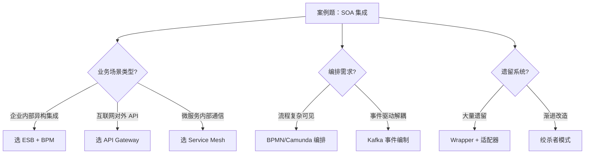

# 案例题型 10 · SOA 与企业应用集成

> 中频题型（与微服务关联紧密），25 分。**与 11-架构演化、05-微服务重构 高度互补**。

## 考点分布

- **SOA 八大原则**（标准化契约 / 松耦合 / 抽象 / 可重用 / 自治 / 无状态 / 可发现 / 可组合）
- **ESB（企业服务总线）** vs **API Gateway / Service Mesh** 选型
- **EAI（企业应用集成）4 层次**：表示层 / 数据层 / 控制 / 业务流程
- **集成模式 EIP（Enterprise Integration Patterns）**：消息路由 / 消息转换 / 消息端点 / 消息构造
- **服务编排（Orchestration）vs 编制（Choreography）**
- **遗留系统改造**：Wrapper / Adapter / 数据同步 / 接口暴露
- **WebService 三件套**：WSDL / SOAP / UDDI（已淘汰）
- **REST vs SOAP**

## 核心知识点速查

### SOA 八大原则

| 原则 | 含义 |
|---|---|
| 服务契约标准化 | 接口定义清晰、跨语言（WSDL/OpenAPI） |
| 松耦合 | 服务间不感知对方实现 |
| 抽象 | 隐藏实现，仅暴露契约 |
| 可重用 | 一次开发、多处使用 |
| 自治 | 服务独立部署、独立演进 |
| 无状态 | 服务实例不保留客户端状态 |
| 可发现 | 通过注册中心查找服务 |
| 可组合 | 服务可被编排为更复杂业务 |

### ESB vs API Gateway vs Service Mesh

| 维度 | ESB | API Gateway | Service Mesh |
|---|---|---|---|
| 定位 | 企业内部集成总线 | 对外 API 统一入口 | 服务间通信基础设施 |
| 流量 | 东西 + 南北 | 南北流量为主 | 东西流量 |
| 业务感知 | 高（编排/转换/路由） | 中（认证/限流） | 低（仅传输层） |
| 性能 | 中（中心化瓶颈） | 高 | 高（Sidecar） |
| 代表 | MuleSoft / IBM IIB / Camel | Kong / Apigee / Spring Cloud Gateway | Istio / Linkerd |
| 时代 | SOA | 微服务 | 云原生 |

### EAI 四层次

```
表示层集成   → 门户聚合（Portal）、网页融合
数据层集成   → ETL、数据库直连、CDC
控制集成     → API/RPC/MQ 调用（最常见）
业务流程集成 → 跨系统流程编排（BPM、ESB）
```

### EIP 经典模式

- **消息路由**：Content-Based Router / Message Filter / Splitter / Aggregator / Routing Slip
- **消息转换**：Message Translator / Content Enricher / Content Filter / Claim Check
- **消息端点**：Messaging Gateway / Service Activator / Polling Consumer / Idempotent Receiver
- **消息构造**：Command / Document / Event / Request-Reply Message

### 编排 vs 编制（必考）

| 维度 | Orchestration 编排 | Choreography 编制 |
|---|---|---|
| 控制 | **中心化**——一个协调者驱动流程 | **去中心化**——服务监听事件自主反应 |
| 可见性 | 流程全局可见 | 流程隐含在事件中 |
| 耦合 | 协调者与服务耦合 | 服务间通过事件解耦 |
| 适用 | 复杂业务流程、需要 SLA | 高解耦、事件驱动架构 |
| 代表 | BPMN + BPEL、Camunda | 事件驱动 + Kafka |

## 答题模板

### 问题类型 1：SOA 架构设计

**标准 5 段式答题**：

```
1. 业务拆分：按业务能力划分服务（订单/库存/支付/物流/CRM/财务）
2. 服务契约：用 WSDL（SOAP）或 OpenAPI（REST）定义接口，纳入服务目录
3. 集成中枢：ESB 做协议转换、路由、编排（异构系统集成痛点解决）
4. 服务治理：注册发现（UDDI 旧 / Nacos 新）、监控、版本管理、SLA
5. 安全：WS-Security / OAuth / API Key + 网关统一鉴权
```

### 问题类型 2：ESB 选型 / 是否引入 ESB

**判断标准**：

```
引入 ESB 适合：
  ✓ 异构系统多（10+ 种协议：SOAP/REST/JMS/FTP/数据库直连）
  ✓ 需要复杂消息转换（数据格式、字段映射）
  ✓ 需要业务流程编排（跨多个遗留系统）
  ✓ 企业内部集成（封闭网络）

不适合 ESB（建议 API Gateway + Service Mesh）：
  ✗ 互联网公司（高并发、ESB 中心化瓶颈）
  ✗ 微服务架构（推崇智能端点 + 哑管道）
  ✗ 主要是 REST + MQ 即可解决
```

### 问题类型 3：遗留系统改造

**3 种策略**（依次推进）：

```
1. Wrapper（包装）：保留遗留系统，外面套一层适配器暴露 API
   优点：风险低、改造小   缺点：性能差、技术债叠加
   
2. Adapter（适配）：在 ESB 上写适配器做协议/数据转换
   优点：与新系统解耦   缺点：ESB 复杂度上升

3. Strangler Fig（绞杀者）：新系统逐步替换老系统功能模块
   优点：渐进式、可控   缺点：周期长（1-3 年）
```

### 问题类型 4：服务编排 / 编制选型

**典型场景判断**：

```
选编排（Orchestration）：
  - 业务流程复杂、步骤多（订单创建涉及 8+ 系统）
  - 需要明确 SLA 和事务边界
  - 团队希望"中心可见"
  - 用 Camunda BPMN / Activiti / Zeebe

选编制（Choreography）：
  - 事件驱动架构（电商订单事件 → 多消费者各自响应）
  - 高度解耦、跨团队
  - 用 Kafka + 事件溯源
```

### 问题类型 5：WebService（SOAP/REST）对比

```
SOAP（WSDL + SOAP + UDDI）：
  ✓ 强契约（WSDL 描述清晰）、跨语言、WS-Security 企业级
  ✗ 重（XML 解析慢、报文大）、复杂
  → 适合企业内部异构集成、金融

REST（资源 + HTTP 动词 + JSON）：
  ✓ 轻量、易用、缓存友好（HTTP）
  ✗ 强契约较弱、安全靠 OAuth/JWT
  → 适合互联网、移动端、微服务
```

## 万能高分句

- "采用 **SOA 八大原则**指导服务设计：标准化契约、松耦合、可重用、可组合"
- "通过 **ESB（如 MuleSoft / Apache Camel）** 实现 12 个遗留系统的协议转换与流程编排，降低集成成本 60%"
- "采用 **Strangler Fig 模式**逐步替换老 ERP，3 年周期内零停机平滑迁移"
- "服务编排用 **Camunda BPMN** 可视化建模，流程变更可视化、可追溯"
- "**事件驱动 + Kafka 编制模式**让订单、库存、物流三大域完全解耦"
- "**API Gateway（Kong）+ Service Mesh（Istio）** 接管 ESB 的南北 / 东西流量职责，避免中心化瓶颈"

## 常见陷阱

| ❌ | ✅ |
|---|---|
| 答 SOA 必上 ESB | ESB 只在异构 + 复杂编排时有价值，互联网项目应避免 |
| 编排和编制混为一谈 | 编排中心化、编制去中心化 |
| WebService 就是 SOAP | WebService 是泛指，REST 也是 WebService |
| ESB 一定有性能问题 | 看吞吐量级，企业内部万级 TPS ESB 完全胜任 |
| 直接全替换遗留系统 | 必须用绞杀者 / 双轨并行，全替换风险极大 |
| 没提服务治理 | 注册发现 + 监控 + 版本管理是 SOA 必备 |
| 没区分东西/南北流量 | 南北用 API Gateway，东西用 Service Mesh |

## 答题流程图



## 推荐学习路径

1. 先看 [past-papers/paper-samples/07-soa.md](../paper-samples/07-soa.md) 与 [11-enterprise-integration.md](../paper-samples/11-enterprise-integration.md) 完整真题
2. 再看 [exam-bank/25-enterprise-integration.md](../../exam-bank/25-enterprise-integration.md) 与 [26-soa-evolution.md](../../exam-bank/26-soa-evolution.md) 巩固选择题
3. 最后看 [cheatsheets/middleware-comparison.md](../../cheatsheets/middleware-comparison.md) 中间件对比
