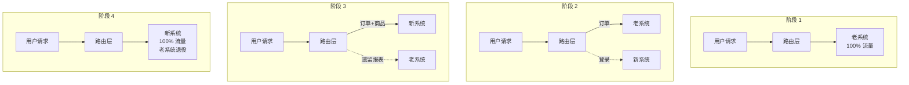
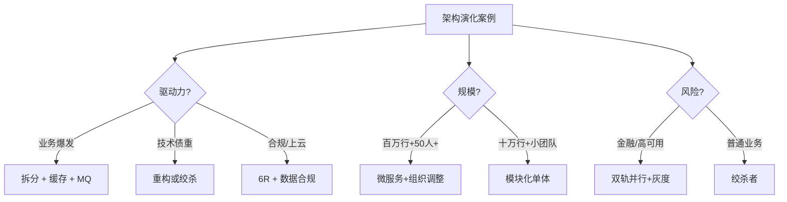

# 案例题型 11 · 架构演化与系统改造

> 中高频题型（2024-2025 高频），25 分。**与 05-微服务重构、10-SOA 集成 互补**。

## 考点分布

- **架构演化驱动力**：业务增长 / 技术债务 / 性能瓶颈 / 合规要求 / 团队规模
- **演化路径**：单体 → 垂直拆分 → SOA → 微服务 → Service Mesh → Serverless
- **绞杀者模式（Strangler Fig）** — 新系统逐步替换老系统
- **上云 6R 模式**：Retire / Retain / Rehost / Replatform / Refactor / Repurchase
- **DDD 拆分指导**：限界上下文（Bounded Context）→ 微服务边界
- **数据迁移**：双写 / 单写双读 / 全量+增量 CDC（Canal/Debezium）
- **零停机迁移**：蓝绿 / 灰度 / 影子流量 / 双轨并行
- **架构演化的成本与风险**：技术债务、组织阻力、回退方案

## 核心知识点速查

### 演化阶段图


### 演化触发信号

| 现状痛点 | 触发演化方向 |
|---|---|
| 单体代码 100 万+ 行，发布一次 4 小时 | → 模块化或拆服务 |
| 单一团队 50+ 人，沟通低效 | → 微服务 + 团队拆分（康威定律） |
| 单库 QPS 上万、单表 5 亿行 | → 分库分表 |
| 跨地域 / 多 IDC | → 单元化架构 |
| 业务峰谷差 100x（如直播） | → Serverless / 弹性扩缩 |
| 国际化业务 | → 多 Region + 数据合规 |

### 绞杀者模式（Strangler Fig）



**核心抓手**：
- 用**路由层**做流量分发
- **新功能直接在新系统建**
- **老功能逐个迁移**到新系统
- **数据双写或 CDC 同步**保证一致
- **每迁移一个模块就在路由层切流量**
- 最终老系统**功能为空，自然下线**

### 上云 6R 决策

| 6R | 含义 | 适用 | 工作量 |
|---|---|---|---|
| **Retire** | 退役、下线 | 已无业务价值 | 最小 |
| **Retain** | 保留在本地，暂不上云 | 强合规、性能极致要求 | 0 |
| **Rehost** | 直接搬迁（Lift & Shift） | 急迫上云、暂不改造 | 小 |
| **Replatform** | 小幅修改（Lift, Tinker, Shift），如换托管 DB | 数据库托管化 | 中 |
| **Refactor** | 重构为云原生 | 长期收益最大 | 大 |
| **Repurchase** | 换 SaaS | CRM/HR/邮件等通用业务 | 中 |

### 数据迁移三步法

```
1. 全量初始化：xtrabackup / pg_dump / DTS 工具迁移历史数据
2. 增量同步：Canal（MySQL binlog）/ Debezium（多 DB CDC）/ OGG（Oracle）实时同步
3. 灰度切换：
   - 双写阶段：业务同时写新旧库
   - 验证阶段：读旧库为主、读新库校验
   - 切换阶段：读写都切新库、旧库保留备份
   - 下线阶段：旧库下线
```

### 零停机迁移技术

| 技术 | 原理 | 适用 |
|---|---|---|
| **蓝绿部署** | 两套环境切换，瞬间切流量 | 应用版本升级 |
| **灰度发布** | 按用户/比例逐步放量 | 大变更小步验证 |
| **影子流量** | 复制真实流量到新系统只读 | 验证新系统性能/正确性 |
| **双轨并行** | 新老系统同时运行、数据双写 | 大型迁移（半年-2 年） |
| **CDC 反向同步** | 切到新库后旧库仍由 CDC 接收变更 | 紧急回滚保险 |

## 答题模板

### 问题类型 1：单体如何演进到微服务？

**6 步演进路线**：

```
1. 识别痛点：发布慢/团队多人冲突/部分模块成瓶颈/单库压力大
2. 模块化单体（中间态）：在单体内按业务能力分包，明确边界
3. 数据库拆分先行：先拆库（按业务子域），代码仍单体
4. 按业务能力提取服务：用 DDD 限界上下文识别服务边界
5. 引入基础设施：注册发现、配置中心、API 网关、服务监控
6. 持续演进：高频变更/独立扩展的模块优先拆分
```

### 问题类型 2：遗留系统改造方案

**绞杀者落地步骤**：

```
1. 评估老系统：识别可拆模块（高频变更、独立性强、价值高的优先）
2. 建立路由层：API 网关 / Nginx Lua / Service Mesh
3. 新系统接管首个模块：从最简单且独立的模块开始（如用户登录）
4. 数据双写或反向同步：保证新老数据一致
5. 流量切换：从 1% → 10% → 50% → 100% 灰度切换
6. 老模块下线：观察 N 周无回流后下线
7. 重复 3-6 直到老系统空壳
8. 最终下线老系统
```

### 问题类型 3：上云改造

**4 步规划**：

```
1. 应用画像：按 6R 分类，列出哪些 Retire/Retain/Rehost/Replatform/Refactor/Repurchase
2. 优先级排序：Retire 先做（清理资产）；Rehost 容易上云；Refactor 价值高但慢
3. 试点先行：选 1-2 个 Replatform 项目验证云能力和团队
4. 规模化推进：建立云上参考架构，团队培训，自动化迁移工具
```

### 问题类型 4：架构演化失败案例分析

**复盘 5 问**：

```
1. 业务驱动是否清晰？（避免技术驱动的演化）
2. 团队组织是否对齐？（康威定律——团队不变架构变不动）
3. 数据迁移是否有兜底？（双写 + 反向同步 + 回滚预案）
4. 灰度策略是否到位？（必须有 1% → 100% 的分级）
5. 监控告警是否足够？（业务指标 + 技术指标双维度对比新老）
```

## 万能高分句

- "采用 **Strangler Fig 模式（Martin Fowler）**，3 年周期内将单体 ERP 渐进式替换为 12 个微服务，**零停机切换**"
- "**康威定律**指导：先调整组织结构（按业务域拆 6 个全功能小组），再拆系统"
- "数据迁移采用 **Canal CDC 双向同步**，新老库一致性 < 1 秒，业务无感"
- "**蓝绿部署 + 影子流量**双重保险，新系统先承接 1% 真实流量验证性能"
- "上云遵循 **AWS 6R 模型**，30% Retire / 40% Replatform / 20% Refactor / 10% Retain，**3 年降本 45%**"
- "**双轨并行 + 反向同步**保留**紧急回滚能力**，确保大变更可控"
- "依据 **DDD 限界上下文**识别服务边界，避免按数据表拆分的反模式"

## 常见陷阱

| ❌ | ✅ |
|---|---|
| 一上来就全拆微服务 | 必须先模块化，分阶段演进 |
| 数据迁移忽视一致性 | 双写 + CDC + 一致性校验 |
| 全量切换无回滚 | 必须灰度 + 反向同步保险 |
| 只换技术不调组织 | 康威定律——组织不变架构变不动 |
| 演化没有度量指标 | 业务 KPI + 技术 SLA 双维度评估 |
| 老系统粗暴下线 | 必须并行观察期 ≥ 1 个月 |
| 一次性 6R 全做 | 优先级排序，分阶段推进 |

## 答题决策树



## 推荐学习路径

1. 先看 [past-papers/paper-samples/09-architecture-evolution.md](../paper-samples/09-architecture-evolution.md) 完整真题
2. 看 [exam-bank/26-soa-evolution.md](../../exam-bank/26-soa-evolution.md) 巩固选择题
3. 看 [05-microservice-refactor.md](./05-microservice-refactor.md) 微服务重构套路
