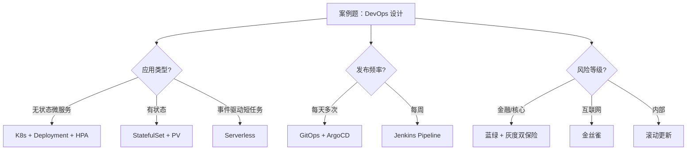

# 案例题型 12 · DevOps 部署与 CI/CD 设计

> 中频题型（云原生时代新增），25 分。**与 05-微服务、11-架构演化 互补**。

## 考点分布

- **DevOps 文化** vs 传统瀑布开发运维分离
- **CI / CD 流水线**：构建、测试、安全扫描、制品、部署
- **部署策略**：蓝绿 / 金丝雀 / 滚动 / A/B / 影子流量
- **IaC（Infrastructure as Code）**：Terraform / Ansible / CloudFormation
- **GitOps**：ArgoCD / Flux，Git 是唯一真理源
- **容器编排**：Kubernetes、Helm、Operator
- **Serverless / FaaS**：AWS Lambda、阿里 FC、Knative
- **可观测性三柱**：Metrics（Prometheus）/ Logs（ELK）/ Traces（SkyWalking）
- **DORA 4 大指标**：部署频率、变更前置时间、变更失败率、恢复时间
- **混沌工程**：Chaos Mesh、ChaosBlade

## 核心知识点速查

### CI/CD 标准流水线


### 部署策略对比

| 策略 | 原理 | 优点 | 缺点 | 适用 |
|---|---|---|---|---|
| **重建（Recreate）** | 停旧版起新版 | 简单 | 有停机 | 内部小流量 |
| **滚动（Rolling）** | 逐批替换 Pod | 无停机、资源占用低 | 回滚慢、两版共存 | K8s 默认 |
| **蓝绿（Blue-Green）** | 两套环境切流量 | 切换快、回滚秒级 | 资源 ×2 | 关键交易 |
| **金丝雀（Canary）** | 按比例灰度放量 | 风险最低 | 流程长 | 互联网迭代 |
| **A/B 测试** | 多版本对比 | 数据驱动 | 复杂 | 产品实验 |
| **影子流量** | 真实流量复制只读 | 真环境验证 | 副作用控制难 | 性能/正确性验证 |

### DORA 4 大指标（业界基准）

| 指标 | 精英级 | 高效级 | 中等级 | 低效级 |
|---|---|---|---|---|
| 部署频率 | 按需 / 每天 | 每周-每月 | 每月-每半年 | 半年+ |
| 变更前置时间 | < 1 小时 | 1天-1周 | 1月-6月 | 6月+ |
| 变更失败率 | 0%-15% | 16%-30% | 16%-30% | 16%-30% |
| MTTR | < 1 小时 | < 1 天 | 1天-1周 | 1月+ |

### 可观测性三柱

```
Metrics（指标）  → 聚合数据、低成本、便于告警
                  Prometheus + Grafana
Logs（日志）     → 详细事件、高成本、故障排查
                  ELK / Loki / Fluentd
Traces（追踪）   → 请求级链路、定位慢点
                  SkyWalking / Jaeger / Zipkin
```

### GitOps 核心原则

```
1. 声明式：所有配置以 YAML 描述
2. 版本化：进 Git，可审计可回滚
3. 自动应用：ArgoCD/Flux 持续 reconcile
4. 持续监控：偏差告警 + 自动修复
```

### Kubernetes 核心对象

| 对象 | 职责 |
|---|---|
| **Pod** | 最小调度单元，1+ 容器 |
| **Deployment** | 无状态应用管理 |
| **StatefulSet** | 有状态应用管理（DB、Redis 集群） |
| **DaemonSet** | 每节点一个（日志收集、监控） |
| **Service** | 内部服务发现 + 负载均衡 |
| **Ingress** | 外部 HTTP/HTTPS 入口 |
| **ConfigMap / Secret** | 配置/密钥外挂 |
| **PV / PVC / StorageClass** | 持久化存储 |
| **HPA / VPA** | 自动扩缩容（水平/垂直） |
| **Operator / CRD** | 自定义控制器，封装运维知识 |

## 答题模板

### 问题类型 1：设计 CI/CD 流水线

**标准 7 段答题**：

```
1. 代码管理：Git + 主干开发 + Feature Branch + PR Review
2. CI 阶段：
   - 编译构建（Maven/Gradle/Docker Build）
   - 单元测试（覆盖率 ≥ 70%）
   - 静态扫描（SonarQube + 安全扫描 Snyk/Trivy）
3. 制品管理：
   - 镜像推 Harbor
   - jar 推 Nexus
   - 不可变制品，一处构建多环境部署
4. CD 阶段：
   - 测试环境自动部署 + 集成测试
   - 预发环境 UAT + 性能压测
   - 生产环境灰度（1% → 10% → 100%）
5. 部署工具：ArgoCD（GitOps）+ Helm
6. 可观测：Prometheus + ELK + SkyWalking
7. 回滚机制：自动健康检查 + 一键回滚（Git Revert / Helm Rollback）
```

### 问题类型 2：选择部署策略

**决策矩阵**：

```
高风险关键交易？      → 蓝绿（瞬间回滚）+ 灰度（1%-100%）双重保险
互联网产品快速迭代？  → 金丝雀 + A/B（数据驱动）
内部系统/低流量？     → 滚动更新即可
有状态服务？          → StatefulSet 滚动更新 + 主从切换
首次大版本上线？      → 影子流量 + 蓝绿
```

### 问题类型 3：可观测性方案

**三柱整合答题**：

```
1. 指标层（Metrics）：
   - 业务指标：QPS / 成功率 / GMV
   - 技术指标：CPU / 内存 / 接口 RT / GC
   - 工具：Prometheus + Grafana + Alertmanager

2. 日志层（Logs）：
   - 结构化日志（JSON 格式）
   - 关键字段：trace_id / user_id / 业务标识
   - 工具：Fluentd 采集 → Kafka → ES + Kibana

3. 链路追踪层（Traces）：
   - 全链路 TraceID 贯通（生成在网关层）
   - 工具：SkyWalking / Jaeger
   - 关联：Trace 关联 Log（trace_id 字段）、关联 Metrics

4. 告警链路：
   - 分级告警（P0/P1/P2/P3）
   - 触发渠道：电话 / 钉钉 / 短信 / 邮件
   - 自动化处理：基于指标自动扩容、自动回滚
```

### 问题类型 4：K8s 部署设计

**5 段答题**：

```
1. 命名空间隔离：按环境（dev/test/prod）或业务（trade/user/order）
2. 部署对象选型：
   - 无状态用 Deployment + HPA
   - 有状态用 StatefulSet + PV
   - 守护进程用 DaemonSet
3. 资源管理：
   - Requests/Limits 强制配置
   - QoS 等级（Guaranteed/Burstable/BestEffort）
   - LimitRange + ResourceQuota 防资源滥用
4. 流量管理：
   - Service（ClusterIP）内部
   - Ingress + Cert-Manager（HTTPS 自动证书）
   - Service Mesh（Istio）做高级流量管理
5. 配置/密钥：
   - ConfigMap 外挂配置
   - Secret 存密钥（结合 Vault / KMS 加密）
```

### 问题类型 5：Serverless 选型

**判断标准**：

```
适合 Serverless：
  ✓ 事件驱动（HTTP/MQ/对象存储/定时器触发）
  ✓ 流量波峰波谷大（如直播、营销活动）
  ✓ 启动延迟可容忍（毫秒-秒级）
  ✓ 无状态（状态存外部存储）
  ✓ 创业 / MVP / 临时任务

不适合 Serverless：
  ✗ 长时间运行任务（> 15 分钟）
  ✗ 持续高负载（成本反而高于 K8s）
  ✗ 延迟极敏感（实时交易）
  ✗ 需要本地状态 / GPU
  ✗ 复杂依赖网络配置（VPC 内服务调用慢）
```

## 万能高分句

- "构建 **CI/CD 流水线**实现"代码提交 → 生产部署"全自动化，单次部署从 4 小时降至 15 分钟"
- "采用 **GitOps（ArgoCD）**，Git 为唯一真理源，**任何环境变更可追溯**"
- "**蓝绿 + 金丝雀双重保险**：核心交易类用蓝绿瞬间切换，前端业务用金丝雀按 1%/10%/50%/100% 放量"
- "**可观测性三柱**贯通（Metrics + Logs + Traces），平均故障定位时间从 30 分钟降至 5 分钟"
- "对标 **DORA 精英级**：每天部署 10+ 次、变更前置时间 < 1 小时、变更失败率 < 5%、MTTR < 30 分钟"
- "**Chaos Mesh 混沌演练**每月 1 次，主动注入故障验证系统韧性"
- "**HPA + Cluster Autoscaler 双层弹性**，应对大促 100x 流量波动，闲时降本 60%"
- "**不可变镜像**：Build Once Deploy Many，避免环境漂移"

## 常见陷阱

| ❌ | ✅ |
|---|---|
| CI/CD 无安全扫描 | 必须 SAST + DAST + 依赖扫描 + 镜像扫描 |
| 直接全量上线无灰度 | 关键变更必须灰度 + 健康检查 |
| 部署策略选错（如金融用滚动） | 关键交易必须蓝绿可回滚 |
| 监控只有 Metrics | 必须三柱齐全 |
| K8s 不配 Resource Requests | 必须配置避免资源争抢 |
| 配置硬编码在镜像 | 必须 ConfigMap + Secret 外挂 |
| Serverless 一把梭 | 长任务、高频持续负载不适合 |
| 没有 DORA 量化目标 | 必须给出可度量的 KPI |

## 答题决策树



## 推荐学习路径

1. 先看 [paper-samples/13-devops-serverless.md](../paper-samples/13-devops-serverless.md) 完整真题
2. 看 [exam-bank/24-devops-serverless.md](../../exam-bank/24-devops-serverless.md) 巩固选择题
3. 看 [cheatsheets/devops-cicd.md](../../cheatsheets/devops-cicd.md) 速查表
