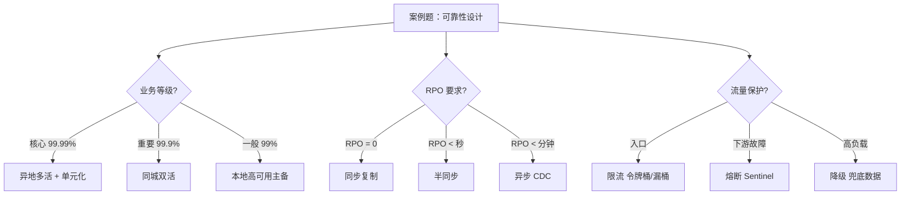

# 案例题型 13 · 可靠性与容灾设计

> 高频题型（金融/医疗/工业必考），25 分。**与 07-security、12-devops 紧密关联**。

## 考点分布

- **可靠性核心指标**：MTBF / MTTF / MTTR / 可用性 A
- **串联 vs 并联可靠性计算**
- **N 个 9 可用性对应停机时长**（99% / 99.9% / 99.99% / 99.999%）
- **冗余设计**：主备 / 主主 / 双活 / 多活
- **容灾等级**：本地 / 同城双活 / 异地多活 / 两地三中心
- **RTO（恢复时间目标）** vs **RPO（恢复点目标）**
- **限流（Rate Limiting）**：令牌桶 / 漏桶 / 计数器 / 滑动窗口
- **熔断（Circuit Breaker）**：Hystrix / Sentinel / Resilience4j
- **降级（Degradation）**：服务降级 / 数据降级 / 静态化兜底
- **故障转移（Failover）**：DB 主从切换、Redis Sentinel、K8s 自愈
- **混沌工程**：主动注入故障验证韧性

## 核心知识点速查

### 可靠性核心公式

| 指标 | 公式 | 含义 |
|---|---|---|
| **MTTF**（Mean Time To Failure） | 平均运行时间 | 平均无故障运行时间（不可修复系统） |
| **MTTR**（Mean Time To Repair） | 平均修复时间 | 故障恢复所需平均时间 |
| **MTBF**（Mean Time Between Failures） | **MTTF + MTTR** | 两次故障间平均时间间隔（可修复系统） |
| **可用性 A** | **MTTF / (MTTF + MTTR)** = **MTBF 中可用比例** | 系统可用比例 |

### N 个 9 可用性对应停机

| 可用性 | 年停机 | 月停机 | 适用 |
|---|---|---|---|
| **99%** | **3.65 天** | 7.2 小时 | 内部工具 |
| **99.9%（三个 9）** | **8.76 小时** | 43.2 分钟 | 一般业务 |
| **99.99%（四个 9）** | **52.6 分钟** | 4.32 分钟 | **互联网核心业务（主流要求）** |
| **99.999%（五个 9）** | **5.26 分钟** | 26 秒 | 金融核心 |
| **99.9999%（六个 9）** | 31.5 秒 | 2.6 秒 | 极致高可用（电信、航天） |

### 串联 vs 并联可靠性

```
串联（所有部件都要可用）：
  R_total = R1 × R2 × R3 ... × Rn
  ↓ 每加一个串联部件，可靠性降低
  
  例：3 个串联部件，每个 0.99 → 0.99³ = 0.9703
  
并联（任一部件可用即可）：
  F_total = (1-R1) × (1-R2) × ... × (1-Rn)
  R_total = 1 - F_total
  ↓ 并联提升可靠性
  
  例：2 个并联部件，每个 0.99 → 1 - 0.01² = 0.9999
```

### 容灾等级（必背）

| 等级 | 含义 | RTO | RPO | 投资 |
|---|---|---|---|---|
| **本地备份** | 仅本地磁盘备份 | 数天 | 数天 | 低 |
| **本地高可用** | 主备机切换 | 分钟 | 0-分钟 | 中 |
| **同城双活** | 同城两个机房，双向同步 | 秒级 | 0 | 高 |
| **两地三中心** | 同城两个 + 异地一个 | 秒-分钟级 | 0-秒级 | 很高 |
| **异地多活** | 多地都对外服务，互为备份 | 0 | 0 | **极高** |

### RTO vs RPO

```
故障发生
   ↓
时间轴：    [─── RPO ───|──故障──|─── RTO ───]
            ↑           ↑                    ↑
       最后备份点    故障时刻          系统恢复时刻

RPO（Recovery Point Objective）：数据丢失容忍量（备份频率）
RTO（Recovery Time Objective）：服务中断容忍时间（恢复速度）

例：日备份 + 1 小时恢复 → RPO = 24h，RTO = 1h
    实时同步 + 自动切换 → RPO ≈ 0，RTO ≈ 秒级
```

### 限流算法对比

| 算法 | 原理 | 优点 | 缺点 |
|---|---|---|---|
| **计数器** | 单位时间内请求计数 | 简单 | 边界突刺 |
| **滑动窗口** | 窗口细分多个时间片 | 解决突刺 | 仍有抖动 |
| **漏桶（Leaky Bucket）** | 请求入桶，按固定速率出桶 | **平滑输出** | 不能应对突发 |
| **令牌桶（Token Bucket）** | 按速率往桶里放令牌，请求取令牌 | **允许突发** | 实现略复杂 |

**工业应用**：Guava RateLimiter 用令牌桶；Nginx 用漏桶；分布式限流用 Redis + Lua。

### 熔断状态机

```
       ┌────────────┐
       │   CLOSED   │ ◄──── 正常调用，统计错误率
       └─────┬──────┘
   错误率超阈值│
             ▼
       ┌────────────┐
       │    OPEN    │ ◄──── 拒绝所有调用，直接 fallback
       └─────┬──────┘
       熔断时间到│
             ▼
       ┌────────────┐
       │  HALF_OPEN │ ◄──── 试探性放行少量请求
       └─────┬──────┘
       成功│  │失败
            ▼  └──► OPEN
       CLOSED
```

### 降级三层

```
1. 服务降级：非核心服务直接返回兜底数据（如个性化推荐降级为默认热门）
2. 数据降级：高负载时返回缓存旧数据/简化数据（如商品详情降级为基本信息）
3. 静态化兜底：CDN 静态 HTML 兜底（如商品详情 / 首页静态化）
```

## 答题模板

### 问题类型 1：可靠性计算

**典型套路**：

```
题干：3 个串联部件 + 2 个并联部件，每个部件可靠性 0.95，求系统可靠性

步骤：
1. 串联部分：R_serial = 0.95³ = 0.8574
2. 并联部分：R_parallel = 1 - (1-0.95)² = 1 - 0.0025 = 0.9975
3. 总系统（串并联混合）：R_total = R_serial × R_parallel = 0.8574 × 0.9975 ≈ 0.8553

关键：先算并联（提升可靠性），再串联整体
```

### 问题类型 2：容灾架构设计

**5 段答题**：

```
1. 业务等级定级：
   - 核心交易 → 99.99% → 异地多活
   - 重要业务 → 99.9% → 同城双活
   - 一般业务 → 99% → 本地高可用
   
2. RTO/RPO 设定：
   - 金融：RTO < 1 分钟，RPO = 0
   - 电商：RTO < 5 分钟，RPO < 1 秒
   - 内部：RTO < 1 小时，RPO < 1 小时

3. 部署架构：
   - 应用：跨可用区多活
   - DB：主从同步 + 自动切换（MHA / Orchestrator）
   - 缓存：Redis Sentinel / Cluster
   - 存储：分布式存储多副本

4. 数据同步：
   - 强一致：DTS 同步 / 半同步复制
   - 最终一致：Canal CDC / Kafka 异步

5. 容灾演练：
   - 季度演练单 AZ 断网
   - 年度演练整 IDC 切换
   - Chaos 工具主动注入故障
```

### 问题类型 3：限流降级方案

**全链路保护答题**：

```
1. 接入层限流：
   - Nginx limit_req（漏桶）
   - 按 IP / API / 用户限流
   
2. 网关层限流：
   - API 网关（Spring Cloud Gateway + Redis Lua）
   - 全局分布式令牌桶
   
3. 应用层限流：
   - Sentinel / Hystrix / Resilience4j
   - 按接口 QPS、按并发线程数限流

4. 熔断策略：
   - 错误率 > 50% 持续 10s → 熔断 30s
   - 半开放行 → 成功率 > 80% 恢复

5. 降级兜底：
   - 一级降级：返回缓存数据
   - 二级降级：返回默认值/空列表
   - 三级降级：返回静态化兜底页

6. 监控告警：
   - 实时监控 QPS / 错误率 / 限流量 / 熔断次数
   - 告警分级触发应急预案
```

### 问题类型 4：99.99% 可用性方案

**12 项关键手段**：

```
设计：
1. 跨可用区部署（应用 / DB / Redis）
2. 无单点（每层至少 N+1 冗余）
3. 无状态化（应用层）

数据：
4. DB 主从 + 自动切换 + 异地容灾
5. 多副本存储（HDFS / Ceph / S3）
6. 数据备份与恢复演练

防御：
7. 全链路限流降级熔断
8. 异步化（MQ 削峰）
9. 多级缓存（CDN + 本地 + Redis）

运维：
10. 自动化部署 + 灰度发布 + 一键回滚
11. 完善监控告警 + 全链路追踪
12. 混沌工程 + 定期演练
```

## 万能高分句

- "构建 **同城双活 + 异地灾备** 两地三中心架构，**RTO < 30s、RPO = 0**"
- "**串并联可靠性计算**：核心链路并联冗余，可靠性从 0.95 提升至 0.9975"
- "**令牌桶 + 滑动窗口双层限流**，应对突发流量 + 平滑长尾"
- "**Sentinel 全链路防护**：限流（QPS+并发）+ 熔断（错误率+RT）+ 降级（兜底）"
- "**Chaos Mesh 混沌工程**每月演练，主动注入网络分区 / Pod Kill / IO 故障"
- "**Redis Cluster 6 主 6 从跨 3 AZ**部署，单 AZ 故障自动切主，业务无感"
- "**单元化架构（Set 化）** 实现异地多活，每个 Set 独立完整闭环"
- "**DORA MTTR < 30 分钟**对标互联网精英级水平"
- "**99.99% 可用性 = 年停机 < 52.6 分钟**——每一项决策都要对标这个上限"

## 常见陷阱

| ❌ | ✅ |
|---|---|
| 只算可用性不给停机时间 | 必须答出"四个 9 = 年停机 52.6 分钟" |
| 串并联公式记反 | 串联用乘法、并联用 1-(1-R)ⁿ |
| RTO/RPO 混淆 | RTO 是恢复时间、RPO 是数据丢失量 |
| 只讲冗余不讲切换 | 必须答自动故障切换机制 |
| 限流只用计数器 | 计数器有边界突刺，要用滑动窗口或令牌桶 |
| 熔断无半开状态 | 必须三态：Closed / Open / Half-Open |
| 容灾不演练 | 必须定期演练 + 混沌工程 |
| 异地多活套话 | 必须答单元化 / 数据同步策略 / 路由策略 |

## 答题决策树



## 速查公式表

```
MTTF：平均无故障时间
MTTR：平均修复时间
MTBF = MTTF + MTTR

可用性 A = MTTF / (MTTF + MTTR) = MTBF 中可用比例

99%      → 年停机 3.65 天
99.9%    → 年停机 8.76 小时
99.99%   → 年停机 52.6 分钟  ← 互联网核心要求
99.999%  → 年停机 5.26 分钟  ← 金融核心
99.9999% → 年停机 31.5 秒    ← 极致高可用

串联可靠性 R = R1 × R2 × ... × Rn  （会降低）
并联可靠性 R = 1 - (1-R1)(1-R2)...(1-Rn)  （会提升）
```

## 推荐学习路径

1. 先看 [paper-samples/03-reliability-design.md](../paper-samples/03-reliability-design.md) 和 [03b-reliability-evaluation.md](../paper-samples/03b-reliability-evaluation.md) 完整真题
2. 看 [exam-bank/20-reliability.md](../../exam-bank/20-reliability.md) 巩固选择题
3. 看 [cheatsheets/quality-attributes.md](../../cheatsheets/quality-attributes.md) 质量战术

---

## 2024 上半年真题 · 试题三（系统可靠性 + 恢复块 vs N 版本程序）

> 来源：2024 年 5 月 系统架构设计师案例分析 试题三
> 公开真题回忆版，仅供学习参考。

### 【题干场景】

某金融机构核心交易系统要求高可靠性，架构师需说明可靠性子特性，并对比**恢复块方法**与 **N 版本程序设计**两种容错技术。

### 【问题 1】（7 分）系统可靠性定义与子特性

**定义**：
> 系统在**规定时间内**、**规定条件下**，**无故障运行**的概率。

**4 个子特性（ISO 25010）**：

| 子特性 | 含义 |
|---|---|
| **成熟性** | 避免因软件缺陷导致失效 |
| **容错性** | 在软件错误或违反接口情况下维持指定性能的能力 |
| **易恢复性** | 失效后重建性能、恢复数据的能力 |
| **可用性** | 在规定条件下系统可运行的程度 |

**可靠性提升技术**：冗余设计 / 双机热备 / 集群 / N 版本程序 / 恢复块 / 看门狗 / 心跳监控

### 【问题 2】（10 分）恢复块 vs N 版本对比

| 维度 | 恢复块方法 | N 版本程序 |
|---|---|---|
| **执行方式** | **串行**（主块失败才执行备块） | **并行**（N 个版本同时运行） |
| **判定机制** | **验证测试**（Acceptance Test） | **多数表决**（Voting） |
| **资源开销** | **低**（仅失败时启动备块） | **高**（N 个版本同时占资源） |
| **响应速度** | **慢**（失败需重试） | **快**（并行最快返回） |
| **错误恢复方式** | **后向恢复**（回滚到检查点） | **前向恢复**（继续向前） |
| **设计复杂度** | 低 | **高**（N 个团队独立开发避免共因故障） |
| **典型应用** | 一般可靠性场景 | 航空航天、核电控制 |

### 【问题 3】（8 分）填空与策略比较

**恢复块流程填空**：

| 填空 | 答案 | 说明 |
|---|---|---|
| (1) | **主块** | 优先执行主版本 |
| (2) | **验证测试** | Acceptance Test 判断结果合法性 |
| (3) | **输出正确结果** | 通过验证则输出 |
| (4) | **异常处理** | 失败则启用备块 |
| (5) | **表决** | N 版本用多数表决 |
| (6) | **后向恢复** | 恢复块的恢复策略 |

**容错策略比较填空**：

| 维度 | 恢复块（评价）| N 版本（评价）|
|---|---|---|
| (7) 资源开销 | **好**（低） | 差（高） |
| (8) 响应速度 | 差（慢） | **好**（并行最快返回） |

### 【采分关键词】

成熟性 / 容错性 / 易恢复性 / 可用性 / 验证测试 / 多数表决 / 后向恢复 / 前向恢复 / 共因故障 / 检查点

### 【常见扣分点】

- ❌ 可靠性子特性少答"成熟性"——4 个特性缺一扣 1 分
- ❌ 恢复块答成"并行"——核心特征是**串行 + 备块**
- ❌ N 版本判定机制答成"投票"不答"多数表决"——术语要准
- ❌ 不提共因故障——N 版本核心动机是用独立设计消除共因故障
